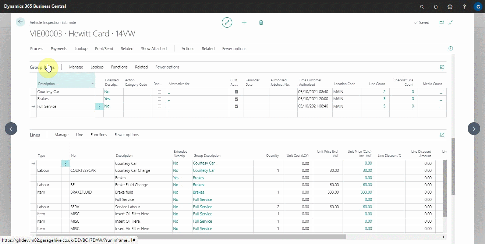
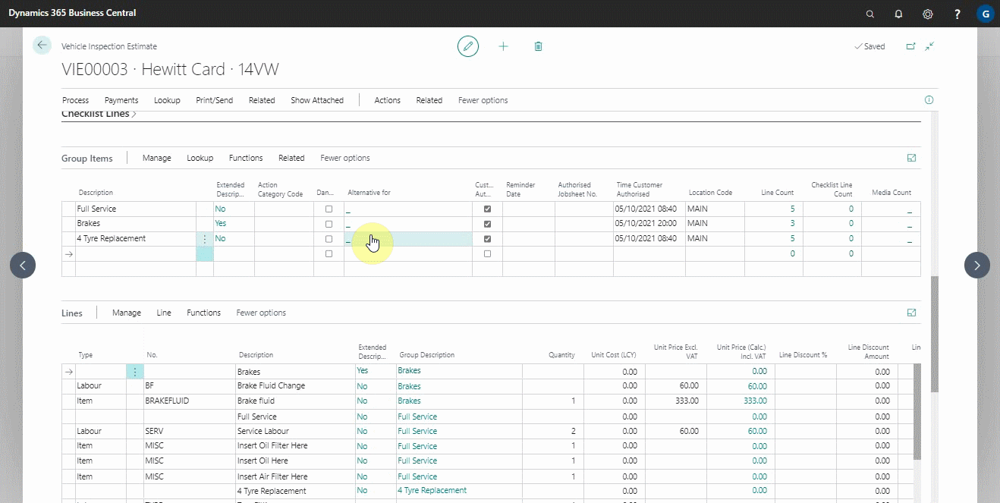
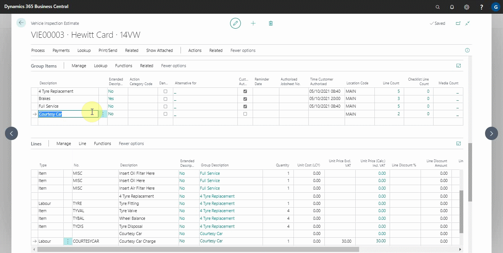
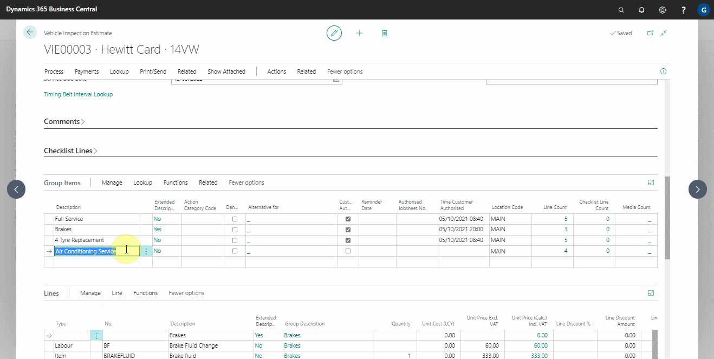

# Working With Group Items Actions
When it comes to using online documents, the group items feature is very important to understand how it works. We've created several actions to help you work around the group item feature in various documents, and we'll walk you through them.

## In this article
1. [Move up and move down actions](#move-up-and-move-down-actions)
2. [Adding service packages, repair times and service interval matrix actions](#adding-service-packages-repair-times-and-service-interval-matrix-actions)
3. [Duplicate and merge groups actions](#duplicate-and-merge-groups-actions)
4. [Creating service package version action](#creating-service-package-version-action)
5. [Matching approved line groups action](#matching-approved-line-groups-action)
6. [Adding checklist attention lines](Adding-checklist-attention-lines)

### Move up and move down actions
These actions are available in jobsheets, estimates, and vehicle inspection estimates and assist in rearranging the group lines in the group items sub-page.
1. Choose **Manage** and then either **Move Up** or **Move Down** from the group items sub-page actions bar.

   

### Adding service packages, repair times and service interval matrix actions
These actions are available in jobsheets, estimates, and vehicle inspection estimates and help in adding a service package, repair times, or service interval matrix as a group. When a group line is selected, and the action is used, the group heading is replaced with the service package heading, and the lines in the group are added to the service package group.
1. Choose **Lookup** and then **Service Package**, **Repair Times** or **Service Interval Matrix** from the group items sub-page actions bar.

   

### Duplicate and merge groups actions
These actions are available in jobsheets, estimates, and vehicle inspection estimates and assist in duplicating or merging the selected groups. When the groups are merged, the document lines in the groups are placed in the newly formed group.
1. From the groups items sub-page actions bar, select **Functions** and then **Duplicate Group** or **Merge Groups**.
   
   

### Creating service package version action
This action is available in jobsheets, estimates, and vehicle inspection estimates and allows you to create a service package version from the selected group, making it easier to reuse the group as a service package.
1. From the group items sub-page actions bar, select **Functions** and then **Create Service Package Version**.

   

### Matching approved line groups action
If you change a group description or price after it has been published and the customer approves it, it is not automatically marked as authorised on the document. It generates an attention comment, which you can manually link to the current group in the document using this action. This action is available in jobsheets, estimates, and vehicle inspection estimates.
1. From the group items sub-page actions bar, select **Functions**, followed by **Match Approved Line Groups**.

### Adding checklist attention lines
This action is available in vehicle inspection estimates and allows you to add vehicle inspection checklist lines as groups in the group items subpage.
1. From the group items sub-page actions bar, select **Functions**, followed by **Add Checklist Attention Lines**.

   

 

### **See Also**

[Introduction to Online Documents](garagehive-online-documents-introduction.html) \
[Grouping document lines](garagehive-group-items-grouping-document-lines.html) \
[Previewing and publishing online documents](garagehive-online-documents-previewing-and-publishing-online-documents.html) \
[Setting up online documents](garagehive-online-documents-setting-up-online-documents.html) \
[Adding and Managing Media in Garage Hive](garagehive-online-documents-adding-and-managing-media.html) \
[Using online documents in estimates, checklists and vehicle inspection estimates](garagehive-online-documents-using-online-documents-in-estimates-checklists-and-vehicle-inspection-estimates.html) \
[What Happens When a Customer Acts on a Sent Online Document?](garagehive-online-documents-what-happens-for-customers-actions.html)
