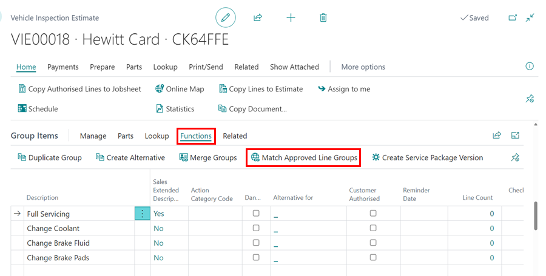
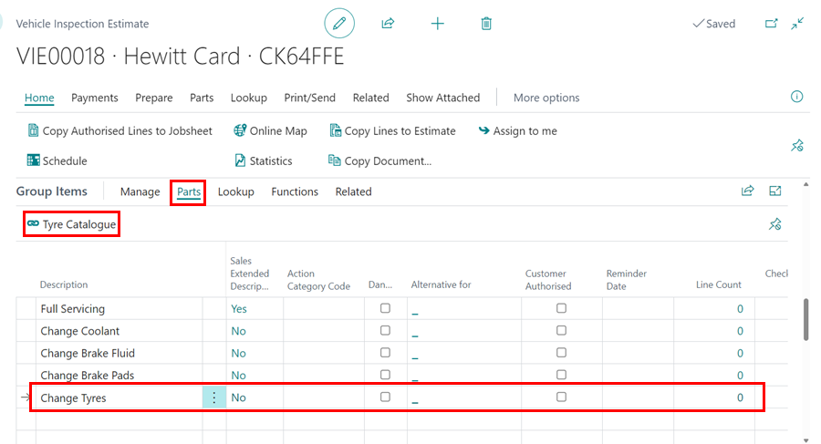
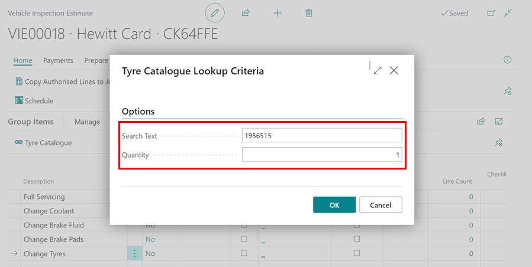
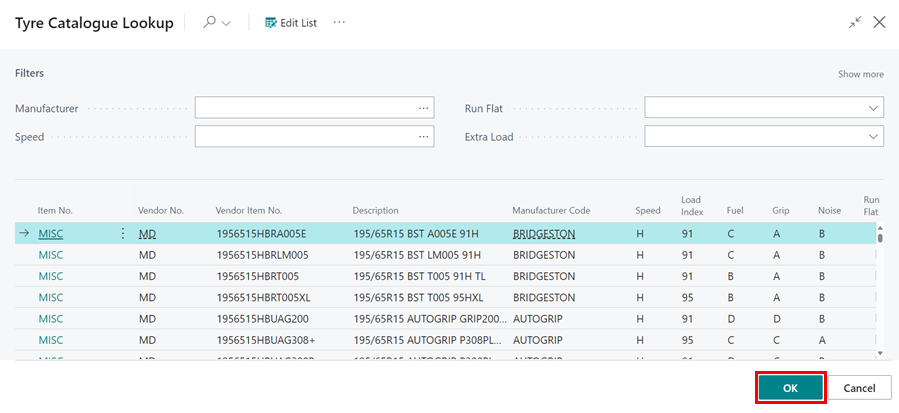

# Working With Group Items Actions
When it comes to using online documents, the group items feature is very important to understand how it works. We've created several actions to help you work around the group item feature in various documents, and we'll walk you through them.

## In this article
1. [Move Up and Move Down Actions](#move-up-and-move-down-actions)
2. [Adding Service Packages, Repair Times and Service Interval Matrix Actions](#adding-service-packages-repair-times-and-service-interval-matrix-actions)
3. [Duplicate Group, Merge Groups and Create Alternative Actions](#Duplicate-group,-merge-groups-and-create-alternative-actions)
4. [Creating Service Package Version Action](#creating-service-package-version-action)
5. [Matching Approved Line Groups Action](#matching-approved-line-groups-action)
6. [Adding Checklist Attention Lines](Adding-checklist-attention-lines)
7. [Lookup Tyre Catalogue](#lookup-tyre-catalogue)

### Move Up and Move Down Actions
These actions are available in Jobsheets, Estimates, and Vehicle Inspection Estimates and assist in rearranging the group lines in the group items sub-page.
1. Choose **Manage** and then either **Move Up** or **Move Down** from the **Group Items** sub-page menu bar.

   

[Go back to top](#top)

### Adding Service Packages, Repair Times and Service Interval Matrix Actions
These actions are available in Jobsheets, Estimates, and Vehicle Inspection Estimates. In contrast to the same actions in the document's header, these actions only update existing group items. If you want to add a group in a new line, you must use the actions available in the document's header.
1. Select a **Group Line** to update, then click on **Lookup** and choose **Service Package**, **Repair Times** or **Service Interval Matrix** from the **Group Items** sub-page menu bar.

   

[Go back to top](#top)

### Duplicate Group, Merge Groups and Create Alternative Actions
These actions are available in Jobsheets, Estimates, and Vehicle Inspection Estimates and assist in duplicating or merging the selected groups as well as creating an alternative for the selected group.  
**Duplicating:**
1. From the groups items sub-page menu bar, select **Functions** and then **Duplicate Group**.

   

**Merging:**
The merging action can be used to merge two or more groups. The document lines from the merged groups are added to the newly formed group when the groups are merged.
1. Select one group to merge, then click on the vertically arranged dots after the first column and select **Select More** or press the **Ctrl** key and select the groups to merge with the mouse cursor.
2. Select **Functions** and then **Merge Groups** from the group items sub-page menu bar.

   

**Create Alternative:**
The **Create Alternative** action creates a new group that is identical to the selected group, which you can edit to make it cheaper, discounted, or otherwise. The group can now be published online alongside the selected group, with the option for the customer to choose. 
1. Select the group for which you want to create an alternative, then select **Functions**, then **Create Alternative** from the menu bar.

   

[Go back to top](#top)

### Creating Service Package Version Action
This action is available in Jobsheets, Estimates, and Vehicle Inspection Estimates and allows you to create a service package version from the selected group, making it easier to reuse the group as a service package.
1. From the **Group Items** sub-page menu bar, select **Functions** and then **Create Service Package Version**.

   

[Go back to top](#top)

### Matching Approved Line Groups Action
If you change a group description or price after it has been published and the customer approves it, it is not automatically marked as authorised on the document. It generates an attention comment, which you can manually link to the current group in the document using **Match Approved Line Groups** action. This action is available in Jobsheets, Estimates, and Vehicle Inspection Estimates.
1. From the **Group Items** sub-page menu bar, select **Functions**, followed by **Match Approved Line Groups**.

   

[Go back to top](#top)

### Adding Checklist Attention Lines
This action is available in Vehicle Inspection Estimates and allows you to add Vehicle Inspection Checklist lines as groups in the group items subpage.
1. From the group items sub-page menu bar, select **Functions**, followed by **Add Checklist Attention Lines**.

   

[Go back to top](#top)

### Lookup Tyre Catalogue
Tyre Catalogue lookup is used to lookup the available tyres in local inventory/stock, and the Micheldever catalogue/stock and it's available in the group items actions:
1. Scroll to the Group Items sub-page, select **Parts** followed by **Tyre Catalogue** in the menu bar.

   

2. Enter the tyre size in the **Search Text**, for example 1956515, and enter the number of tyres you require in the **Quantity** field. Click, **OK**.

   

3. This opens up the list of tyres available along with their specifications. To narrow your search, use the filters at the top.

   

[Go back to top](#top)

 

### **See Also**

[Introduction to Online Documents](garagehive-online-documents-introduction.html){:target="_blank"} \
[Grouping document lines](garagehive-group-items-grouping-document-lines.html){:target="_blank"} \
[Previewing and publishing online documents](garagehive-online-documents-previewing-and-publishing-online-documents.html){:target="_blank"} \
[Setting up online documents](garagehive-online-documents-setting-up-online-documents.html){:target="_blank"} \
[Adding and Managing Media in Garage Hive](garagehive-online-documents-adding-and-managing-media.html){:target="_blank"} \
[Using online documents in Estimates, Checklists and Vehicle Inspection Estimates](garagehive-online-documents-using-online-documents-in-estimates-checklists-and-vehicle-inspection-estimates.html){:target="_blank"} \
[What Happens When a Customer Acts on a Sent Online Document?](garagehive-online-documents-what-happens-for-customers-actions.html){:target="_blank"}
