

# How to Assign Technicians to Group Tasks (Pool Jobs) and Future Jobs in Garage Hive
In Garage Hive, **Group Tasks(Pool Jobs)** are used to allow a group of technicians to choose from a pool of jobs. This allows you to book to one bay on the schedule without having to assign to individual technicians. For instance, you can group all the Tyre jobs together. Here is how to create **Group Tasks** in Garage Hive:

## In this article
1. [Create Easy Clocking Group Tasks Action](#create-easy-clocking-group-tasks-action)
2. [Assign Group Tasks to Resources](#assign-group-tasks-to-resources)
3. [Adding Future Jobs for Technician](#adding-future-jobs-for-technician)

### Create Easy Clocking Group Tasks Action
1. In the top-right corner of your screen, choose the  icon, enter **Easy Clocking Menu Items**, and select the related link.

   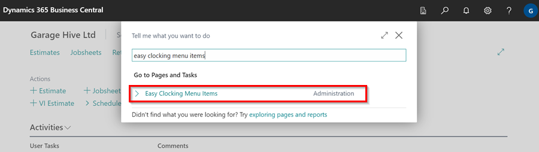

2. Click on **New** to create a new **Group Tasks** action. A **No.** will be automatically assigned for this action. For **Type**, choose **Button** from the options. 
3. Enter a **Caption** for your Group Task action. This caption will be the name or title of your **Group Task (Pools Jobs)**. 
4. In the **Run Action** dropdown menu, select **Start Group Task**. 
5. To assign an **icon** to your Group Task, you can copy the icon from an existing action.

   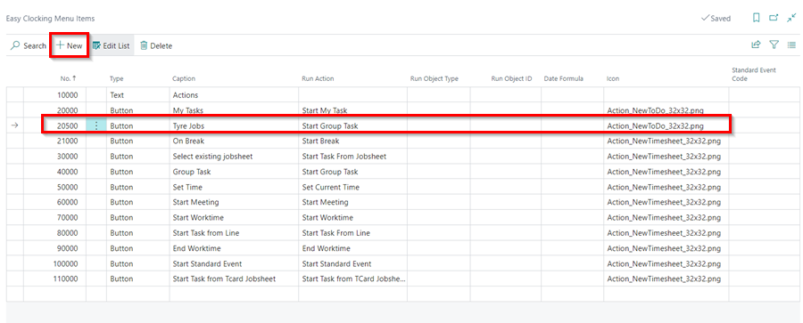

6. The added **Group Task** will now appear in the **Easy Clocking** page.

   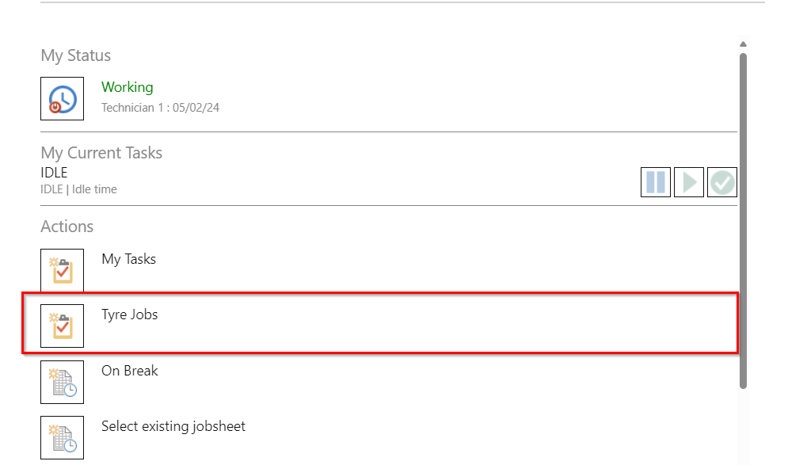

7. You can repeat the steps above to create additional **Group Tasks** actions, such as **MOT Jobs**, **Service Jobs**, etc.

   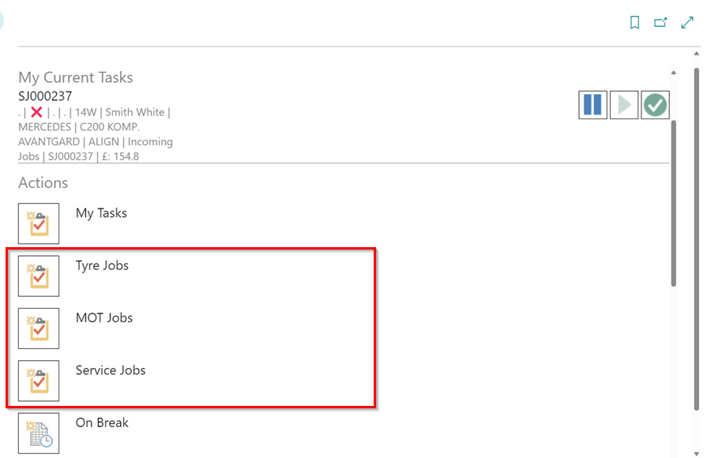

[Go back to top](#top)

### Assign Group Tasks to Resources
To assign technicians to **Group Tasks (Pool Jobs)**:
1. In the top-right corner of your screen, choose the  icon, enter **Schedule Resource Links**, and select the related link.

   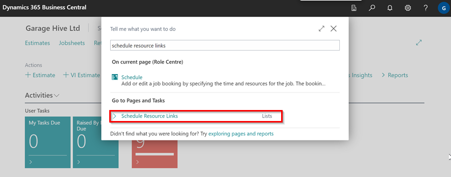

2. Click on **Edit List**. In the **Group Resource No.** column, select the **Resource No (Bay Name)** to which you want to assign technicians and in the **Resource No.** column, select the technician you wish to assign to the chosen group. 
3. Repeat the selection process for all the groups and technicians you need to assign, ensuring every required group has its technicians assigned.

   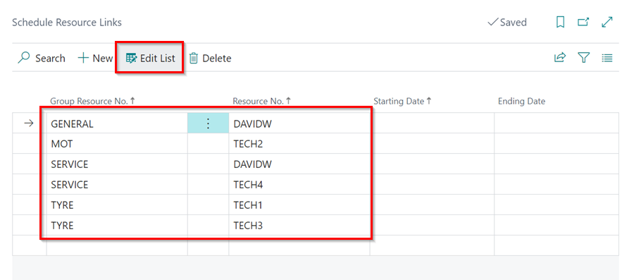

4. Only the technicians assigned to specific groups will be able to view and access the tasks meant for their groups. When done, exit the page.
5. Open the schedule, and allocate the tasks in the different Resource Groups that are available in the schedule.

   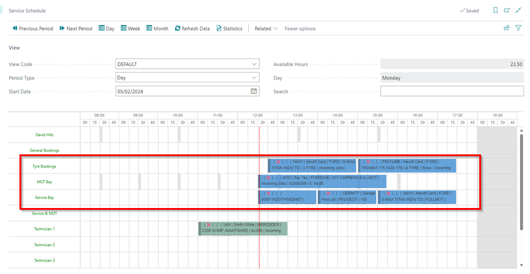

6. When a technician is ready to start a task, they can click on the **Group Task** action in the easy clocking. 

   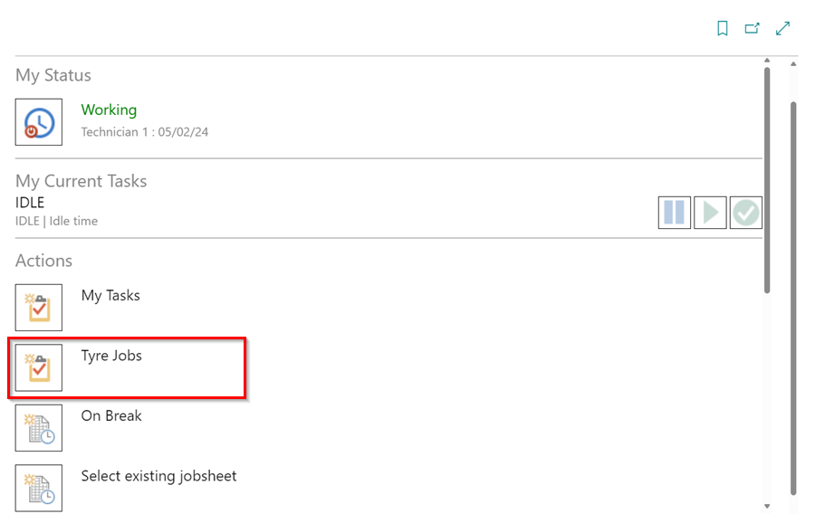

7. Technicians can view and select from the group tasks assigned to them. After selecting the desired task, they should click **OK**.

   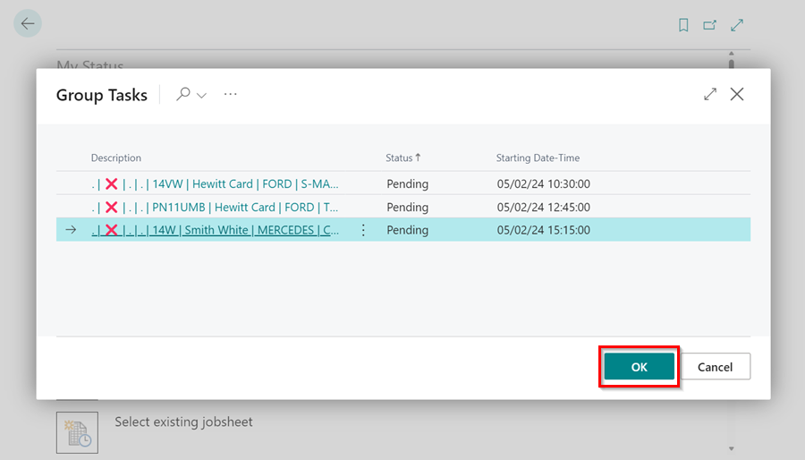

8. To start the task, the technician selects **Start Task** and then clicks **OK**.

   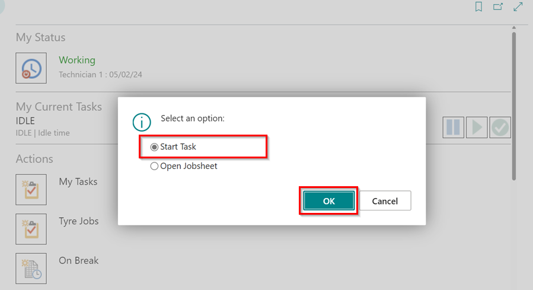

[Go back to top](#top)

### Adding Future Jobs for Technician
1. In the top-right corner of your screen, choose the  icon, enter **Easy Clocking Menu Items**, and select the related link.

   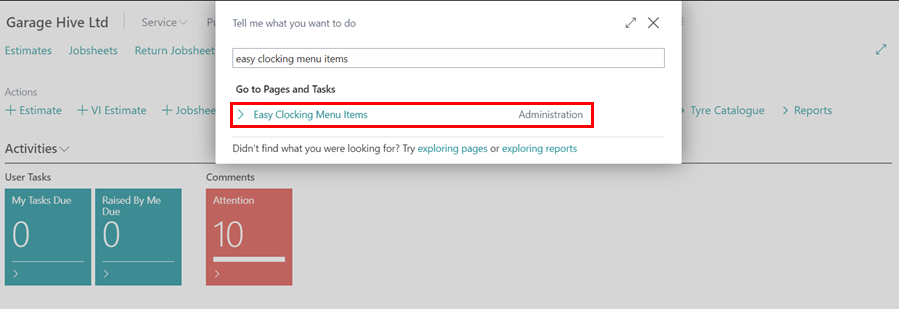

2. Click on **New** to create a new **Future Job Tasks** action. The **No.** will be automatically assigned to this action. For **Type**, select **Button** from the available options. 
3. Enter a **Caption** for your future job action, for example **Tomorrow's Jobs**. 
4. In the **Run Action** dropdown menu, select **Start My Task**.
5. In the **Date Formula**, enter the formula based on the number of days in the future you want to assign tasks. For example, to schedule tomorrow's tasks, enter **1D**; for two days from today, enter **2D**, and so on.
6. To assign an **icon** to your Group Task, you can copy the icon from an existing action.

   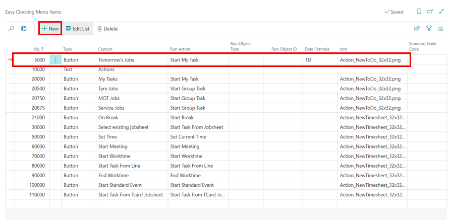

7. Open the schedule and assign the tasks to the technician for the future day you created the action.

   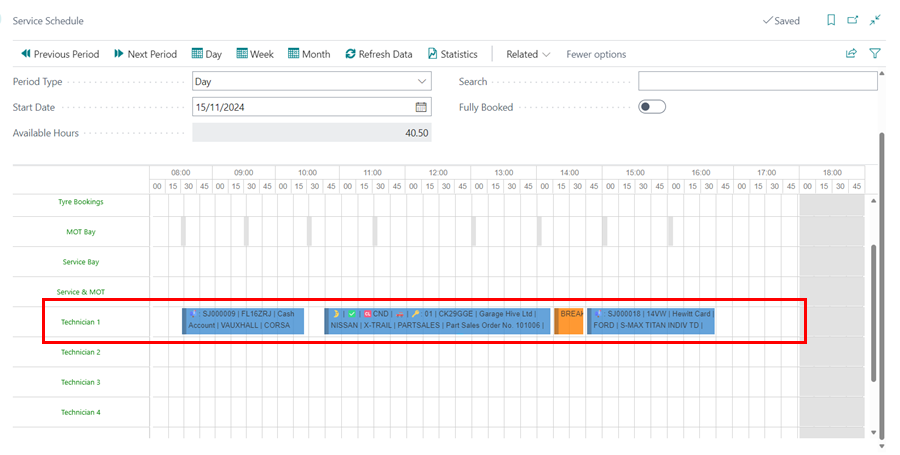

8. The added future tasks will now be visible on the technician's **Easy Clocking** page.

   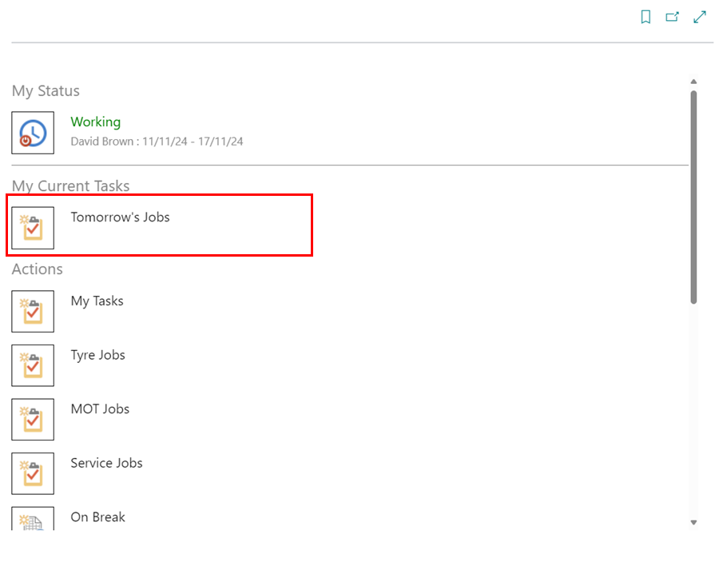  

9. The technician can now click on **Tomorrow's Jobs** to view the assigned tasks.

   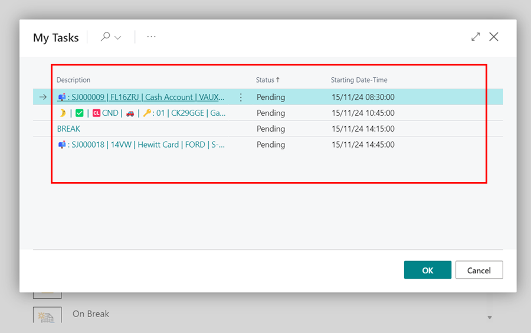

10. You can repeat the above steps to create additional **Future Jobs** actions.

[Go back to top](#top)