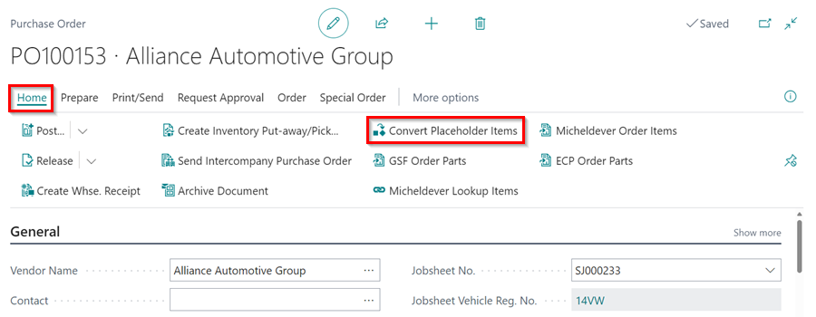
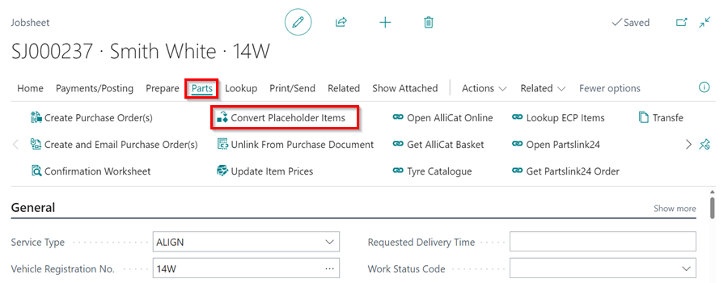

# GSF Integrations in Garage Hive

     

GSF integrations allow you to link Garage Hive to the [GSF Car Parts website](https://www.gsfcarparts.com/), where you may directly place an order for the parts that need to be ordered from the Garage Hive system.

## In this article
1. [Getting the System Integration Customer ID](#getting-the-system-integration-customer-id)
2. [Linking GSF to Garage Hive system](#linking-gsf-to-garage-hive-system)
3. [Ordering Parts from the GSF Website using the Garage Hive system](#ordering-parts-from-the-gsf-website-using-the-garage-hive-system)
4. [Ordering Parts from the Purchase Order](#ordering-parts-from-the-purchase-order)
5. [Receiving Parts from the GSF Invoice into the System](#receiving-parts-from-the-gsf-invoice-into-the-system)

### Getting the System Integration Customer ID
You will require a **System Integration Customer ID** before you can begin the process of linking the Garage Hive system to GSF. If you have multiple locations, you should get a **System Integration Customer ID** for each location.
You will need to do the following to obtain this information:
1. ##### Existing GSF Customer
   If you are an existing GSF Customer please complete the form within the link below. You will then receive your **System Integration Customer ID** back via email.

      [Complete this form.](https://docs.google.com/forms/d/e/1FAIpQLSdKunTIs9KA2b-xQs2hjEPvhKTKfdLrNE86fOQLGKBqxrAXkQ/viewform){:target=" blank"}

   Alternatively, you can contact your local GSF Branch with your **GSF Account No.** and request your **System Integration Customer ID** directly from them. Use this [Finder](https://www.gsfcarparts.com/branches){:target=" blank"} to find your local branch.

2. ##### New GSF Customer
   As a new GSF customer, you will need to contact your local GSF Branch to create an account and advise them that you would like a **System Integration Customer ID**. To find your local branch, use this [Finder](https://www.gsfcarparts.com/branches){:target=" blank"}.

After getting the **System Integration Customer ID**, continue to [Linking GSF to Garage Hive System](#linking-gsf-to-garage-hive-system).

### Linking GSF to Garage Hive system
As a GSF customer, you will need to contact your GSF local branch and get the **Customer ID** before you can begin the process of linking the Garage Hive system to GSF. If you have multiple locations, you should get a **Customer ID** for each location. After getting the **Customer ID**:
1. In the top-right corner, choose the  icon, enter **GSF Integrations**, and choose the related link.
2. Select **New** to add the location to which you want to link with GSF, then choose the **Location Code** and enter the **Customer ID** that you got.

   

3. Under the **Additional** FastTab, enter the **Placeholder Item No.** for the items you order from GSF.
4. Choose the **Vendor No.** to which you want to link the items, when making a **Special Order**, then select the **Vendor Reference Format** as the **Purchase Order Number** or **VRM/KEYNO/SA** to assist GSF in referencing your order when the items are delivered. 
5. Slide the **Enable** slider to the right to enable the integration, and then exit the page.

   

### Ordering Parts from the GSF Website using the Garage Hive system
To order parts from the GSF website:
1. You may add the items from the external data lookup to the Jobsheet that you want to work on. Choose **Lookup**, followed by **Repair Times** and/or **Service Interval Matrix**. Choose the type of labour and items required for the vehicle.
1. **MISC** will be used as a placeholder for the added items.

   
   
1. Choose **Parts** from the actions bar, then **Open AlliCat Online**. This redirects you to your account at the **AlliCat Online Catalogue Portal** and opens the page where the items in the Jobsheet have been looked up using the **Vehicle Registration Number**.

   

1. Add the items from your **Shopping List** to your **Basket**, then open the **Basket** and choose **Send Quote to Garage Hive**.

   

1. Open the Jobsheet you're working on and, from the actions bar, choose **Parts**, then **Get AlliCat Basket**.
1. Return to the Garage Hive system, select an item to add to the Jobsheet from the page that opens, then scroll to the right and click the **Action** column. You can add it as a **New line**, **New line to a group**, or **Update an existing line**. When you're finished, click **OK**.

   

1. The **Description**, **Quantity**, and **Unit Cost** of the Item lines will be updated, but the **Item No.** will remain as **MISC**.
1. The Item lines will also be marked as **Purchase (Special)** with the **Vendor No.** and the **Vendor Item No.** added.

   

1.  When the customer approves the work, create a purchase order from the actions bar by selecting **Parts** and then **Create Purchase Order(s)**.
1.  In the pop-up notification, you have the option to select **Yes** and place an order from **Allicat** which also creates a Purchase Order for the items, or **No** and simply create the Purchase Order.

   

### Ordering Parts from the Purchase Order
1. Open the **Purchase Order.**
2. To make an order through GSF's **AlliCat Online Catalogue Portal**, select **Process** from the actions bar, followed by **GSF Order Parts**. The order will be placed, and more details will be received from GSF.

   

### Receiving Parts from the GSF Invoice into the System
When the items arrive, you may now convert the placeholder items to the actual item number. To do this, use the **Convert Placeholder Items** action, which is available in both the Purchase Order and the Jobsheet. Learn more [here](garagehive-creating-a-placeholder-item.html#convert-a-placeholder-item-to-the-vendor-item-number){:target="_blank"}.

   

 

   