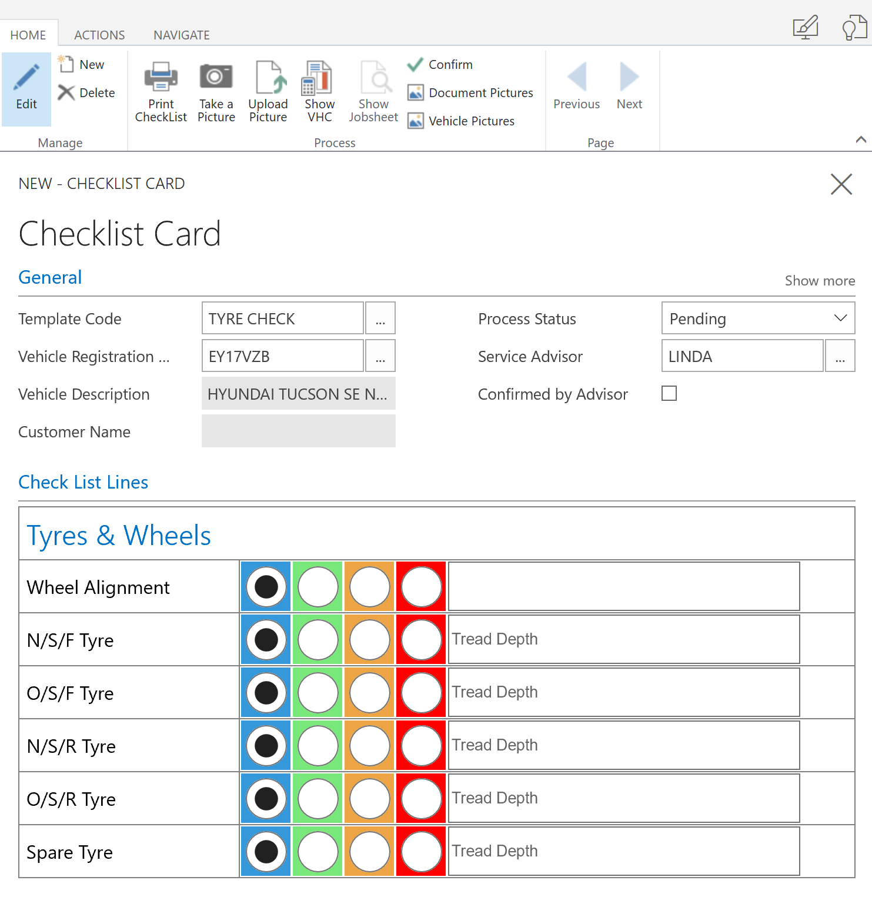

# What are Checklists?

Checklists offer the ability to create an inspection sheet/checklist for all areas of your business. For example, a vehicle insepction is a type of checklist. 

Checklists have the following structure 

* Checklist
    * Questionnaire Templates (Header)
        * Question Groups (Questions belonging to a Questionnaire Template)

## Questionnaire Templates

A questionnaire template is considered the header of the checklist, each questionnaire template must have at least one **Linked Question Group**

## Question Groups

Question Groups are where you enter your checklist questions, a question group for example could be about "tyres" and could consist of a traffic light system and check boxes. 

Question groups can be linked to multiple **Questionnaire Templates**, for example a **Tyre Question Group** could belong in the **Full Service Questionnaire Template** and the **Interim Service Questionnaire Template**. 

## How to create a checklist

From the home screen, press the down arrow and select **Checklists**

