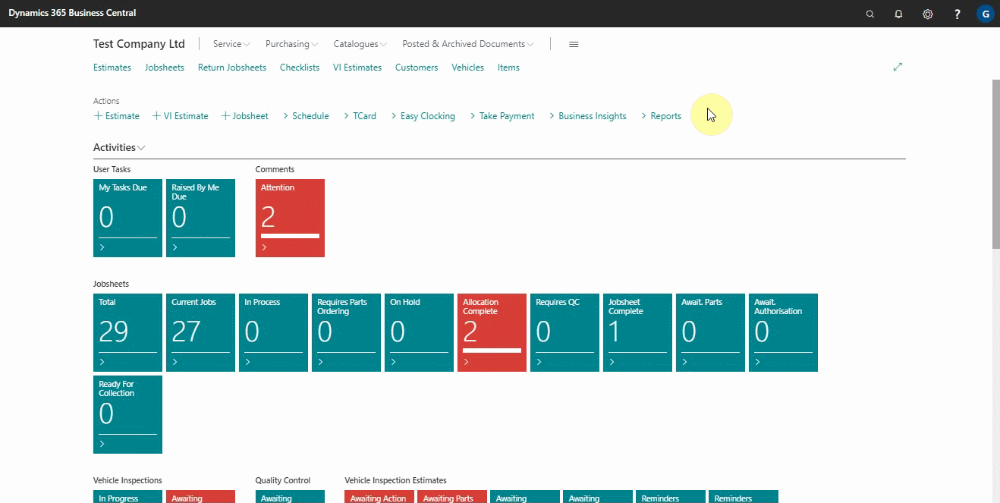
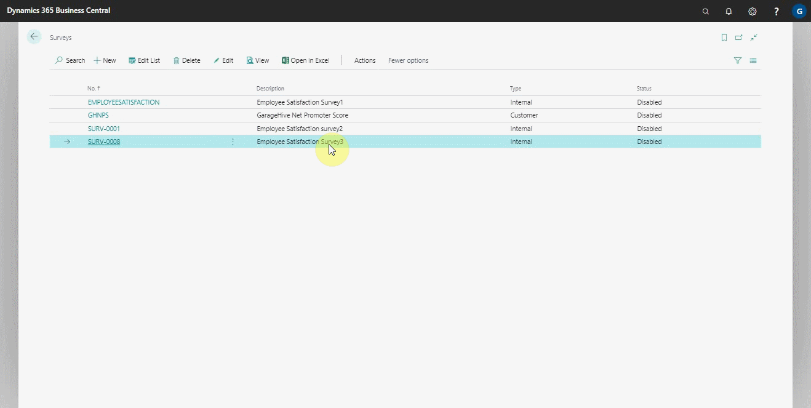
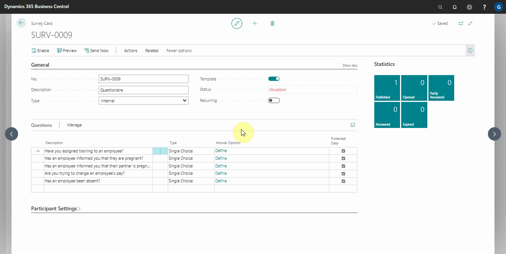

# How to Get Started With External Consultant Survey

If you have external consultants who advise you on specific activities such as human resources (HR), they may provide you with an internal survey template. To setup the external consultant survey, follow these steps:
1. In the top-right corner, choose the  icon, enter **Surveys**, and choose the related link.

   

2. In the **Surveys** page select **Actions**, and then **Import** the file with the extension **stx** provided by the consultant.
3. The system will automatically import the survey number, description, questions, external consultant email address, and **Recurrence Settings**.

   

4. Open the imported survey and select your user account as a participant in the **Participant User Count** under the **Participant Settings** FastTab. Ensure that the contact details are correct, if not edit as they should be.
5. Select the **Internal Notification Method** in which you want to receive the survey, which can be SMS, email, or both.
6. Confirm that the external consultant's email address is entered in the **External Consultant Email**, so that a pdf copy of the answers you provide is sent to the external consultant.

   

7. The survey should be a recurring survey. So the recurring feature at the **General** FastTab should be enabled, which activates a new section named **Recurrence Settings**. 
8. From the **Recurrence Settings** select the frequency with which you respond to the survey from the external consultant and enter a start date and time when you begin answering the survey.
9. Choose **Enable** action, to enable the survey.

   

9. After answering the survey, and submitting it, the external consultant will receive the survey responses as a PDF.

 

### **See Also**

[Setting up and sending internal surveys](garagehive-setting-up-and-sending-internal-surveys.html){:target="_blank"} \
[Scheduling recurring internal surveys](garagehive-scheduling-recurring-internal-surveys.html){:target="_blank"} \
[Reviewing internal surveys](reviewing-internal-surveys.html){:target="_blank"} \
[Exporting an internal survey](garagehive-exporting-an-internal-survey.html){:target="_blank"} \
[Importing an internal survey](garagehive-importing-an-internal-survey.html){:target="_blank"}