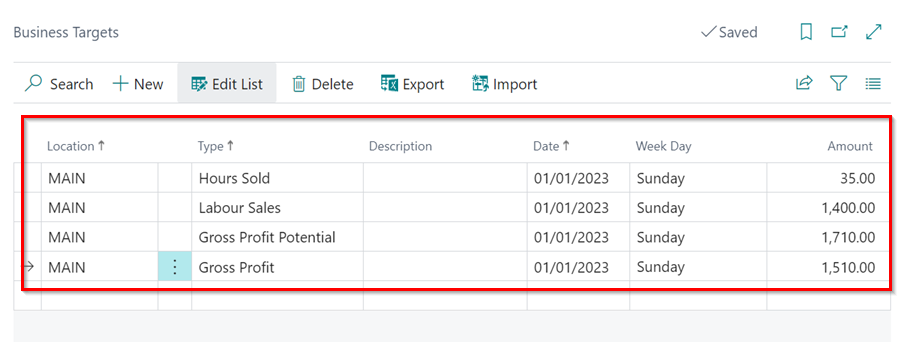
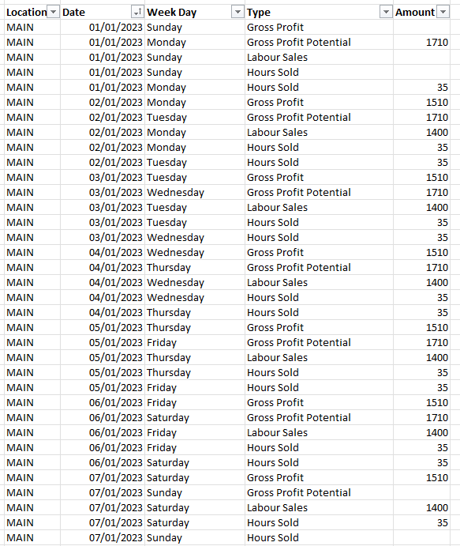

## How to Set Business Targets in Garage Hive
**Business Targets**, such as **Gross Profits**, assist the company in keeping track of the company's performance, ensuring continuous improvements, and always knowing how the company's progress is fairing at all times. Here's how to set **Business Targets:**
1. In the top right corner  icon, enter **Business Targets** and select the related link.

   

2. To set the targets, select the **Location** code, then the **Type** as **Gross Profit**, followed by the **Date** and **Week Day**, which can be the first day of the week, today's date, or any other date as you will get to fill all the days in a calendar year.
3. Now, enter the **Amount** that you want to be your daily target.
4. Select **Export** from the actions bar after selecting all of the fields in the first line. The goal of exporting at this point is to make it easier to enter all of the other days in a year from an excel sheet.
5. In the pop-up window, select **Location** as entered on the first line, and **Type** as **Gross Profit**. Click **OK**.

   

   

6. This now exports the first line as an excel file. Open it and enter all of the **365** days in a year from the excel sheet. Edit the amounts for days where you want the targets to be different, such as Saturdays and Sundays.

   

7. When completed, save the excel sheet and open Garage Hive, then select **Import** on the **Business Targets** page to import the excel sheet that you just edited.
8. Choose the excel file in the ***.xlsxfile name** field, and click **OK**.

   

   

9.  All of the days you added will be imported, and you will have finished setting the business targets in your system.

     

10. If you need to edit the file in bulk, simply **Export** it, edit it, and then **Import** it; otherwise, you can edit individual lines from the **Business Targets** page.

 

### **See Also**
[Video - How to install the Garage Hive Power BI report](https://youtu.be/iO17qPjBAc0) \
[How to set your Average Labour Rate](garagehive-labour-rate.html) \
[Installing the Power BI App](powerbi-installing-app.html) \
[Refreshing your Power BI data](powerbi-refresh-data.html) \
[Updating your Power BI App](powerbi-updating-app.html) \
[Updating your Power BI credentials](powerbi-updating-app.html) \
[Deleting the Power BI and installing a new one](garagehive-delete-old-powerbi-app-and-install-new-one.html) 
