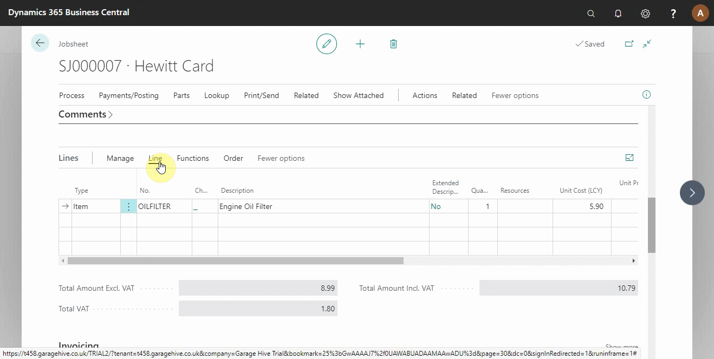

# Viewing an Item History from a Document

To view an item history from a jobsheet, estimate, or vehicle inspection estimate, select the item you want to view the history from the document lines, click on **Line** from the actions bar in the lines section, and select **Item History Overview** from the submenus (see below).

