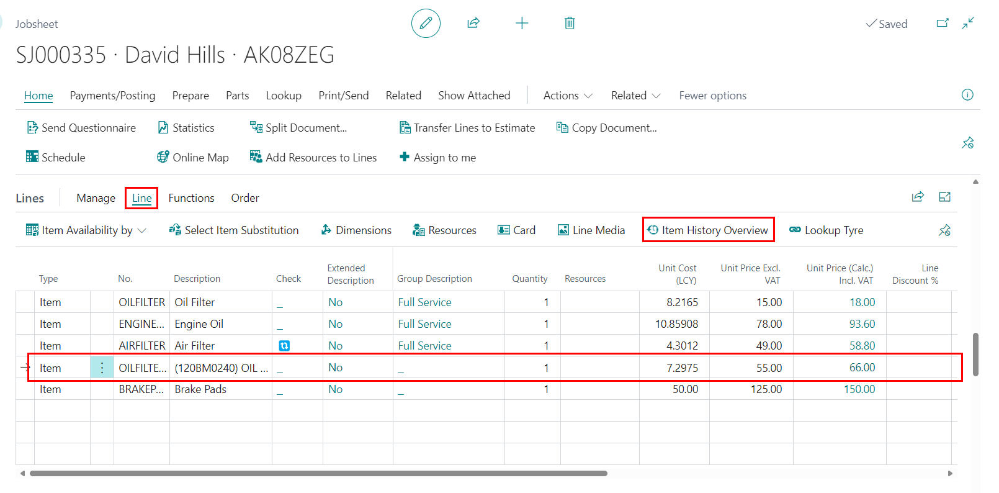

# Viewing an Item History from a Document

To view an item history from a Jobsheet, Estimate, or Vehicle Inspection Estimate:
1. Select the item you want to view the history from the document lines.
2. Click on **Line** from the menu bar in the lines section, and select **Item History Overview** from the submenus.

 

### **See Also**

[Create an Item Card](garagehive-create-an-item-card.html){:target="_blank"} \
[Create Item Templates](create-item-templates.html){:target="_blank"}