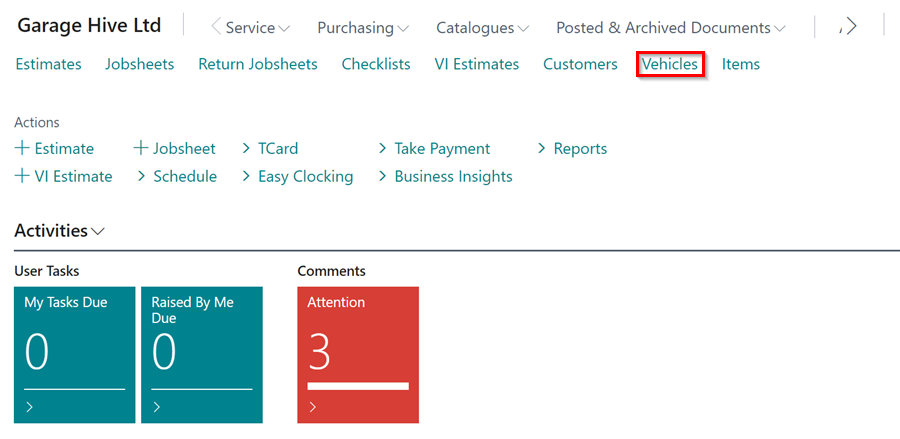
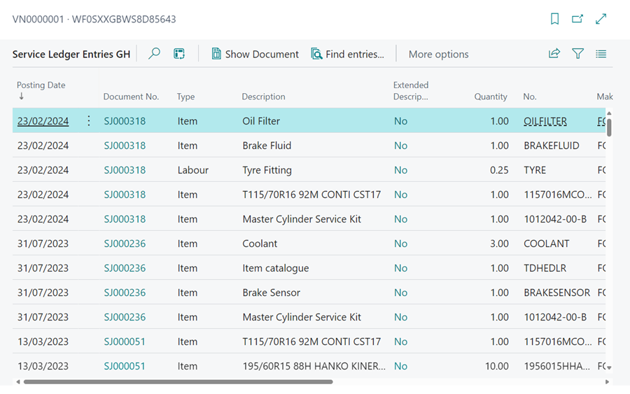

#   How to view Service History 

####   There are multiple ways of viewing service history of a vehicle.

-   Last Visit Date via the **Vehicle** search then **FactBox** on the home page.
-   Full history through the **Vehicle** search then **History** button within the *Actions Bar* followed by **Vehicle History**.
-   Full history within the jobsheet through the **Lookup** button followed by **Vehicle History**.   

##  Option 1 - 
Last Visit Date via the **Vehicle** search then **FactBox** on the home page.

Select Vehicles in the home screen. 

A.  Search & Highlight relevant vehicle. 

B.  Ensure the Factbox is displayed. 

C.  You will see the date and mileage of the last visit (If you require to see specifics of the last visit select either the date or mileage.)

##  Option 2 - 
Full history through the **Vehicle** search then **History** button within the *Actions Bar* followed by 
**Vehicle History**.

Select Vehicles in the home screen. 

A.  Search & Highlight relevant vehicle. 

B.  Select History within the Actions Bar. 

C.  Select Vehicle History. 

##  Option 3 - 

Full history within the jobsheet through the **Lookup** button followed by **Vehicle History**.   

Search for Jobsheet within Home Screen via the: - 

A.  Actions Bar

B.  Tiles

Open the Jobsheet

A.  Select Lookup within the Actions Bar.  

B.  Select Vehicle History.

##  How Service History is Displayed & Why 

Service History is displayed in list format, showing all Items, Labour or External Service which have been invoiced against this vehicle. 

You can search for a specific word, which will filter all history to include that description. 

You can choose columns which you wish to be displayed for example: - 

*   Mileage
*   Resource (Technician)
*   Date 
*   Cost 

You can also view the document a specific item relates to. 

A.  Select Process within the Action Bar. 

B.  Select Show Document. 

This will display the posted jobsheet. 

