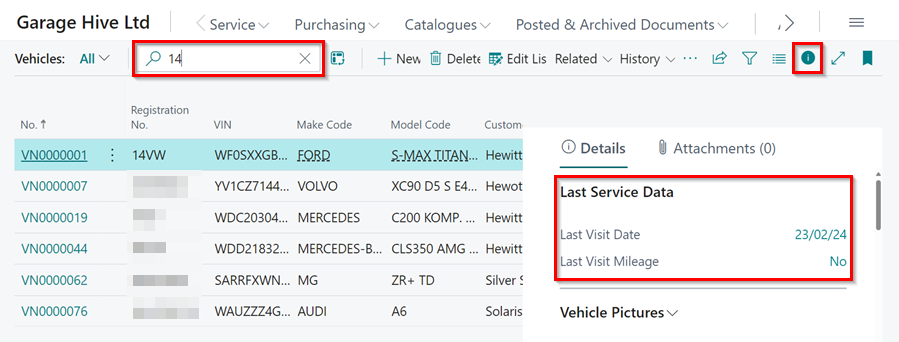
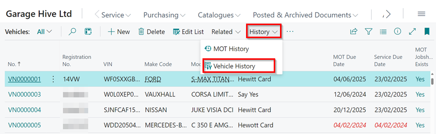

# How to view Service History 
There are multiple ways of viewing service history of a vehicle.

1. [Last Visit Date of the Vehicle From the Vehicle Card](#last-visit-date-of-the-vehicle-from-the-vehicle-card)
2. [Full History of the Vehicle from the Vehicle Card](#full-history-of-the-vehicle-from-the-vehicle-card)
3. [Full History of the Vehicle from the Jobsheet](#full-history-of-the-vehicle-from-the-jobsheet)
4. [How Service History is Displayed](#how-service-history-is-displayed)

## Last Visit Date of the Vehicle From the Vehicle Card 
To view the Last Visit Date of the vehicle:
1. Select **Vehicles** in the Role Centre. 

   

2. Search and select the vehicle you want to view the Last Visit Date for.
3. Click on the Factbox icon (ℹ️) to open the Factbox pane, if it's not already showing.
4. You will see the date and mileage of the last visit. If you need more details about the last visit, simply click on either the date or mileage.

   

[Go back to top](#top)

## Full History of the Vehicle from the Vehicle Card
To view the full history of the vehicle form the Vehicle Card:
1. Select **Vehicles** in the Role Centre.

   

2. Search and select the vehicle you want to view the full history for.
3. Select **History** from the menu bar, followed by **Vehicle History**.

   

[Go back to top](#top)

## Full History of the Vehicle from the Jobsheet
To view the full history of the vehicle from the Jobsheet:
1. Open the Jobsheet List, from the Role Centre.  

   

2. Search and Open the Jobsheet that has the vehicle that you want to view the vehicle history.
3. Select **Related** from the menu bar, followed by **Vehicle History**.

   

[Go back to top](#top)

## How Service History is Displayed
1. The service history of the vehicle is displayed as a list, showing all items, labour or external services that have been invoiced. 

   

2. You can search for specific words to filter your history.

   

3. You can [personalise](garagehive-personalising-garage-hive.html) the page to view columns which you wish to be displayed. For example you can have the following columns: 
   * Mileage
   * Resource (Technician)
   * Date 
   * Cost 
4. You can view the document related with a specific item by selecting the item from the service ledger entries list and then clicking on **Show Document** from the menu bar.

   

5. This will show the posted Jobsheet. 

[Go back to top](#top)

 

### **See Also**

[How to View Vehicle History in Garage Hive](https://www.youtube.com/watch?v=EvhukzzeABo){:target="_blank"}

