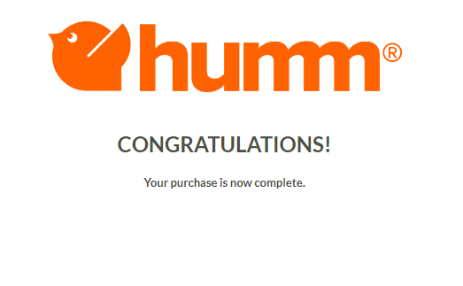

**Humm** is a debt-factoring service integrated with Garage Hive that allows customers to have work done on their vehicles or purchase a vehicle using Humm financing. Customers can then transfer their bills to Humm and have their needs fulfilled.

### Humm Financing Registration
To register for Humm financing, please fill out the form at the link below:

   > ## Humm financing registration form: <ins>[click here.](https://forms.office.com/e/gWgRznDDZh){:target="_blank"}</ins>

## In this article
1. [Requesting for Humm Financing](#requesting-for-humm-financing)
2. [Starting the Purchase on Humm Website](#starting-the-purchase-on-humm-website)
3. [Finalise the Payment in Garage Hive](#finalise-the-payment-in-garage-hive)

### Requesting for Humm Financing
1. To request Humm financing from a Jobsheet, select **Payment/Posting**, then **Take Payment**.

   

2. Select the **Humm Payment Method** line from the **Document Payments** pop-up window, then click **Request Humm Finance**.

   

3. Enter the **Email** and **Phone No.** to be used for the Humm payment request, then click **OK**.

   

4. You will be notified that *The finance request has been initiated.* Click **OK**.

   

5. To view the payment status, select **Payment Gateway Entries** from the menu bar.

   

### Starting the Purchase on Humm Website
1. After requesting Humm financing, the customer will receive an email with a link to start the purchase.

   

2. To start the purchase, click on the link which opens the Humm website. Enter the phone number that will be used for the purchase and then click **Got Your Limit? Start Purchase**.

   

3. A verification code will be sent via SMS to the number provided. For verification, enter the code.

   

3. The following page will provide a summary of the purchase. Check that all of the information is correct. Click **Next**.

   

4. Now, select the frequency with which to repay the financing and click **Select this Option**.
5. Scroll down and enter the **First Repayment Date**, then check the boxes to confirm eligibility and that no changes will affect contractual payments. Click **Next**.

   

   

6. An email containing the purchase documentation as well as the Terms and Conditions, will be sent. Please read them carefully and then click **Proceed** when done.

   

7. The following page now provides a summary of the purchase's terms and conditions; ensure that all information is correct. Scroll down and check the boxes to confirm opening and reading the loan agreement and authorise Humm to debit the card.
8. An **Acceptance Code** will be sent via SMS to the phone number provided. Enter the code and click **Accept Terms and Conditions**.

   

   

9.  Add a card that will be directly debited by Humm on the next page, and check the checkboxes below to authorise Humm to immediately take **Upfront** payment and any future repayments for the purchase after selecting **Complete Purchase**. Click the **Complete Purchase** button.

   

   

10. The purchase is now complete.

   

### Finalise the Payment in Garage Hive
1. When the payment is authorised in Humm, a notification will appear in the **Attention** tile on Garage Hive's Role Centre.

   

2. To open it, click on the tile and then on the Jobsheet **No.** with the authorised payment.

   

3. Select **Payment/Posting** and then **Take Payment** from the Jobsheet. By default, the **Payment Gateway Amount** field along the Humm Payment method line should be filled. Enter in the **Amount** field with the same amount and click **Close**.

  

4. You can now post the document by selecting **Payment/Posting** and then **Post**.

   

5. After posting the document, a new sales invoice will be generated with the customer name **Humm**. In the top right corner, choose the  icon, enter **Sales Invoices**, and select the related link. 

   

6. Open the invoice with the customer name **HUMM** from the list of Sales Invoices.

   

7. The invoice has two lines, one for the total amount of the recently posted Jobsheet and the other for the **Audit and Accountancy Fees** charged by Humm or any other commision account that is added in setup. The invoice total will be the total amount on the Jobsheet minus the **Audit and Accountancy fees**.

   

8. To post the Sales Invoice, go to the menu bar and select **Posting**, then **Post**.

   

9. The payment is now finalised.