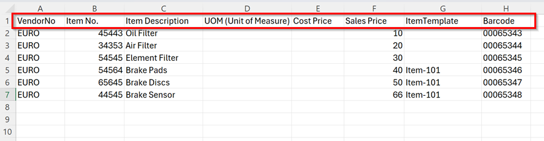
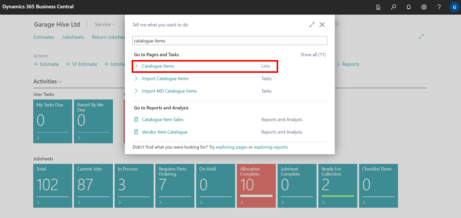

# We are still working on this article!
We are currently reviewing this article before it is published, check back later.

# Importing Catalogue Items with Prices in Garage Hive
This feature enables garages to import catalogue items along with their prices in Garage Hive. This ensures that the catalogue list is updated with new items and that existing item prices and descriptions are up-to-date. This feature also makes it easy to quickly add catalogue items to the inventory with the updated prices, which streamlines the inventory management process. To import the catalogue items with prices:

1. Start by downloading the Excel template (CSV format) below, which you will use to add all the items you wish to add in the system.

   > # Download the Import Catalogue Items with Prices Template: <ins>[Import Catalogue Items Template](import-catalogue-items-with-prices.csv){:target="_blank"}</ins>

2. The excel template has the following fields available to fill:

      

   * **Vendor No.** - This field must be filled.
   * **Item No.** - This field must be filled.
   * **Item Description** - Required for each item.
   * **UoM (Unit of Measure)** - Filling in this field is optional.
   * **Cost Price** - Optional, but useful for tracking item costs.
   * **Sales Price** - This field must be filled, so that the item prices are updated.
   * **Item Template** - Optional. If filled, ensure you copy the code from the **Item Template** within the system. Search for **Item Templates** in the  icon, located at the top right corner of your screen.

      

3. After downloading and filling in the excel template, save the file in your computer. 
4. Open your Garage Hive system and in the top-right corner, choose the  icon, enter **Import Catalogue Items with Sales Prices** and select the related link.

   

5. Choose the file you’ve just saved to import the catalogue items into the system.

   

6. Once the file is imported, you can view the added catalogue items by clicking the  icon, enter **Catalogue Items** and select the related link.

   

[Go back to top](#top)