

# We are still working on this article!
We are currently reviewing this article before it is published, check back later.

# How to Import Your Exported Data Into QuickBooks
If you're using **QuickBooks** as your accounting system, you'll need to import the data you [exported from Garage Hive](garagehive-finance-accountancy-export.html){:target="_blank"} and ensure that your accounting system is [integrated with Garage Hive](garagehive-quickbooks-online-integration.html){:target="_blank"}. Here's how to import the data:
1. Begin by creating a folder named **QuickBooks Online Exports** and saving it to a cloud storage service of your choice; this ensures that it will not be lost even if your PC data is lost.
1. Create a new folder within the **QuickBooks Online Exports** folder, and name it **Done**.

   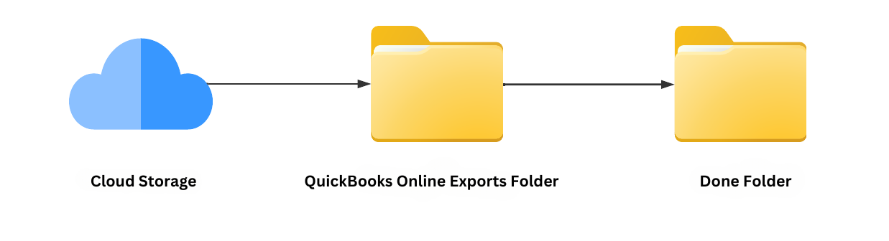

1. From the Garage Hive exported zip file ([learn how to export from Garage Hive](garagehive-finance-accountancy-export.html){:target="_blank"}), right click to **Extract All** and select the **QuickBooks Online Exports** folder as the destination.

   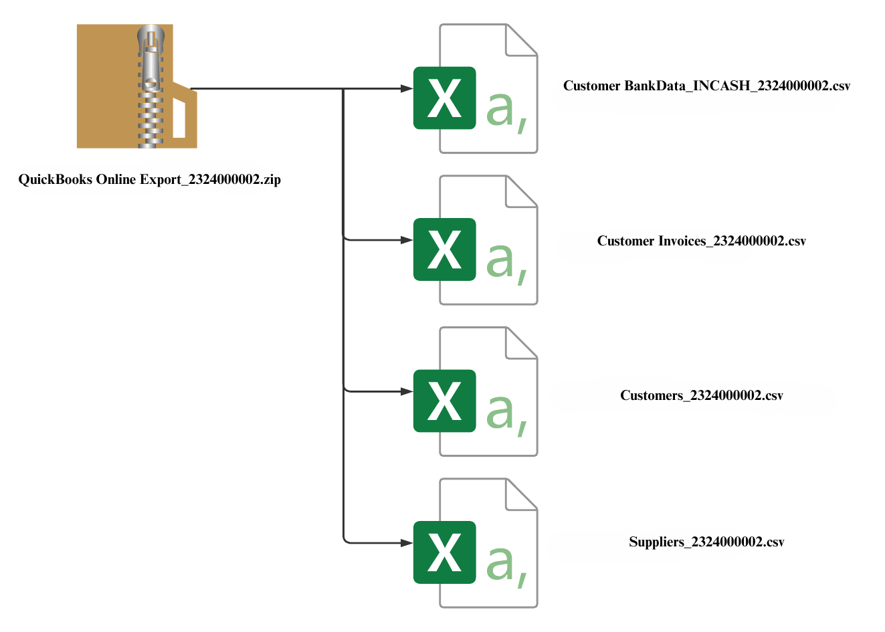

1. Open the **QuickBooks Online** system and click on the **Settings** gear icon in the top right corner, and select **Import Data** under **Tools**.

   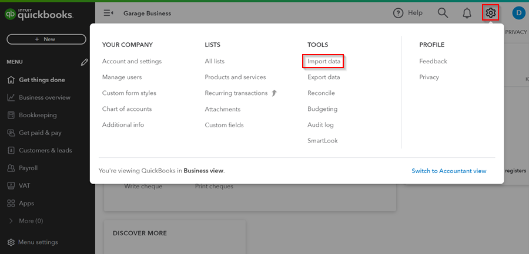

1. Click on **Invoices**, and select the the **Customer Invoices** csv file from the **QuickBooks Online Exports** folder that you created. Check the **Add new contacts that don't exist in QuickBooks** checkbox, to add new customers. Click **Next**.

   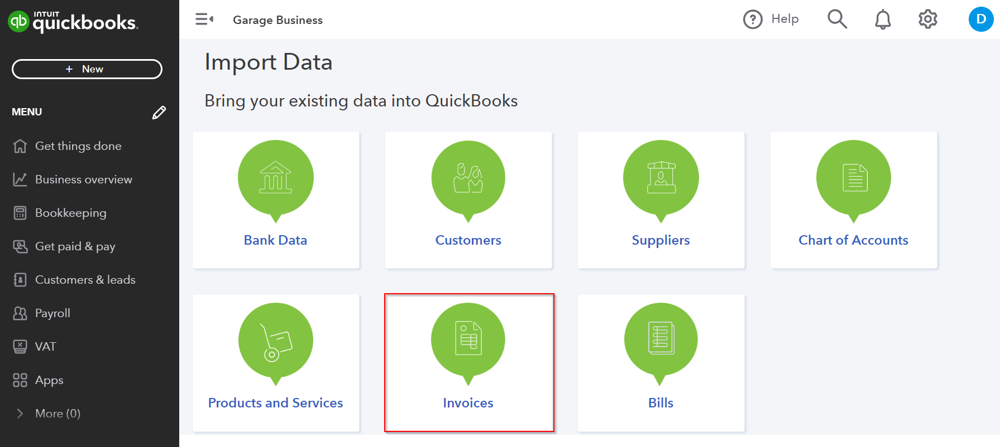

   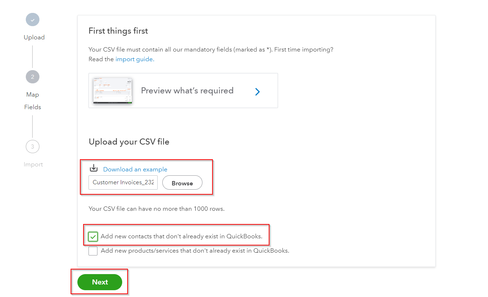

1. Select the date format as **D/M/YYYY** in the **Invoice Date** field, as it is used in Garage Hive. Click **Next**.

   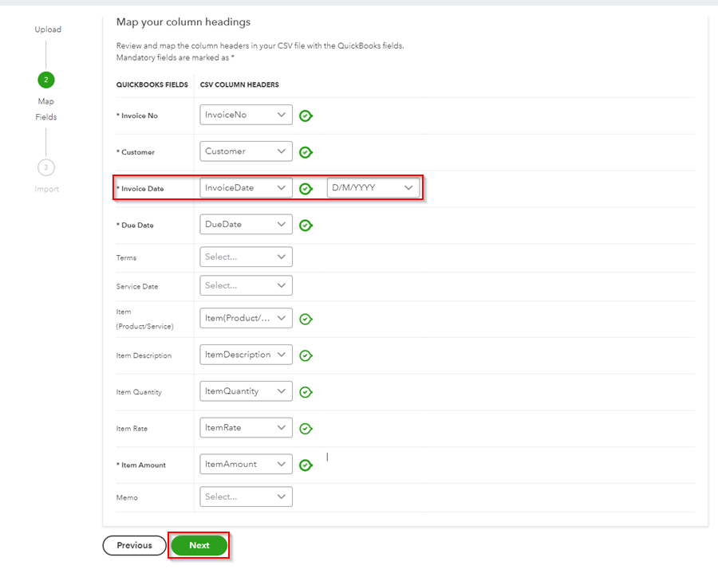

1. You will get a summary of what will be imported. Click on **Start Import**. Your invoices will start import.

   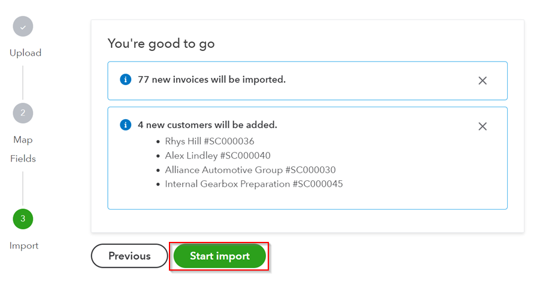

1. Your invoices will start import. Click **OK** when done.

   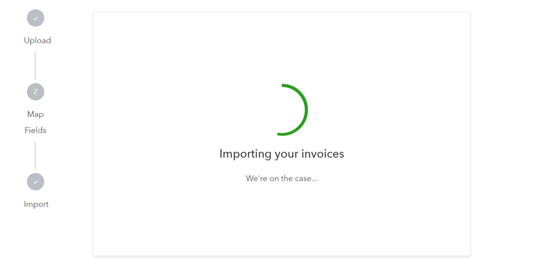

2. Next, start importing **Sales Receipts** which is done via **Bank Data**. Select **Bank Data** in the **Import Data** page.

   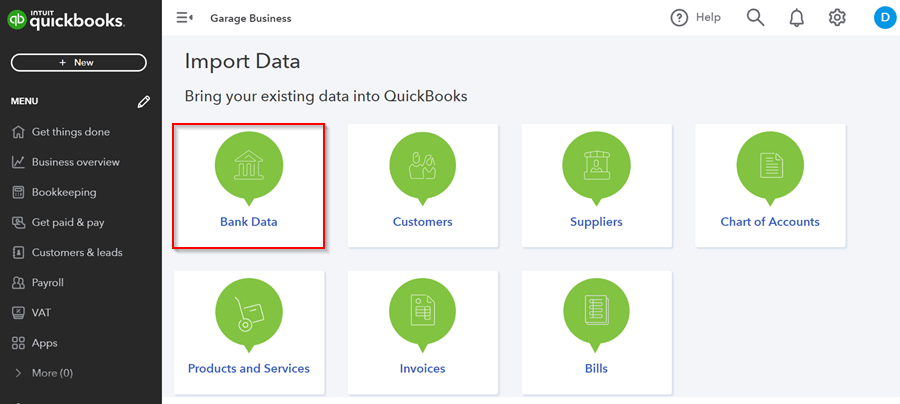

3. In this case you will have to import **Bank Data** for the different files with different payment methods. Each csv file is named with the payment method at the end, for example **Customer BankData_INCASH**.

   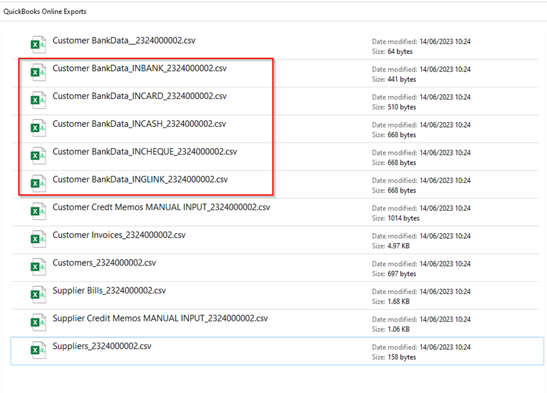

4. Upload each file at a time, you can start with **Customer BankData_INCASH**, under the **Manually Upload Your Transactions** section. Click **Continue**.

   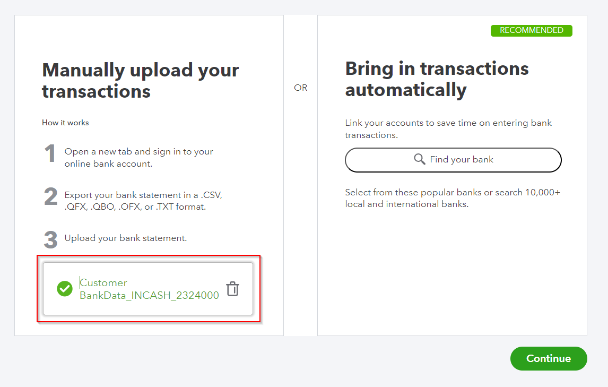

5. Select the **Account** for the transactions, in this case we will select **Cash**. Click **Continue**.

   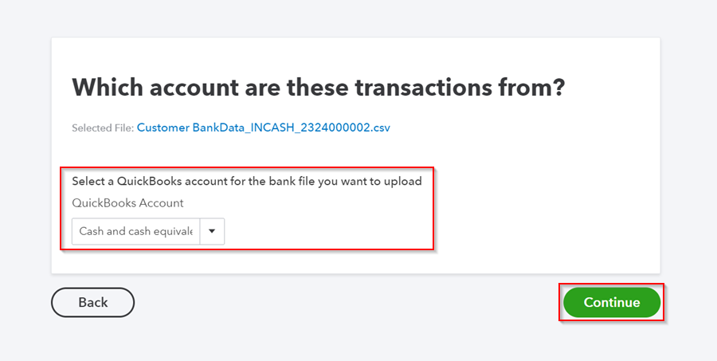

6. Select date format as **dd/mm/yyyy**. Click **Continue**.
   
   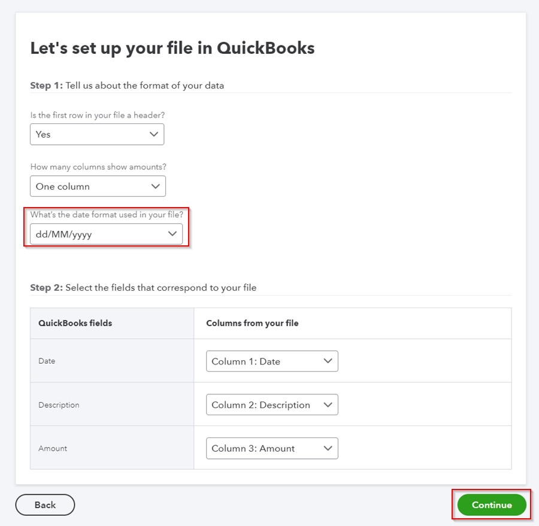

7. Select the transactions you want to add by checking on the checkbox. Click **Continue**.

   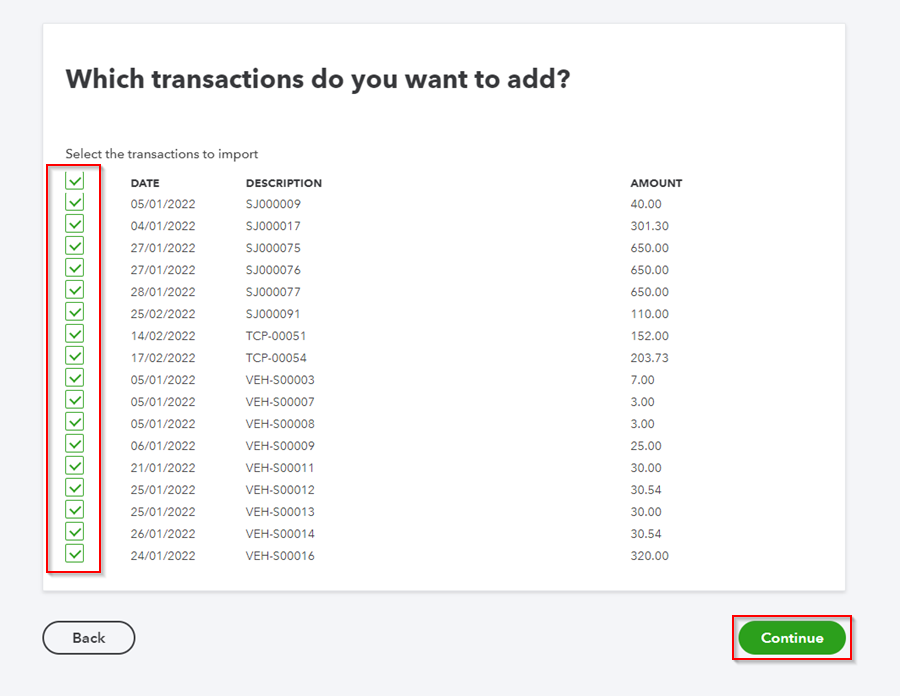

8. In the pop-up notification, click **Yes** to import the transactions. When completed, click **Done**.

   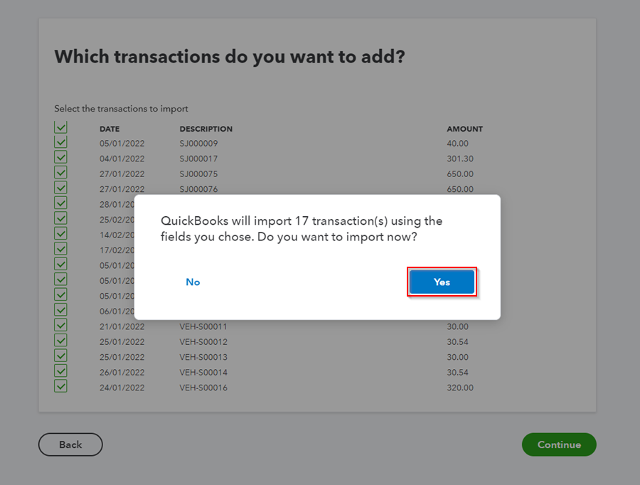

9. Match the transactions in the next page using the actions in the **Action** column, to ensure they are correctly added.

   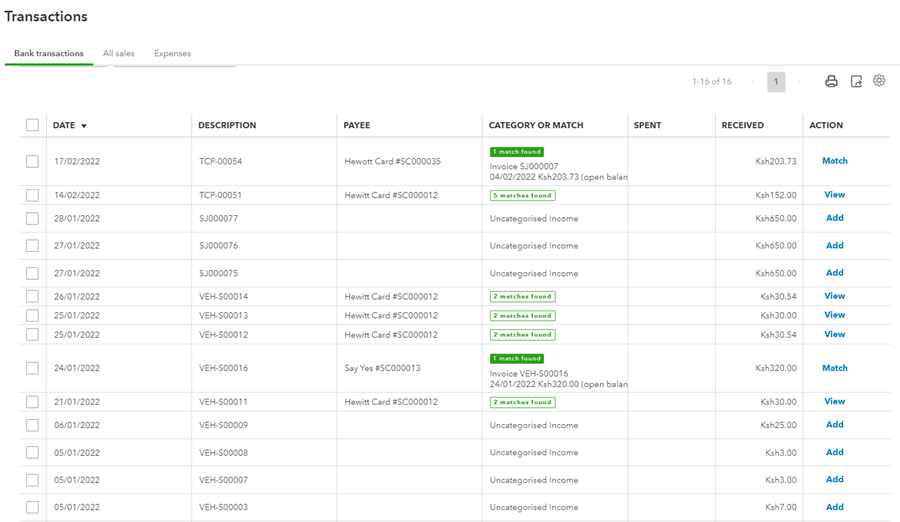

10. Your data has now been imported successfully. If you run into any problems while importing, please contact our support team.
11. Open the **QuickBooks Online Exports** folder on your computer and copy all the imported files to the **Done** folder you created; this ensures that you do not reimport the same files the next time you import files to the **QuickBooks Online** system.

   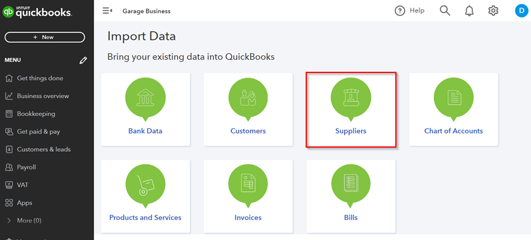

[Go back to top](#top)