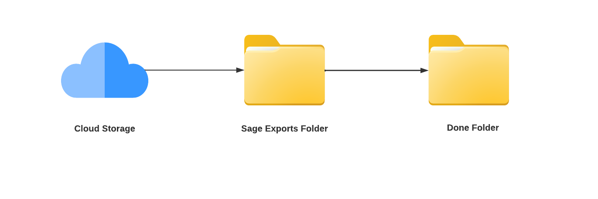
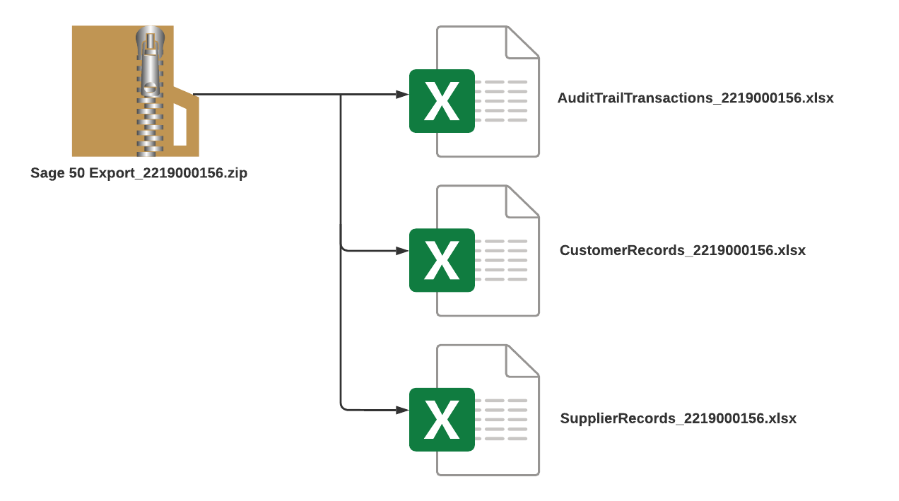
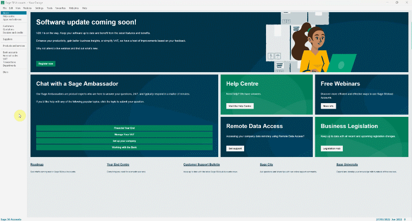
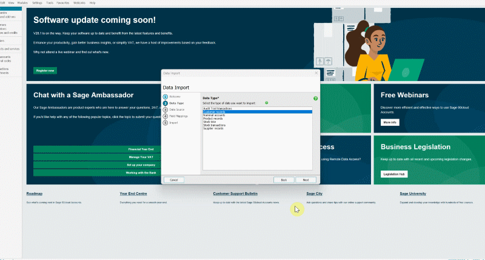
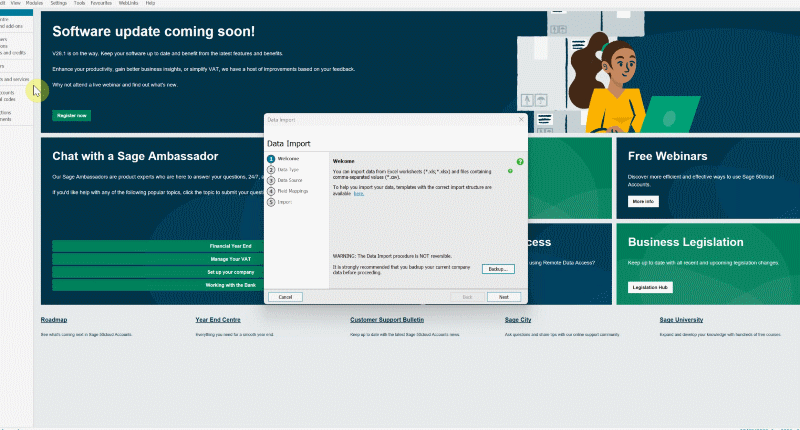

# How to Import Your Exported Data Into Sage 50 Accounts

If you're using **Sage 50 Accounts** as your accounting system, you'll need to import the data you exported from Garage Hive. Here's how to do it:
1. Begin by creating a folder named **Sage Exports** and saving it to a cloud storage service of your choice; this ensures that it will not be lost even if your PC data is lost.
2. Create a new folder within the **Sage Exports** folder, and name it **Done**.

   

3. From the Garage Hive exported zip file ([learn how to export from Garage Hive](garagehive-finance-accountancy-export.html)), right click to **Extract All** and select the **Sage Exports** folder as the destination.

   

4. Now, open the **Sage 50 Accounts** system and select **File**, then **Import**.
5. Before proceeding, **back up** your current company data. This is done to guarantee that if anything goes wrong, you can restore the system to its pre-import status.
6. After the backup, click **Next** and choose the **DataType** that you want to import. You can start with either **Customer Records** or **Supplier Records**. In this case, we'll start with **Customer Records**, thus the **Data Type** will be **Customer Records**.

   

7. Click **Next**, then select the data type to import as **Excel Worksheet** and **Browse** the file from your computer in the **Sage Exports** folder you created. Select the file to import and click **Open**.
8. Click **Next**, and leave the **Field Mappings** as is. Click **Import**.

   

9.  The data will now be imported into your **Sage 50 Accounts** system, click **Close**.
10. Repeat the process for the **Supplier Records**, making sure to choose the **Supplier Records** as the **Data Type**.
11. Lastly, import the **Audit Trail Transactions** and set the **Data Type** to **Audit Trail Transactions**. The **Audit Trail Transactions** are now the real documents for the transactions you've done with the imported customer and supplier records.

   

12. When finished, all data will be captured in your **Sage 50 Accounts** system, just as it is in **Garage Hive**.
13. Open the **Sage Exports** folder on your PC and copy all the imported files to the **Done** folder you created; this ensures that you do not reimport the same files the next time you import files to the **Sage 50 Accounts** system.

 

### **See Also**

[How to Integrate Garage Hive With Your External Accountancy System](garagehive-external-accountancy-integration.html) \
[How to Export to Your External Accountancy System](garagehive-finance-accountancy-export.html) \
[Xero API Integration Setup](xero-api-integration.html)