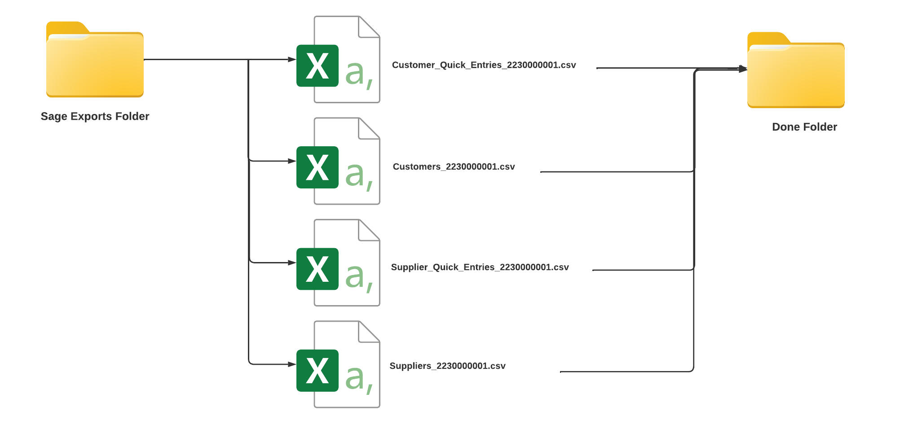

# How to Import Your Exported Data Into Sage Accounting
If you're using **Sage Accounting** as your accounting system, you'll need to import the data you [exported from Garage Hive](garagehive-finance-accountancy-export.html){:target="_blank"} and ensure that your accounting system is [integrated with Garage Hive](garagehive-sage-accounting-integration.html){:target="_blank"}. Here's how to import the data:
1. Begin by creating a folder named **Sage Exports** and saving it to a cloud storage service of your choice; this ensures that it will not be lost even if your PC data is lost.
1. Create a new folder within the **Sage Exports** folder, and name it **Done**.

   

1. From the Garage Hive exported zip file ([learn how to export from Garage Hive](garagehive-finance-accountancy-export.html){:target="_blank"}), right click to **Extract All** and select the **Sage Exports** folder as the destination.

   

1. Open the **Sage Accounting** system and go to the **Contacts** menu, then select **Customers** to start importing the customer list. Hover the mouse pointer over the down arrow next to the **New Customer** option on the **Customers** Page and click **Import Customers**.
1. In the pop-up window, click **Choose File** and go to the **Customers** csv file in the **Sage Export** folder you created, then click **Open**. **Upload** the file.
1. Select **Contacts** once again, and then **Suppliers** to import the supplier. Follow the same procedure as for customers.

   

1. After importing the customer and supplier list, select **Sales** menu then **Quick Entries** to import the customer documents. Hover the mouse pointer over the down arrow next to the **New Quick Entry** option on the **Quick Entries** Page and click **Import Quick Entries**.
1. In the pop-up window, click **Choose File** and go to the **Customers Quick Entries** csv file in the **Sage Export** folder you created, then click **Open**. **Upload** the file.
1. Select **Purchases** this time, and then **Quick Entries** to import the supplier documents. Follow the same procedure as for customers.

   

1. Your data has now been imported successfully. If you run into any problems while importing, please contact our support team.
1. Open the **Sage Exports** folder on your computer and copy all the imported files to the **Done** folder you created; this ensures that you do not reimport the same files the next time you import files to the **Sage Accounting** system.

   

[Go back to top](#top)

 

### **See Also**

[Accountancy System Integrations](garagehive-external-accountancy-integration.html) \
[How to Export to Your External Accountancy System](garagehive-finance-accountancy-export.html)
