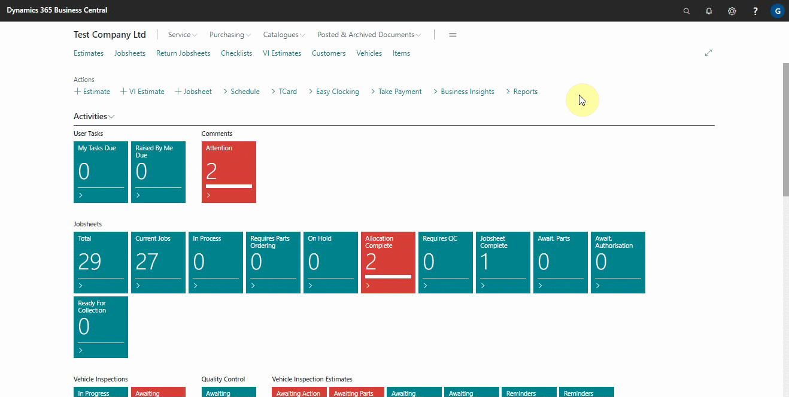
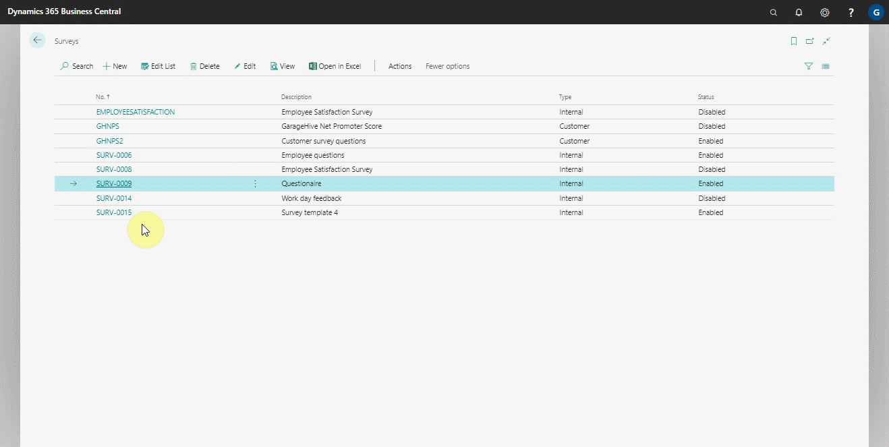

# Importing an Internal Survey

Importing an internal survey is a feature available in the surveys to help you receive a survey file with the extension **stx**. For example, you could import a survey shared from an external consultant.

### To import an internal survey:
1. In the top-right corner, choose the  icon, enter **Surveys**, and choose the related link.
2. From the actions bar, click on **Actions** and select **Import**.

   

3. The import action can also be applied from an open survey. Open the survey and select **Actions**, then **Import**.
4. The import action allows you to select the file with the **stx** extension that you want to import, then click **Open**.

   

5. The system will automatically import the survey number, description, questions, external consultant email address, and **Recurrence Settings** fields.

### Repeat use:
When receiving a survey from an external source for a repeat time, the existing survey will be automatically updated when imported.

  



 

### **See Also**

[Setting up and sending internal surveys](garagehive-setting-up-and-sending-internal-surveys.html) \
[Scheduling recurring internal surveys](garagehive-scheduling-recurring-internal-surveys.html) \
[Reviewing internal surveys](reviewing-internal-surveys.html) \
[How to get started with external consultant survey](garagehive-how-to-get-started-with-external-consultant-survey.html) \
[Exporting an internal survey](garagehive-exporting-an-internal-survey.html)