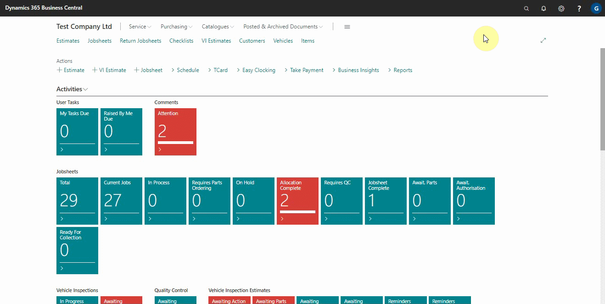
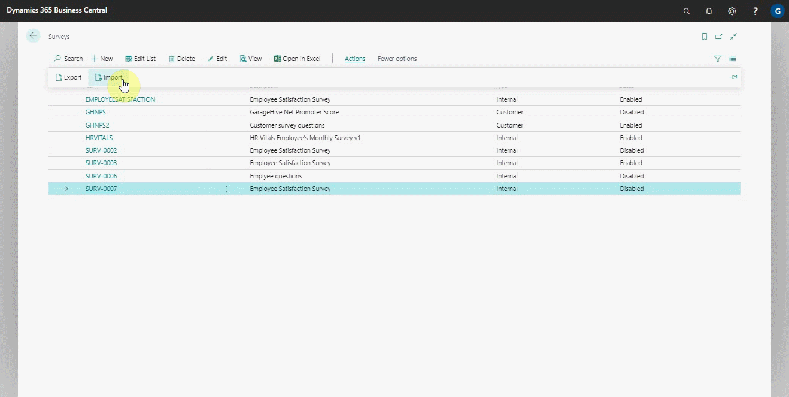
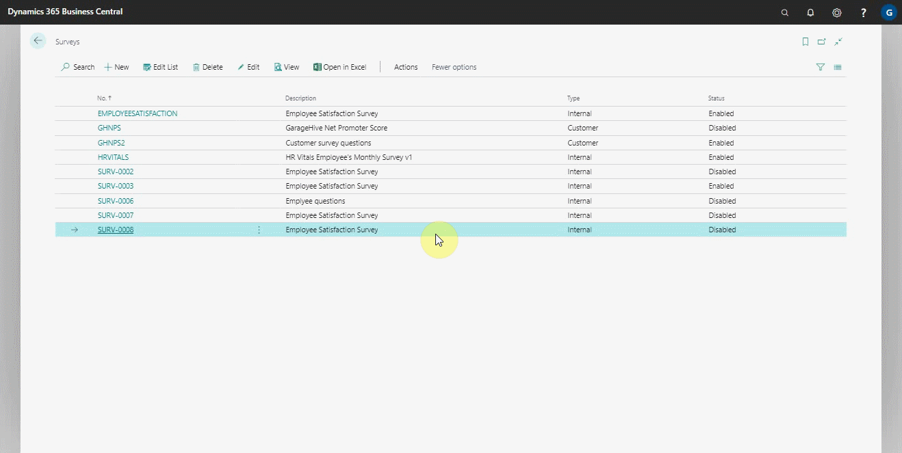

# Importing and Exporting Internal Surveys

Importing and exporting internal surveys is function available in internal surveys to help you receive or share a survey in the from of **stx** format. For example, you could import an a survey shared from an external HR consultant survey.

### To import an internal survey:
1. Search for **Surveys** at the top-right corner, and select it from the results. A list of previously created surveys is displayed.
2. From the actions bar, click on **Actions** and select **Import**.

   

3. The import action allows you to select the **stx** file format that you want to import, then click **OK**.
4. The survey is imported and added to the list in the order of the survey numbering.
5. You have the option of editing the survey or using it as is.

      

### To export an internal survey:
1. Repeat the above steps up to number 2, but this time choose **Export** instead. You must have selected the survey to export from the list. The survey is saved as a **stx** file.

   

 

### **See Also**

[Setting up and sending internal surveys](garagehive-setting-up-and-sending-internal-surveys.html) \
[Scheduling recurring internal surveys](garagehive-scheduling-recurring-internal-surveys.html) \
[Reviewing internal surveys](reviewing-internal-surveys.html) \
[Setting up an external HR consultant survey to answer](setting-up-an-external-hr-consultant-survey-to-answer.html) \
[Importing External Survey Updates](garagehive-importing-external-survey-updates.html)