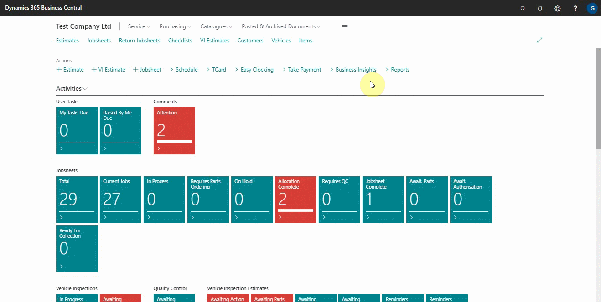
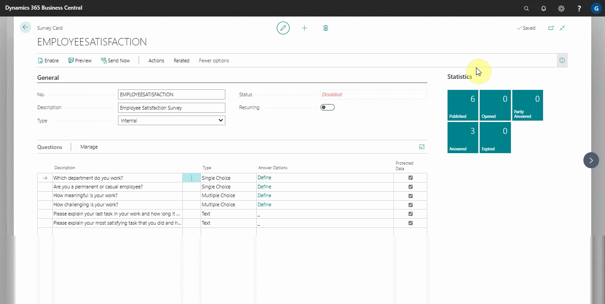
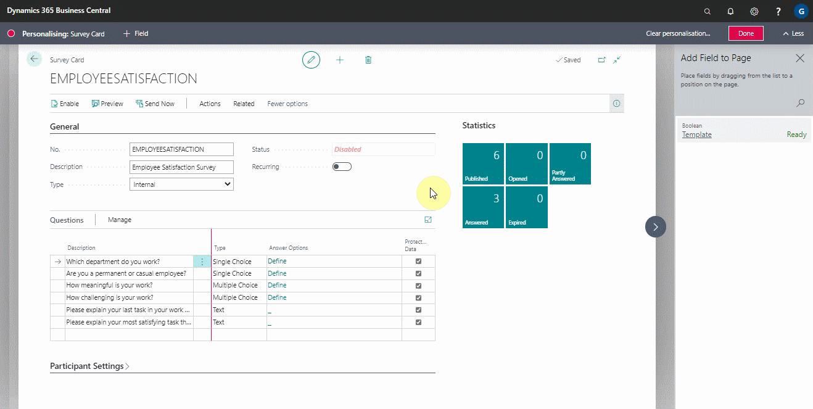

# Importing External Survey Updates

When you have previously imported a survey from an external source, and the external source wants to share some survey changes in the questions, schedule, or general information, the survey can be updated in the system without creating a new one, as long as the survey number remains the same. There are two ways to make use of this feature:

**As a first time user:**
When using this feature for the first time, you must add the **Template** field, which you can do by personalising:
1. In the top-right corner, search for **Surveys** and select it from the results.
2. Choose the survey for which you want to enable the **Template** field.

  

3. In the top-right corner, click the settings icon and then select **Personalise**.
4. To add a field, click the **+Field** button in the top bar that appears.

  

5. From the side panel that appears, click and hold the **Template** Field, then drag and drop it into the **General** FastTab section. Click on **Done**, at the top-right corner.

  

6. With the new **Template** field, you can now activate it by selecting the slider. When it is enabled, it means that the current survey is a template for an external survey and that it can be updated by importing a similar survey into the system rather than creating a new one of the same survey.

 

**As a repeat user:**
As a repeat user, you will have already activated the **Template** field, and all you need to do now is use the feature:
1. Locate and select the survey to be updated. 

  

2. Select **Actions** from the action bar and then **Import** to import the survey. If you can't find the **Actions** option, click **More Options**.

  

3. The survey is updated with the changes after being imported.

> **Note:**
>
> When updating the survey, the participants section remains unchanged.

### **See Also**

[Setting up and sending internal surveys](garagehive-setting-up-and-sending-internal-surveys.html) \
[Scheduling recurring internal surveys](garagehive-scheduling-recurring-internal-surveys.html) \
[Importing and exporting internal surveys](garagehive-importing-and-exporting-internal-surveys.html) \
[Reviewing internal surveys](reviewing-internal-surveys.html) \
[Setting up an external HR consultant survey to answer](setting-up-an-external-hr-consultant-survey-to-answer.html)