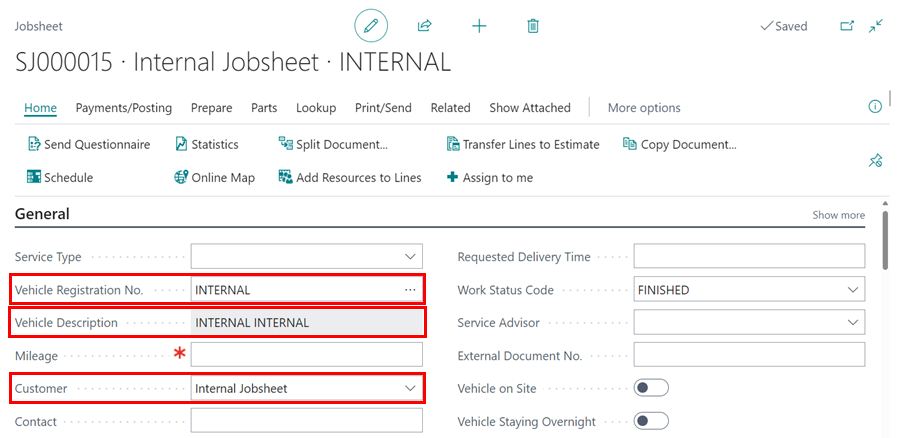
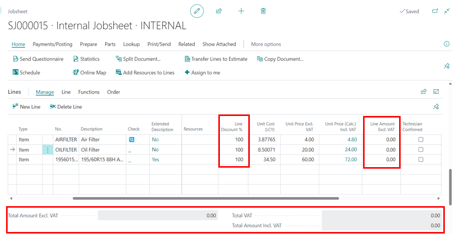

## What it an Internal Jobsheet?

An Internal Jobsheet is used to apply internal costs to a current month. 

Using an Internal Jobsheet is a method of maintaining and controlling your stock levels, in particular for items such as consumables you purchase but wouldn't necessarily sell to customers. Here are some examples of how you can use an Internal Jobsheet

* Maintaining consumable stock
* Items used for workshop maintenance
* Workshop tool write off
* Parts write off (lost or damaged)
* Surcharge write off

## Why is an Internal Jobsheet useful? 

From a business owners perspective, an Internal Jobsheet allows you to monitor consumable usage and any stock shrinkage without staff using Item Journals to adjust stock.  Internal Jobsheets can be done daily, weekly or monthly. It is important to make sure that the Internal Jobsheet is posted in the month it is created, this is because all of the costs of the items on the Jobsheet will apply to that current month. 

## How to Use an Internal Jobsheet

The first time you create an Internal Jobsheet, it is recommended that you create the vehicle registration number "Internal", with the Make and Model "Internal". Then create a customer called "Internal Jobsheet". 

Once this has been setup for the first time, making new Internal Jobsheets require you only to type the registration number "Internal", the rest of the information will automatically populate. 

It's recommended that all of your Internal Jobsheets use the same information, this makes checking the history of your Internal Jobsheets simple. 

Once the Internal Jobsheet has been created, populate the lines with the items you want to write off. You must make sure that the **Unit Price** is blank or the **Line Discount** is 100%.

You can keep the Internal Jobsheet open for as long as you like, this allows you to keep adding items as they are written off. Once you are ready to post the Jobsheet, make sure the total value is 0. The month that the Internal Jobsheet is posted is the month that all of the costs of those items will be applied to.

[Go back to top](#top)

