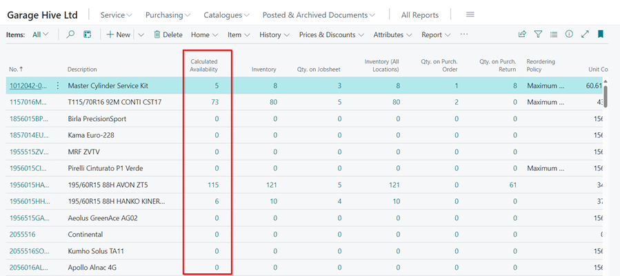

# Inventory Management in Garage Hive
Managing inventory in Garage Hive involves ensuring that item quantities are accurately tracked based on purchases, current stock, and items that have been signed out in documents. This process ensures that there are enough items available to issue out and that document posting is not affected. Here are some ways to manage the inventory:

### 1. Use the Calculated Availability Column in Items List
The **Calculated Availability** column in the items list is a real-time inventory tracking feature to help maintain up-to-date records of item quantities based on the formula: 

  **Calculated Availability** = **Qty. in stock** - **Qty. in Unposted Jobsheets** - **Qty. in Unposted Sales Docs**. + **Qty in Unposted Sales Credit Memo** + **Qty. in Unposted Return Jobs**.
  
This allows for immediate visibility into stock levels, helping to avoid overstocking or stockouts.

   

### 2. Set the Re-order Policies
The re-order policies helps in managing the stock by ensuring that an item is re-ordered when it gets to a certain quantity. This can be set up for each item in the system from the **Item Card**. To learn more, read this article on [Re-ordering Policies and Requistion Worksheet](garagehive-requisition-worksheet-items-to-order.html){:target="_blank"}.

   

### 3. Analyse the Usage Patterns
Utilise the available Garage Hive reports to analyse item usage patterns. This will help in understanding which items are in high demand and which are less frequently used. To access the reports, open the items list, click on the ellipsis(...) from the menu bar, select **Reports**, followed by **Inventory**, and then **Inventory Statistics**. You can also use the PowerBI Reports to analyse the items usage. To learn more about the Power BI Reports, click [here](powerbi.html){:target="_blank"}.

   

### 4. Use Suppliers Integrations
Direct integration with suppliers can significantly improve the efficiency of managing item quantities. Garage Hive allows for seamless integration with suppliers, facilitating quick order placements and ensuring that stock levels are replenished in a timely manner. The supplier integration links are available in the documents under the **Parts** menu in the menu bar.

   

### 5. Do Regular Physical Stock Takes
Regular physical stock takes are crucial in helping verify the accuracy of the system's data, identify possible discrepancies, and adjust records accordingly. To learn more on how to do physical stock take, click [here](garagehive-doing-physical-stock-take.html){:target="_blank"}.

[Go back to top](#top)

