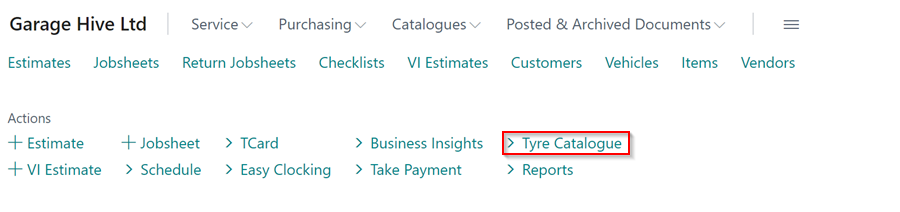
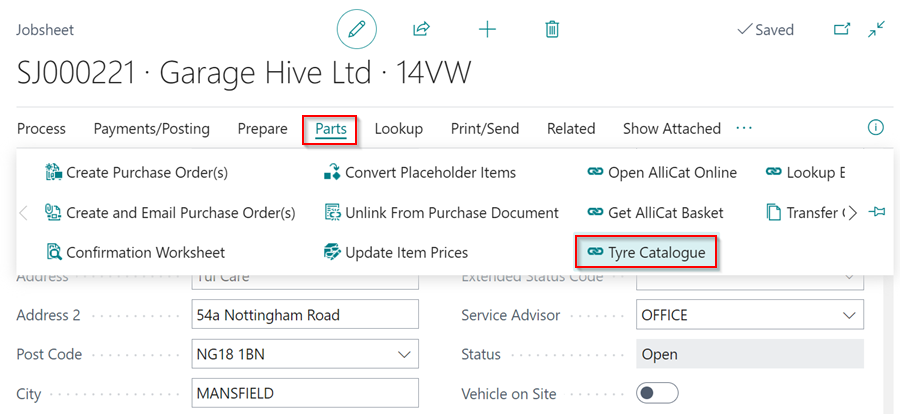
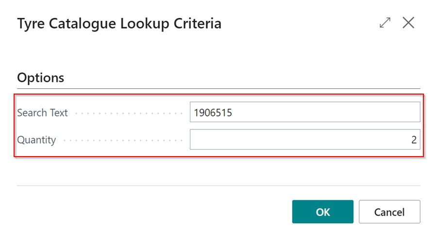
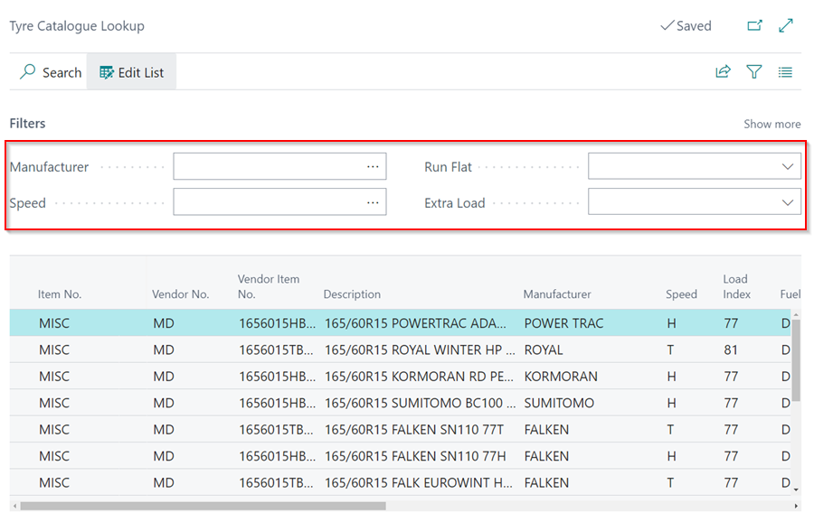
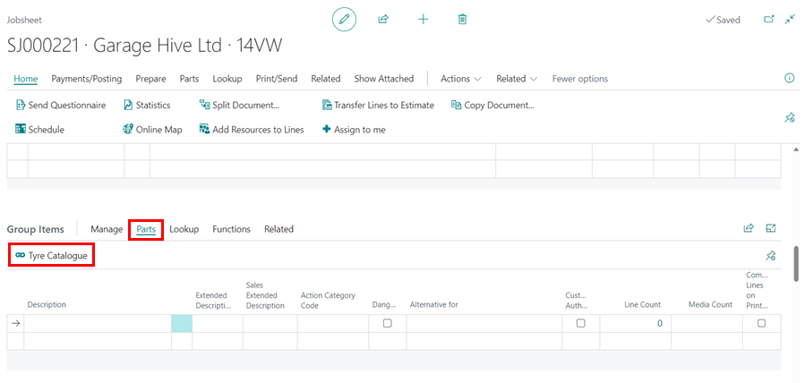
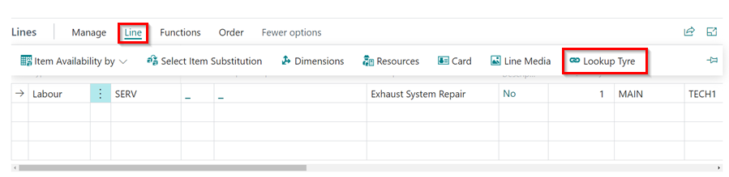

# How to Use Item Lookup and Tyre Lookup Features in Garage Hive

## In this article
1. [Item Lookup](#item-lookup)
2. [Tyre Catalogue Lookup](#tyre-catalogue-lookup)

### Item Lookup

   

The **Item Lookup** feature is found in documents when adding an item or labour in a document. This allows you to search the specific **Item** or **Labour** that you are adding in the document. This is how to use the **Item Lookup**:
1. In the document, select the **Type** of entity that you want, either **Item** or **Labour** then enter a keyword or number in the **No.** field, for example **MOT**. Press the tab or enter key. This opens a window with all the items or labours that have the keyword.

   

2. To open the full list of items or labours available in the system from the document line, select either **Item** or **Labour** and then click on the ellipsis (...) in the **No.** field.

   

[Go back to top](#top)

### Tyre Catalogue Lookup
Tyre Catalogue lookup is used to lookup the available tyres in local inventory/stock, and the Micheldever catalogue/stock. It is available in the **Role Centre**, **Jobsheet**, **Estimate** and the **VI Estimate**. To access the **Tyre Catalogue**:
1. From the Role Centre, select **Tyre Catalogue**.

   

2. From the **Service Documents** (Jobsheet, Estimate or VI Estimate), select **Parts** followed by **Tyre Catalogue**.

   

3. Enter the tyre size in the **Search Text**, for example 1906515, and enter the number of tyres you require in the **Quantity** field. Click, **OK**.

   

4. This opens up the list of tyres available along with their specifications. To narrow your search, use the filters at the top.

   

5. Other places where the tyre catalogue can be accessed in the **Service Documents** (Jobsheet, Estimate or VI Estimate) are:
   * **Group Items**
     - From the Group Items sub-page menu bar, select **Parts** followed by **Tyre Catalogue**.

       

   * **Lines**
     - From the **Lines** sub-page menu bar, select **Line** followed by **Tyre Lookup**. Ensure that an **Item** line is selected.

       

[Go back to top](#top)