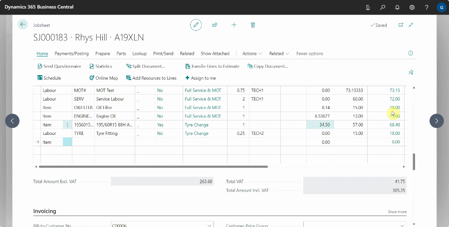

# How to Use Item Lookup and Advance Tyre Lookup Feature in Garage Hive

## In this article
1. [Item Lookup](#item-lookup)
2. [Advance Tyre Lookup](#advance-tyre-lookup)

### Item Lookup

   

The **Item Lookup** feature is found in documents when adding an item or labour in the a document. This allows you to search the specific **Item** or **Labour** that you are adding in the document. This is how to use the **Item Lookup**:
1. In the document, select the **Type** of entity that you want, either **Item** or **Labour** then enter a keyword or number in the **No.** field, for example **MOT**. Press the tab or enter key. This opens a window with all the items or labours that have the keyword.

   

2. To open the full list of items or labours available in the system from the document line, select either **Item** or **Labour** and then click on the ellipsis (...) in the **No.** field.

   

### Advance Tyre Lookup
The **Advanced Tyre Lookup** feature in Garage Hive enables the availability of a list of stock tyres in the system from tyre vendors/suppliers. This allows garages that trade in tyres to look up tyres in the system when they need to buy new tyres for selling.

To use this feature, you should first import a tyre stock file from the supplier, then proceed as follows:

1. To add a tyre to a Jobsheet, open the Jobsheet and choose the line to which the tyre will be added. Enter the tyre size in the format **T1956015**, where **T** is for Tyre, **195** is for tyre cross section width, **60** is for sidewall height, and **15** is for rim diameter. Press the **Tab** key.
2. The **Advanced Tyre Lookup** page will open, displaying a list of all available tyres in the specified size. This excludes any additional **Catalogue Items** added to the system. Select the tyre you need from the list.
3. Click **OK** to add the tyre to the Jobsheet. A tyre item will be created in the system and added to the Jobsheet.

[Go back to top](#top)