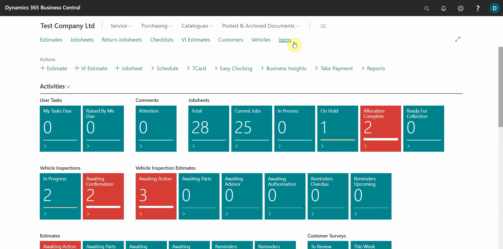
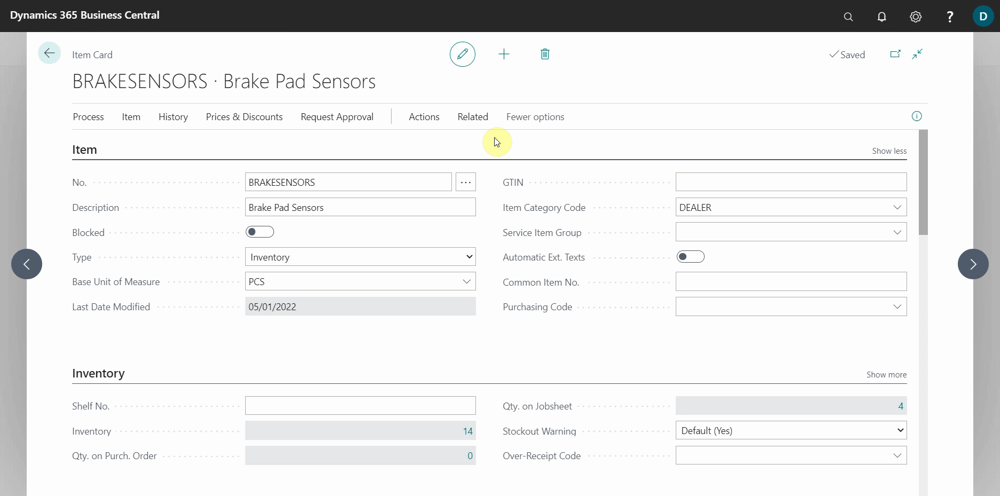
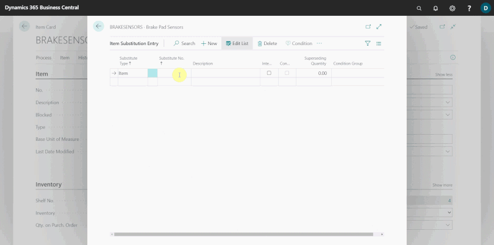
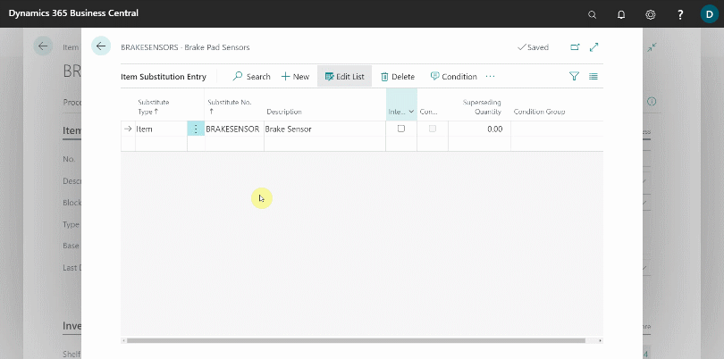
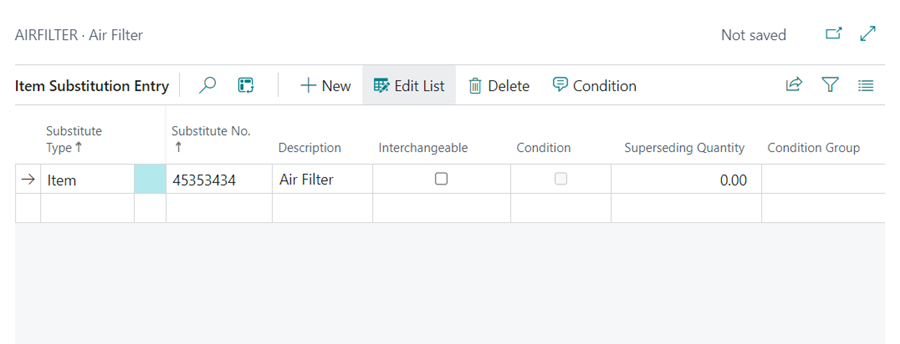
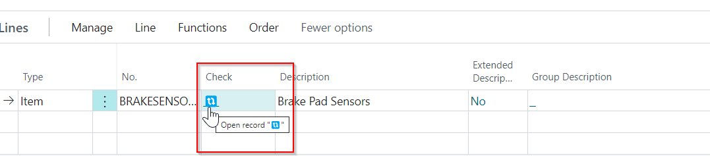
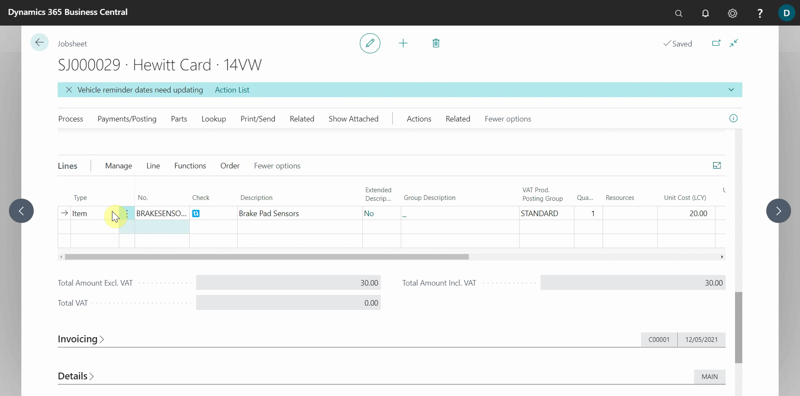

# Item Substitution Management in Garage Hive
**Item Substitution** in Garage Hive is a feature in which an item to be sold can have one or more items used in its place when there is a lack of inventory for the item, unavailability of the item from the vendors, or when the delivery time is taking too long and the item is urgently required and so on. The substitute items are identical items that serve the same purpose as the main item.

## In this article
1. [Setting up item substitution](#setting-up-item-substitution)
2. [Using item substitution](#using-item-substitution)

### Setting up item substitution
To setup **Item Substitution**:
1. In the service advisor role centre, select the **Items** page from the navigation bar, and then choose the item for which you want to add substitutes from the **Items** list page.

   

2. Select **Related** from the actions bar in the **Item** card, followed by **Item** and then **Substitutions**.

   

3. Fill out the **Item Substitution Entry** page with the substitute item(s).

   

4. If the **Substitute** item you are adding can be used Interchangeably with the primary item, select the **Interchangeable** check box.

   

5. If you want to know which items have a substitute, look at the **Substitutes Exist** column in the items list. If the column is not available, you can add it by [personalising](garagehive-personalising-garagehive.html#adding-fields-to-pages) the page.

   

### Using item substitution
To use the substitutes that have been added:
1. When you add an item with a substitute in a service or sales document, you will see a notification in the **Check** column with an icon (🔃) indicating that there is a substitute for the item.

   

2. To open the **Item Substitution Entries** page for the item, click on the icon (🔃). Select the item to use in place of the item in the document and click **OK**. The item in the document will be replaced by the substitute.

   

 

### **See Also**

[Creating a Parts Sales Quote in Garage Hive](garagehive-creating-sales-quote.html) \
[Using Parts Sales Order in Garage Hive](garagehive-using-parts-sales-order.html) \
[Creating a Sales Parts Invoice](garagehive-creating-sales-invoice.html) \
[Using Parts Sales Return Order in Garage Hive](garagehive-using-sales-return-order.html)

