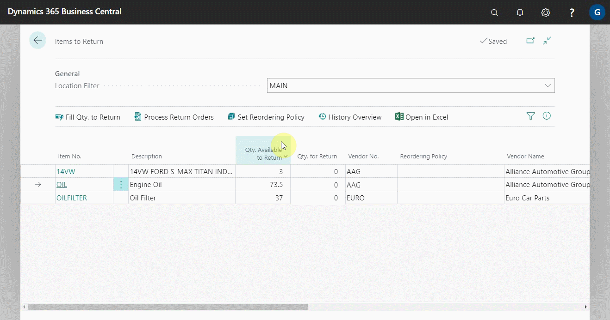
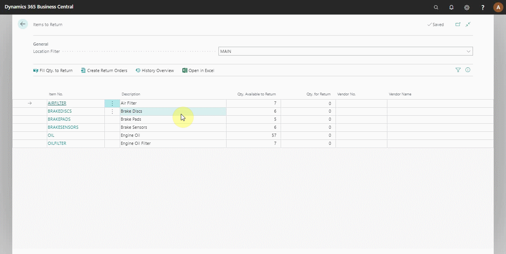
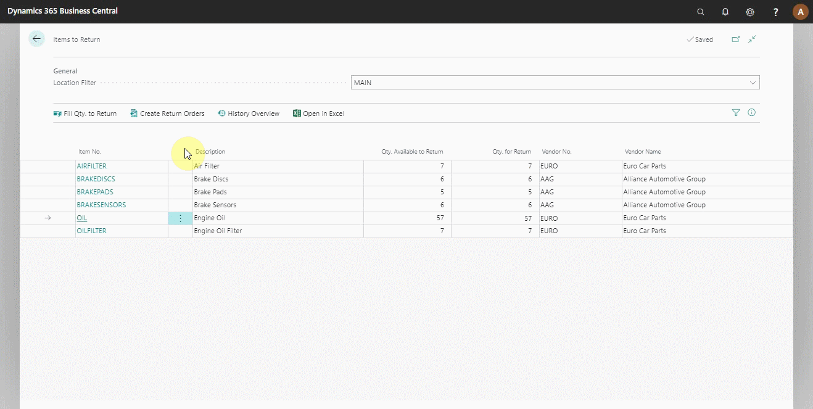

# Items to Return Report 
The Items to Return Report allows you to keep track of which parts are in stock and need to be returned based on the criteria listed below:
- The item is not in a jobsheet
- The item is not on a Purchase Return Order
- The item doesn’t have any reorder policy

This report regularly ensures that parts are returned and not lost or thrown away, resulting in reduced loss of revenue. To open the report:

1. From the home screen actions bar, click on **Reports**.
2. Select **Additional** and from the list of the submenus, select **Items to Return** to open the report.

    

    

3. You can now select the items to return by adding the quantity in **Qty. For Return** column and the respective **Vendor No.** or **Vendor Name** column.

    

4. Or, you can click on **Fill Qty. to Return** from the actions bar to add all items in the report in the column **Qty. For Return**. 
5. If not already added automatically from the item card, enter the vendor details in the **Vendor No.** or **Vendor Name** column.

    

6. After you've added the items you want to return, go to the actions bar and select **Process Return Orders**. You can **Create New Return Order** from the **Items to Return Vendor Actions** page, or you can add to Existing Return Order by clicking on the **Alternative Action** **Add to Existing Return Order**. Click **OK** to create the Purchase Return Order(s).

    

7. You can as well view the history of an item in the report. Click on **History Overview** from the actions bar.

### **See Also**

[Video: How to use items to return](https://www.youtube.com/watch?v=WH-hKLISWds)

