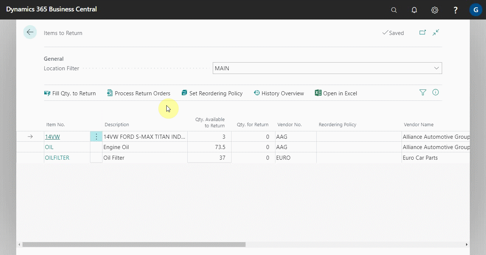
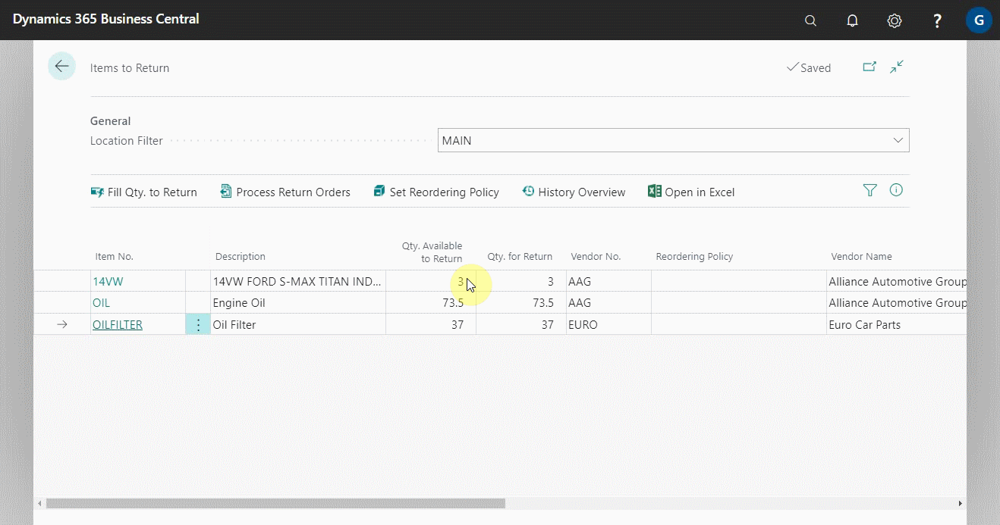

# Items to Return Report 
The Items to Return Report helps you monitor what parts you have in stock based on the following criteria:
- The item is not in a jobsheet
- The item is not on a Purchase Return Order
- The item doesn’t have any reorder policy

This report regularly ensures that parts are returned and not lost or thrown away, resulting in reduced loss of revenue.

1. From the home screen actions bar, click on **Reports**
2. Select **Additional** and from the list of the submenus, select **Items to Return** to open the report.

> **Note:**
>
> Based on the criteria stated above, the report opens a list of suggested items that you shouldn't have in stock. 

3. You can now select the items to return by adding the quantity in **Qty. For Return** column and the respective **Vendor No.** or **Vendor Name** column.

4. Or, you can click on **Fill Qty. For Return** from the actions bar to add all items in the report in the column **Qty. For Return**. 
5. Add the vendor details in the **Vendor No.** or **Vendor Name** column.

6. After selecting the items to return, click on **Create Return Orders** from the actions bar to create purchase return orders for the respective vendors. 

7. You can as well view the history of an item in the report. Click on **History Overview** from the actions bar.

### **See Also**

[Video: How to use items to return](https://www.youtube.com/watch?v=WH-hKLISWds)

