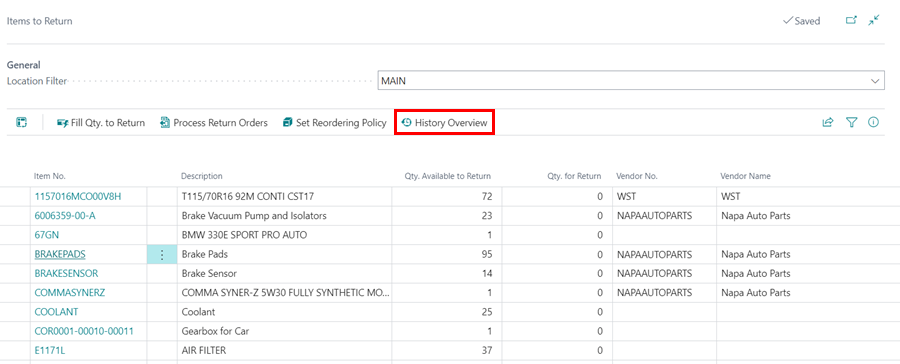

#   Items to Return Report 

The Items to Return Report helps you monitor what parts you have in stock, which are not on a jobsheet or Purchase Return Orders. 

Using this report regularly ensures that parts are returned and not lost or thrown away resulting in reduced lost revenue. 

*   In the home screen within the Actions Bar. 
    -   Select Reports 
    -   Select Additional 
    -   Select Items to Return 

The report will show you the cost price of the parts needing to be returned. 

You can also see the date a part was purchased by pressing the number within the Inventory column.  

This will open the Item Ledger Entries, showing all movement of the specific part. 

