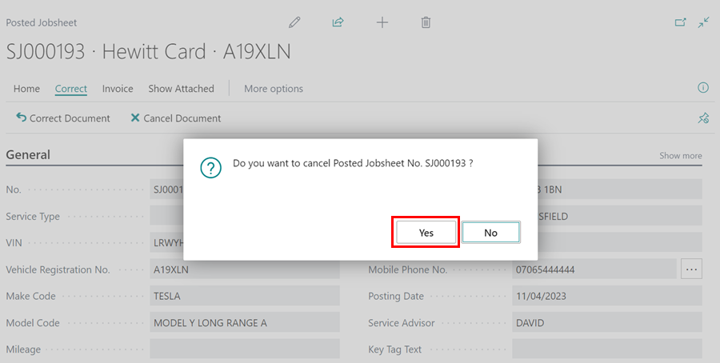

# Cancelling and Correcting a Posted Jobsheet 
When you post a Jobsheet with incorrect information, such as wrong item or labour allocation or incorrect payment method selection, the Garage Hive system has the option of having it cancelled or corrected with the available **Cancel** and **Correct** functions.

## In this article
1. [Cancelling a Jobsheet](#cancelling-a-jobsheet)
2. [Correcting a Jobsheet](#correcting-a-jobsheet)
 
### Cancelling a Jobsheet
The **Cancel** feature allows you to cancel an existing posted Jobsheet, including those that were posted in error. Follow these steps to cancel a Jobsheet:
1. Select the **Posted & Archived Documents** from the role centre, and choose **Posted Jobsheets**.

   

2. Within the **Posted Jobsheets** page, **Search** for the Jobsheet to cancel or select from the list. 

   

3. To cancel a Jobsheet, open it and select **Correct** from the menu bar, then **Cancel Document**.

   

4. When prompted to confirm whether you want to cancel the Jobsheet, select **Yes**.

   

5. If the **Mileage** is zero, you'll receive a notification asking if you want to continue; select **Yes**. Another notification will appear if the posting date differs from the work date; select **Yes**.

   

6. The Jobsheet will now be successfully cancelled.

[Go back to top](#top)

### Correcting a Jobsheet
The **Correct** feature is used to modify a posted Jobsheet and enter the correct data. Follow these steps to correct a Jobsheet:
1. Select the **Posted & Archived Documents** from the role centre, and choose **Posted Jobsheets**.

   

2. Within the **Posted Jobsheets** page, **Search** for the Jobsheet to cancel or select from the list. 

   

3. To correct a Jobsheet, open it and select **Correct** from the menu bar, followed by **Correct Document** from the drop-down menu.

   

4. You'll see a notification confirming that the **Posted Jobsheet** will be cancelled and a new version of the Jobsheet will be created for you to make the correction; select **Yes**.

   

5. The mileage is zero notification will appear, along with posting and work date notification; select **Yes** for both.

   

6. A credit memo will be generated, as well as a new Jobsheet that will be opened. The posted Jobsheet will now be indicated as **Cancelled**.

   

7.  Fill in the details on the newly created Jobsheet with the correct information, including the payment method if it was entered incorrectly, and then post it when ready. 

[Go back to top](#top)

## See Also

[Video - How to Cancel/Correct a Posted Jobsheet in Garage Hive](https://youtu.be/4H50FX9LCPw){:target="_blank"}