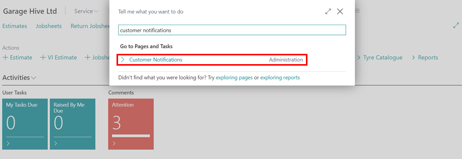
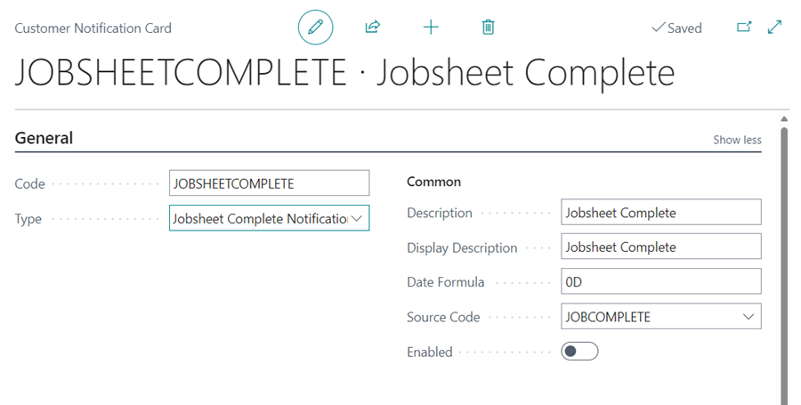
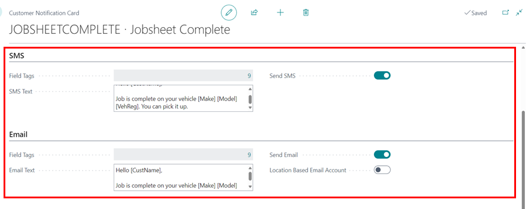
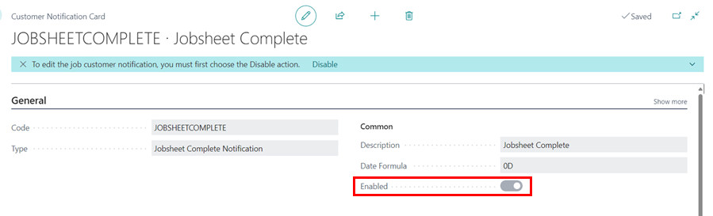
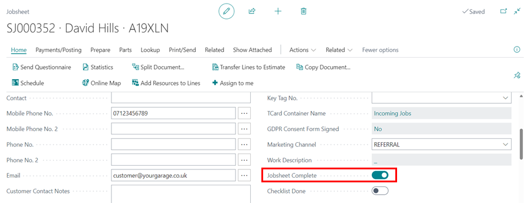

# How to Set Up Jobsheet Complete Notification
The **Jobsheet Complete Notification** is sent to the customer when the **Jobsheet Complete** slider is enabled within the Jobsheet, provided the setup is available in the system. To setup the Jobsheet Complete Notification:
1. In the top right corner, choose the  icon, enter **Customer Notifications**, and select the related link.

   

1. To create a new notification, click on **+New** on the **Customer Notifications** list page.
1. From the **General** FastTab, assign a code to the customer notification, in this case we'll assign it as **JOBSHEETCOMPLETE**. Select the **Type** as **Jobsheet Complete Notification**.
1. Add the **Description** field as well, which also populates the **Display Description** field but can be changed. **Display Description** is what the customer sees when when the notification is sent.
1. In the field **Date Formula**, enter the number of days (D), weeks (W), or months (M) that the notification should be sent from the system after the Jobsheet is marked as complete. In this case we'll add **0D**.
1. Select the **Source Code** as **JOBCOMPLETE**.

   

1. After setting up the details above, create the message that will be sent to the customer. You can either send a message via the email or the SMS or both. There are two sections to set up the messages for SMS and email. 
1. In each section, there is a field called **Field Tags** that defines the specific tags to use in the message template, so that the tagged field is automatically added to the text based on the service document selected. Some examples are as follows:
   - [CustName] - When included in the message template, the Customer’s Name from the service document is automatically added in the message.
   - [VehReg] - When included in the message template, the Vehicle Registration No. from the service document is automatically added in the message.
   - [Make] - When included in the message template, the Vehicle Make from the service document is automatically added in the message.
   - [Model] - When included in the message template, the Vehicle Model from the service document is automatically added in the message.
   - [BookingDate] - When included in the message template, the Booking Date from the service document is automatically added in the message.
1. Create a message in the **SMS Text** and **Email Text** fields, then enable the **Send SMS** and/or **Send Email** sliders.

   

1. To activate the setup in the system, turn the **Enabled** slider to the right.

   

1. The customer will now receive this notification whenever the **Jobsheet Complete** slider within the Jobsheet is activated.

   

[Go back to top](#top)
