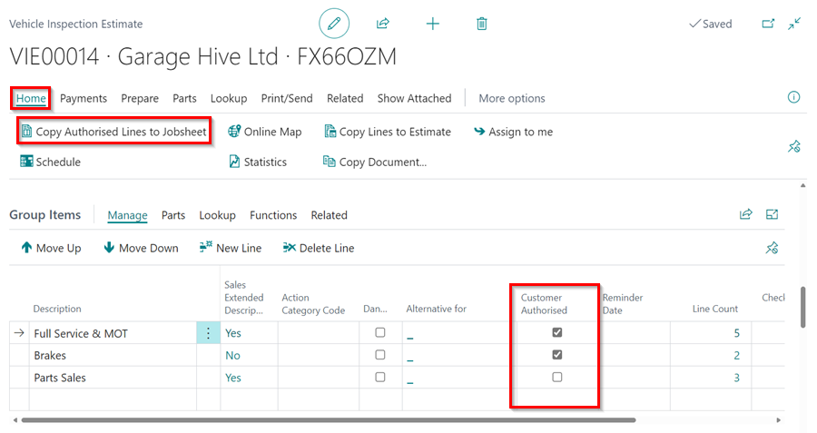
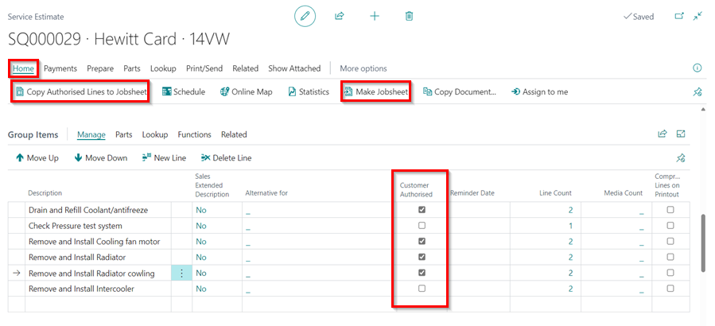
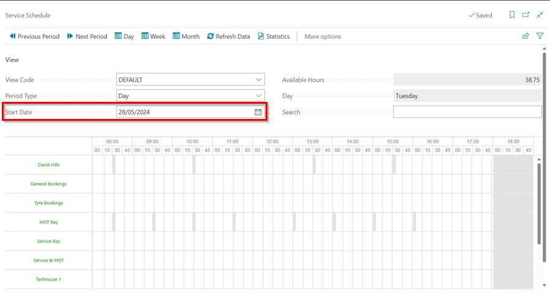
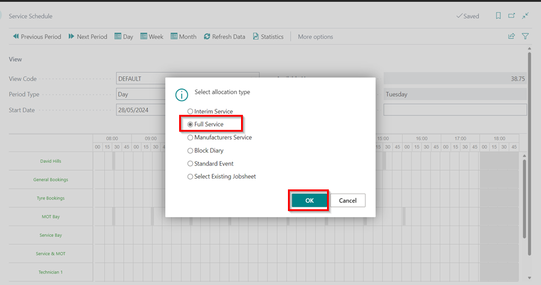
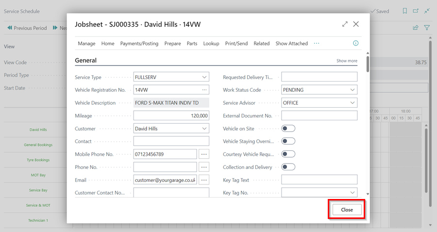
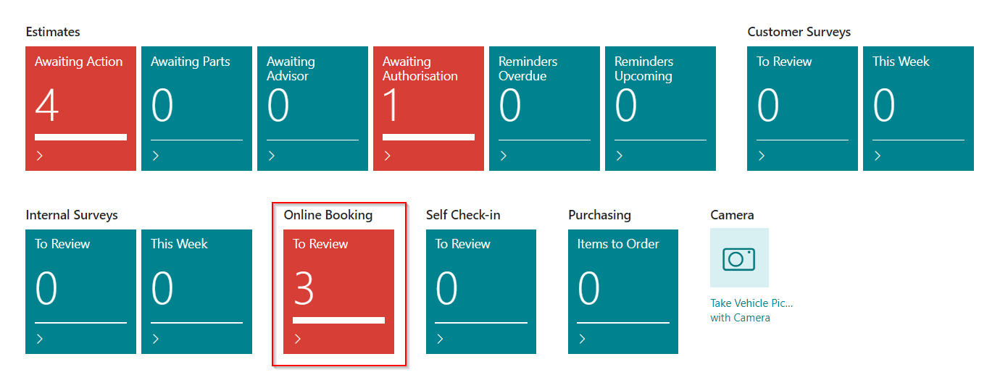

# Creating a New Jobsheet From Various Places in Garage Hive

A Jobsheet can be created from various places in Garage Hive:

1. [From a VIE](#creating-jobsheet-from-vehicle-inspection-estimate)
2. [From an Estimate](#creating-a-jobsheet-from-an-estimate)
3. [From the schedule](#creating-a-jobsheet-from-the-schedule)
4. [From Online booking](#creating-a-jobsheet-from-online-booking)

Let's look at how to make a Jobsheet from the places listed above:

### Creating Jobsheet from Vehicle Inspection Estimate
When creating a VIE for a customer, the **Customer Authorised** lines can be used to generate a Jobsheet. This makes it simpler to convert an estimate directly into a Jobsheet. To make a Jobsheet from a VIE:
1. Select **Home** and then **Copy Authorised Lines to Jobsheet** from the menu bar. You have the option of creating a new Jobsheet or selecting an existing one.

   

### Creating a Jobsheet from an Estimate
When a customer requests a quotation prior to bringing the vehicle on site, the quotation you create can be converted to a Jobsheet once the customer approves and brings the vehicle on site.
1. From the estimate, click **Home**, and then select **Copy Authorised Lines to Jobsheet** or **Make Jobsheet** to generate a Jobsheet.

   

### Creating a Jobsheet from the Schedule
When booking directly from the schedule, you can also create a Jobsheet from there:
1. Open the **Schedule** and choose the **Start Date** for the booking. 

   

2. Click and drag along the **Service** bay or any other work bay to make a booking, then select an allocation and click **OK** to create a Jobsheet. 

   

3. Enter the vehicle and customer details, and click **Close**.

   

4. For the Technician resource, you can only choose an existing Jobsheet.

### Creating a Jobsheet from Online Booking
When customers book online, the bookings are directly reflected in the system from the Role Centre, where a Jobsheet is created.

   

[Go back to top](#top)

### **See Also**

[Video: How to schedule a booking in Garage Hive](https://www.youtube.com/watch?v=4bic2AH6Lrw){:target="_blank"} \
[Creating a Vehicle Inspection Estimate](garagehive-VHC.html){:target="_blank"} \
[Creating a Booking From the Schedule](garagehive-create-a-booking.html){:target="_blank"} \
[Creating an estimate](garagehive-create-an-estimate.html){:target="_blank"}