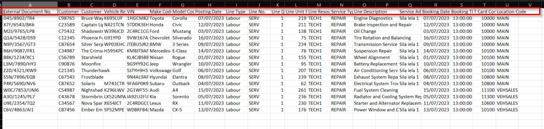

# We are still working on this article!
We are currently reviewing this article before it is published, check back later.

# How to Manually Import Jobsheets from External System
If you need to import data from another system and continue working on it from Garage Hive, you can do so by manually importing the data to Garage Hive. Here's how it's done:

1. In the top-right corner, choose the  icon, enter **Import Jobsheets** and select the related link.

   

2. Click **Download Template** to download the csv file into which you will manually enter the data.

   

3. Enter the data in the format specified in the csv file template. To avoid document duplication in the system, ensure that the column **External Document No.** is filled in. When you're finished, save the file.

   

4. Return to Garage Hive, choose the  icon, enter **Import Jobsheets** and select the related link. Click on **Upload File**.

   

5. Select the csv file you saved on your computer, and click **OK**.

   

6. The Jobsheets will be imported with the data added, and you can continue editing in Garage Hive.

   

7. You can find all the imported Jobsheets in the **Jobsheets List**.

   



[Go back to top](#top)
