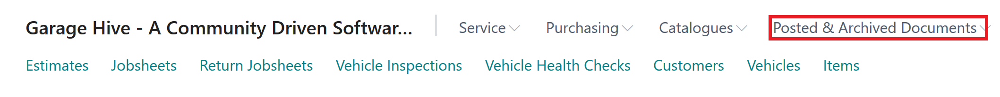

#   Cancelling a Jobsheet and Reopening for Incorrect Payment Method. 



When a job has been invoiced and the incorrect payment method has been selected. 

Please follow these steps on how to reopen the jobsheet and correct. 

# Cancelling a Jobsheet and Reopening for Incorrect Payment Method. 

1. Find incorrect jobsheet and take a note of the number. 

2.  Within the home screen select Posted & Archived Documents. 

3.  Select Posted Jobsheet. 

4.  Search for the relevant job, using the jobsheet number, registration number or customer name etc. 

5.  Select Process and then Cancel Document at the top of the page. 

6.  Go back to the home screen. 

7.  Select Jobsheets and + New

8.  Select relevant Service Type within the jobsheet. 

9.  Select Process followed by Copy Document. 

11.  In Document Type selected Posted Order. 

12. In Document No. input the original jobsheet number and select the "Include Header" box. 

14. Select OK. 

15. Select Payment/Posting followed by Take Payment.

16. You can now correct the payment method. 

17. Once you have corrected the payment method, you can now repost this document. 

## THIS CAN ONLY BE DONE THIS WAY IF NOTICED ON THE DAY THE MISTAKE WAS MADE. UNLESS THE POSTING RESTRICTIONS ARE REMOVED. 