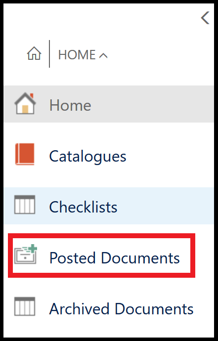

When a job has been invoiced and the incorrect payment method has been selected. 

Please follow these steps on how to reopen the jobsheet and correct. 

# Cancelling a Jobsheet and Reopening for Incorrect Payment Method. 

1. Find incorrect jobsheet and take a note of the number. 

2.  Select Posted Documents in the Home Screen. 

3.  Search for posted jobsheet and open. 

4.  Select Cancel Document at the top of the page. 

5.  Go back to the home screen. 

6.  Select Jobsheets. 

7.  Select Service Type within the jobsheet. 

8.  Select Actions tab on the top of the page. 

9.  Choose Copy Document. 

10.  In Document Type selected Posted Order. 

11. In Document No. input the original jobsheet number. 

12. Place a tick in the "Include Header" box. 

13. Select OK. 

14. Select Home tab on the top of the page.

15. You can now go into Take Payment and correct the payment method. 

### THIS CAN ONLY BE DONE THIS WAY IF NOTICED ON THE DAY THE MISTAKE WAS MADE. UNLESS THE POSTING RESTRICTIONS ARE REMOVED. 