

When a Jobsheet is completed, it should now be posted in order to update the relevant accounts in the system. To do so, you must understand how to take payment on a Jobsheet, update the Jobsheet lines, and then post the Jobsheet.

## In this article
1. [Adding resources to labour lines in a Jobsheet](#adding-resources-to-labour-lines-in-a-jobsheet)
3. [Updating the items numbers and quantities](#updating-the-items-numbers-and-quantities)
4. [Taking a payment in a Jobsheet and posting it](#taking-a-payment-in-a-jobsheet-and-posting-it)
5. [Post the Jobsheet without taking the payment](#post-the-jobsheet-without-taking-the-payment)

### Adding Resources to Labour Lines in a Jobsheet
Before posting the jobsheet, all labour lines must-have resource information added to them. There are several ways this can be done:
1. If the Technician uses the Technician **Confirmed** button on their device, the resources column will be pre-populated.

    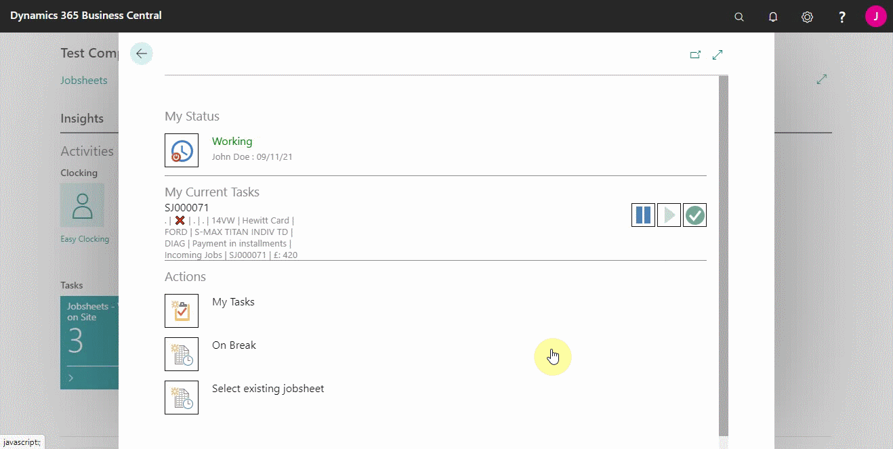

2. If a front-of-house staff member is familiar with the Technician's **Resource No.**, they can add this directly to the labour line and then press the **Tab** key to assign 100% of that labour line to that specific Technician.

    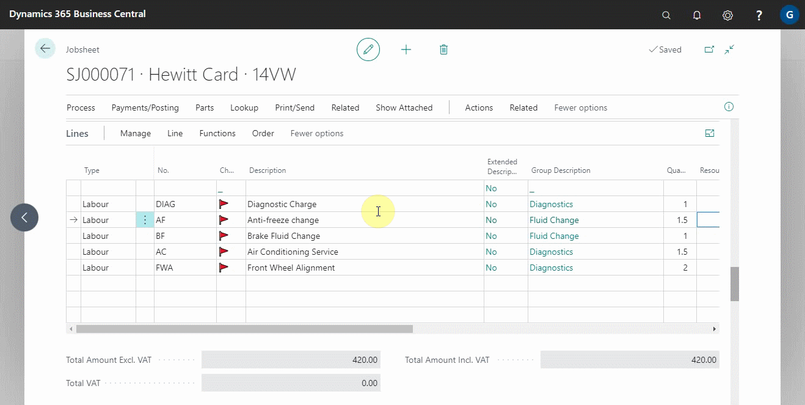  

3. If multiple technicians are working on the job or there are multiple labour lines upon which a sole technician has clocked onto a job, you can select **Process** followed by A**dd Resources to Lines**. This will either split the total time spent between multiple technicians on all lines, or it will add 100% to all labour lines for one specific technician. 

    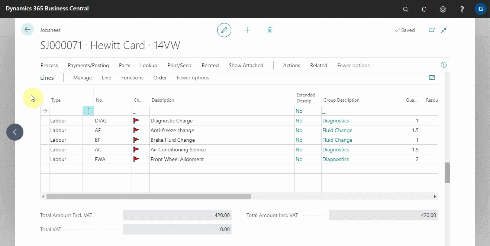

4. If you post the jobsheet without adding the resources, you will be prompted to do so automatically before posting.

    

[Go back to top](#top)

### Updating the Items Numbers and Quantities
1. All item numbers must be updated from the **Placeholder Item**, such as **MISC, to their actual item numbers. Ensure that the quantities and prices of the items remain unchanged.

    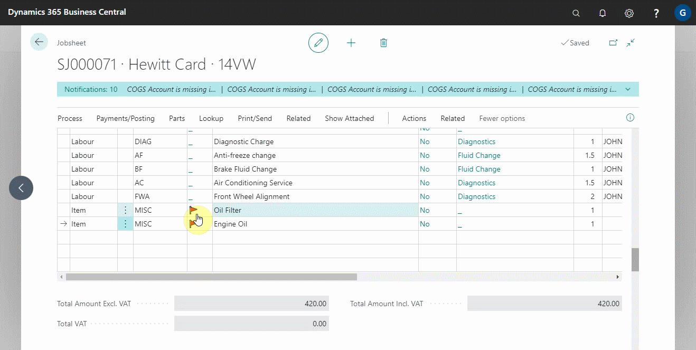

    - If all part numbers with **Placeholder Item** have not been updated/added to the jobsheet, the following error message will be displayed:

        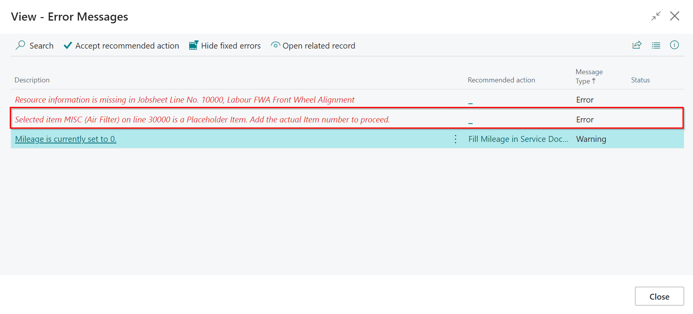

2. All parts need to be bought into stock. If all parts have not been accepted into stock using a purchase order, you will get an error message: 

    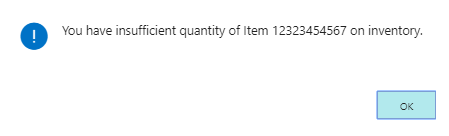

[Go back to top](#top)

### Taking a Payment in a Jobsheet and Posting It
Once the job is finished and the financial details are correct, you have two options. You can either take payment from the customer and post the Jobsheet, or you can [add payment terms](#post-the-jobsheet-without-taking-the-payment) to the Jobsheet and then post it. To take payment from the Jobsheet:
1. Select **Payments/Posting** from the Jobsheet's menu bar, then **Take Payment**.

    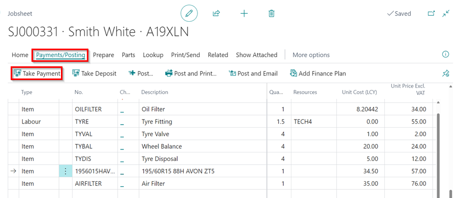

2. Enter the amount paid in the payment method row corresponding to the customer's chosen payment method. If the customer is paying by card, select **Pay by Card Terminal** from the menu bar. If they are using Humm Financing, select **Request Humm Financing** from the menu bar. For payments made through GarageLink, select **Pay by Garage Link** from the menu bar.

    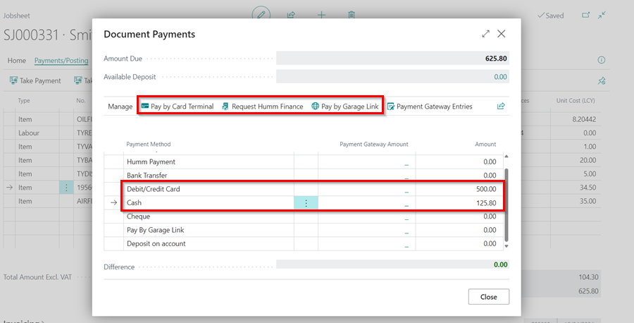

3. When multiple card terminals are available for the location, a notification will prompt you to select the card terminal that the customer is using.

   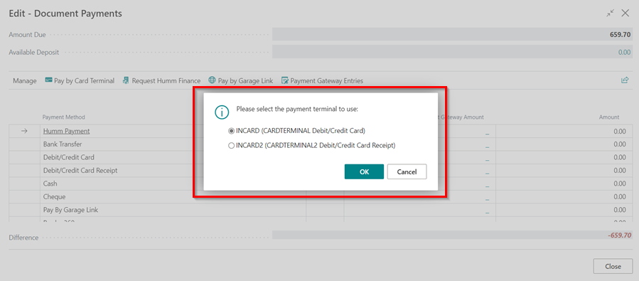

4. You can view other payments that have been applied in the document by selecting **Payment Gateway Entries** action, in the **Document Payments** window.

    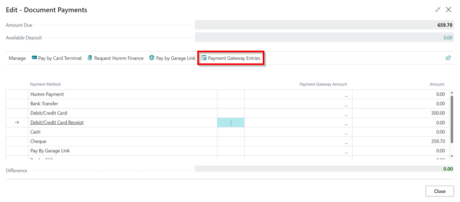

5. Close the **Take Payment** page, and select the **Post** under the **Payment/Posting** menu.

   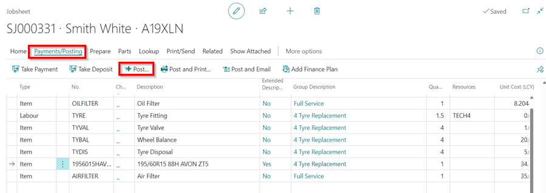

[Go back to top](#top)

### Post the Jobsheet Without Taking the Payment
1. Scroll down to the **Invoicing** FastTab and enter the customer's **Payment Terms Code**, such as **10 days from invoice (10D)**.

   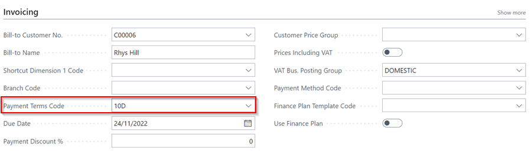

2. Then from the menu bar, select **Payment/Posting**, then you can select either of the following options:
  * **Post** - Post/invoice this jobsheet without the option of printing or emailing it.
  * **Post and Print** - Post/invoice this jobsheet and print a copy of the invoice.
  * **Post and Email** - Post/invoice this jobsheet and email a copy of the invoice to the **Bill-To Customer**.

Click **Yes** on the pop-up notification of *do you want to post the Jobsheet?*.

   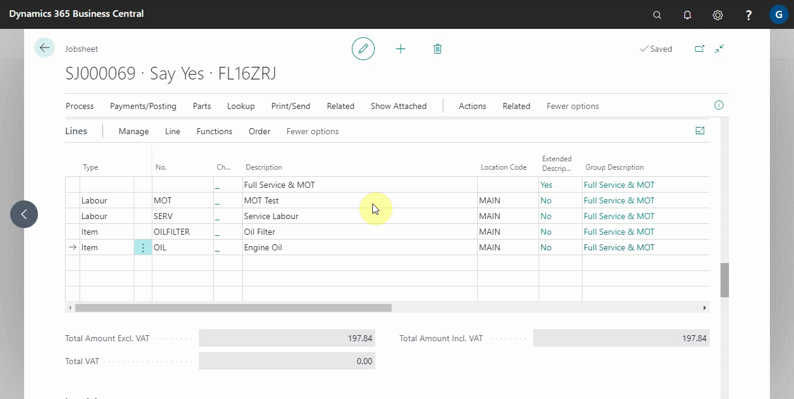

[Go back to top](#top)

 



 

### See Also

[Setting Up Payment by Card Terminal](garagehive-setting-up-payment-by-card-terminal.html){:target="_blank"} \
[Setting Up Payment by Garage Link for Pay360](garagehive-payment-gateways.html){:target="_blank"} \
[Setting Up Payment by Garage Link for Dojo](garagehive-payment-gateways.html){:target="_blank"} \
[How to Use Humm Financing](garagehive-humm-financing.html){:target="_blank"} \
[How to Set Card Terminals Into Integration Mode](garagehive-setting-card-terminals-into-integration-mode.html){:target="_blank"} \
[Generating Paymentsense Card Machine End of Day, X Balance and Z Balance Report](garagehive-paymentsense-card-machine-x-and-z-report.html){:target="_blank"}
 