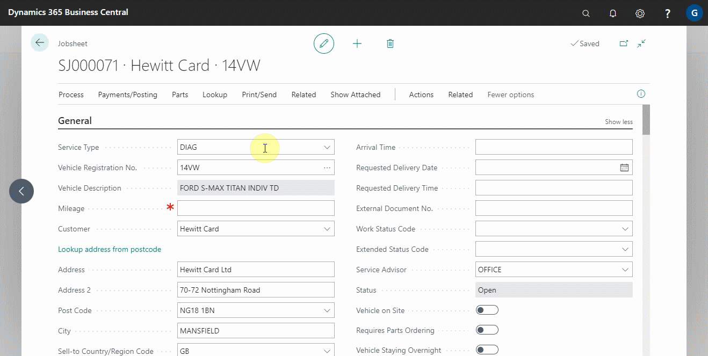

## In this article
1. Taking a payment in a Jobsheet
2. Adding resources to labour lines in a Jobsheet
3. Updating the items numbers and quantities
4. Posting the jobsheet

### Taking a payment in a Jobsheet 
When the job is complete and the financial information is correct. You now need to collect the payment from the customer and post the jobsheet.
1. Select **Payments/Posting** from the jobsheet's actions bar, then **Take Payment** to mark the customer's payment method and add the amount paid along the customer's payment method row.

    

### Adding resources to labour lines in a Jobsheet
Before posting the jobsheet, all labour lines must-have resource information added to them. There are several this can be done:
1. If the Technician uses the Technician **Confirmed** button on their device, the resources column will be pre-populated.

    

2. If a front-of-house staff member is familiar with the Technician's **Resource No.**, they can add this directly to the labour line and then press the **Tab** key to assign 100% of that labour line to that specific Technician.

      

3. If there are multiple technician's working on the job or there are multiple labour lines upon which a sole technician has clocked onto a job you can Select **Process** followed by **Add Resources to Lines**. This will either split the total time spent between multiple technicians on all lines or it will add 100% to all labour lines for the one specific technician. 

    

4. If you post the jobsheet without adding the resources, you will be prompted to do so automatically before posting.

    

### Updating the items numbers and quantities
1. All item numbers must be updated from the **Placeholder Item**, such as **MISC, to their actual item numbers. Ensure that the quantities and prices of the items remain unchanged.

    

    - If all part numbers with **Placeholder Item** have not been updated/added to the jobsheet, the following error message will be displayed:

        

2. All parts need to be bought into stock. If all parts have not been accepted into stock using a purchase order, you will get an error message: 

    

### Posting the jobsheet
Now, you have the option of:
    
    * To **Post** - Post/invoice this jobsheet without the option of printing or emailing it.
    * To **Post and Print** - Post/invoice this jobsheet and print a copy of the invoice.
    * To **Post and Email** - Post/invoice this jobsheet and email a copy of the invoice to the **Bill-To Customer**.

    

> **Note:**
>
> After the jobsheet has been posted, it can be found in **Posted & Archived Documents** under **Posted Jobsheet**, which can be accessed from the role centre navigation menu.