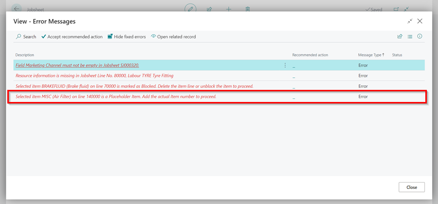
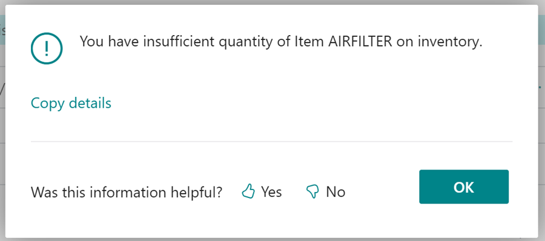

#    How to take a payment and invoice a jobsheet. 

 When the job has been completed and the financial information is correct. You now need to take a payment (if not an account customer or had any payment terms set) and post the jobsheet. 

 

 A.  Select Payments/Posting in the Action Bar

 B.  To mark the payment method of how the customer has paid select **Take Payment**   

 

 C.   You then have the option of: - 
    
*   Post - Simply Post/Invoice this jobsheet without the option of printing or email without finding the document in the Posted Documents section within the Home Page.      

*   Post and Print - Post/Invoice this jobsheet and print out of a copy of invoice. 

*   Post and Email - Post/Invoice this jobsheet and send a copy of the invoice via email. 

## Several Requirements which need to be met before Garage Hive will allow a jobsheet to be invoiced. 

####    1.  Resource information needs to be added against all Labour Lines. There are several ways this can be done.  

    * If the technician is using the Technician Confirmed button within their devices, this will automatically be pre-populated.

    * If the front of house member of staff knows the Technician's Resource No, they can add this directly on the labour line then tab, this will allocate 100% of that labour line to that specific technician. 

    *   If there are multiple technician's working on the job or there are multiple labour lines upon which a sole technician has clocked onto a job you can Select **Process** followed by **Add Resources to Lines**. This will either split the total time spent between multiple technicians on all lines or it will add 100% to all labour lines for the one specific technician. 

If this is not done, you will see the following error message: 

####    2.  All Item numbers must have been updated from the "MISC - Placeholder Part Number"

If all part numbers have not been updated/added on the jobsheet you will get the following error message: 

####    3.  Parts need to be bought into stock.  

If all parts have not been bought into stock using a purchase order, you will get an error message: 

 