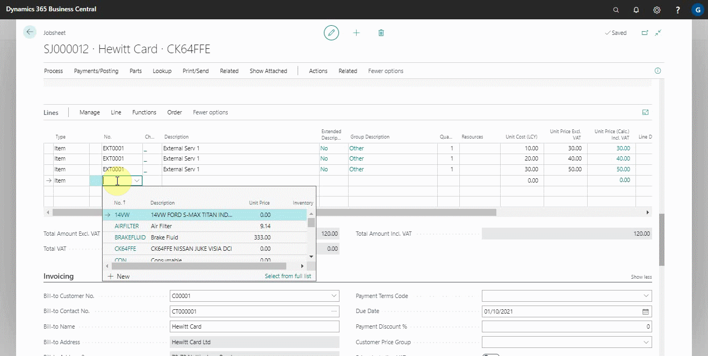
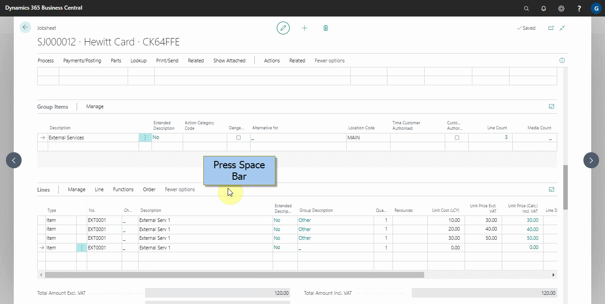
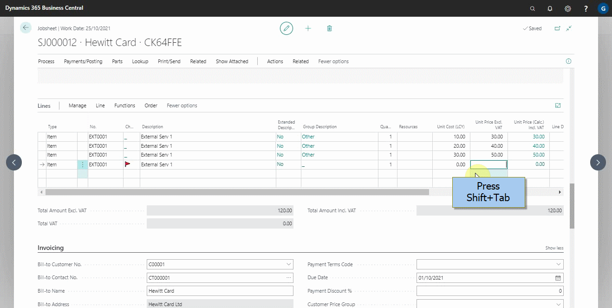
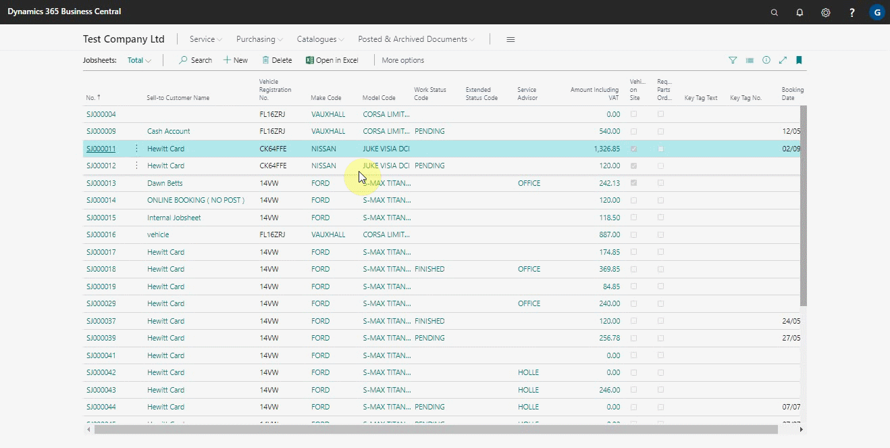
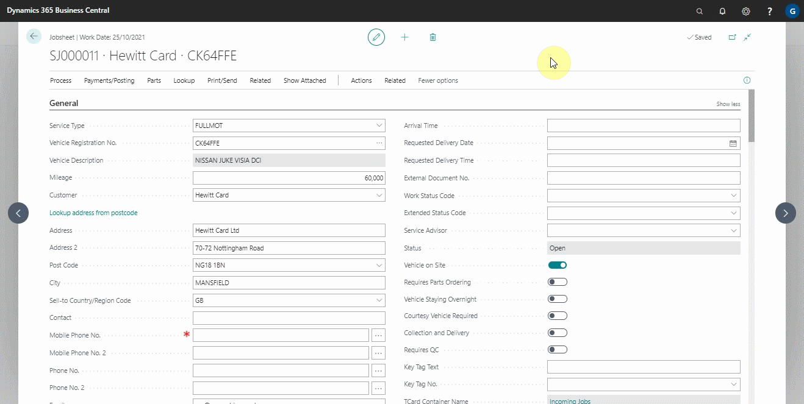
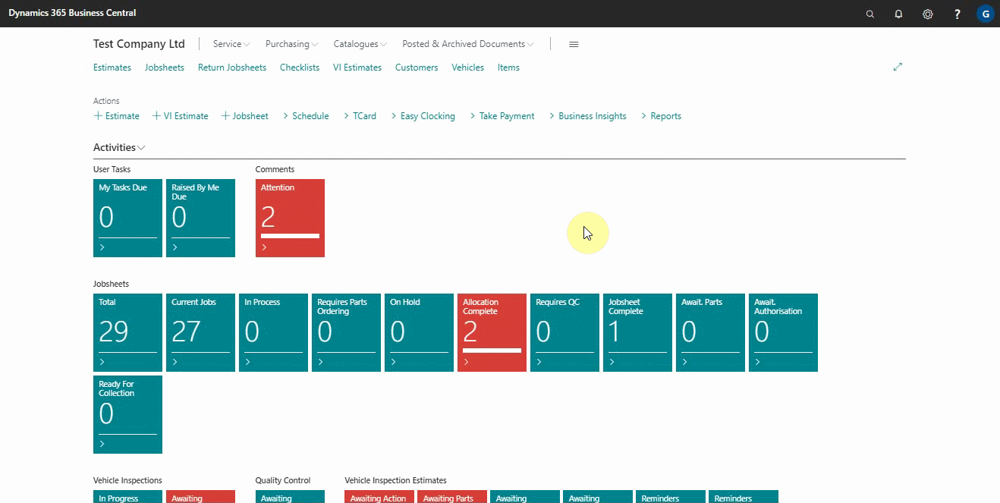
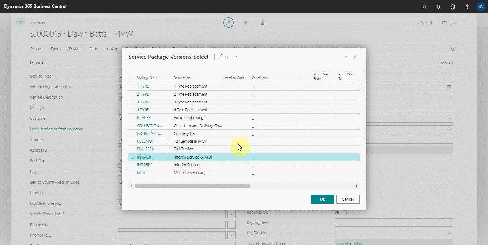
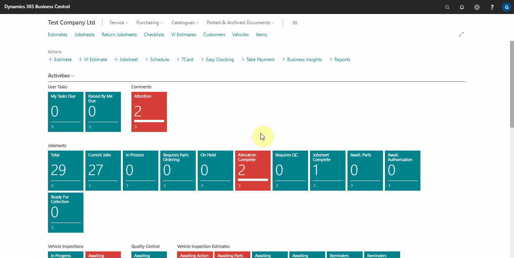
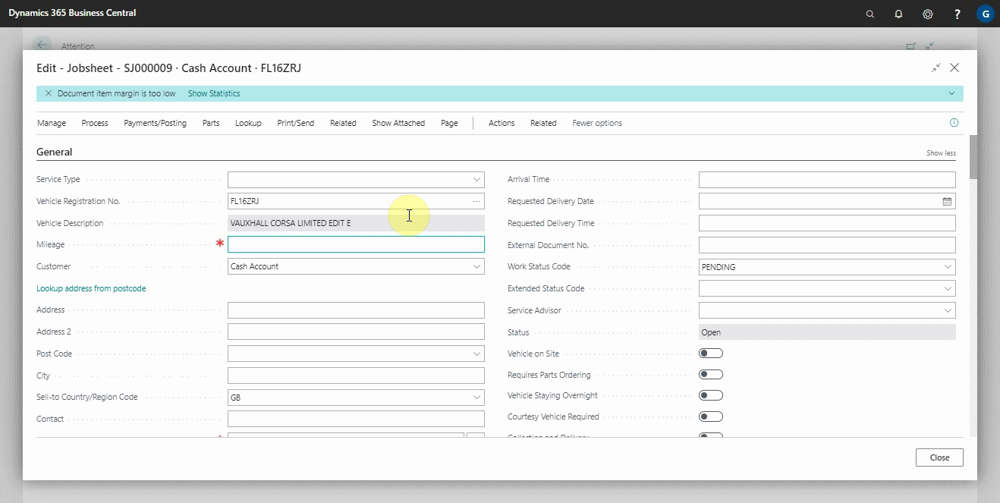
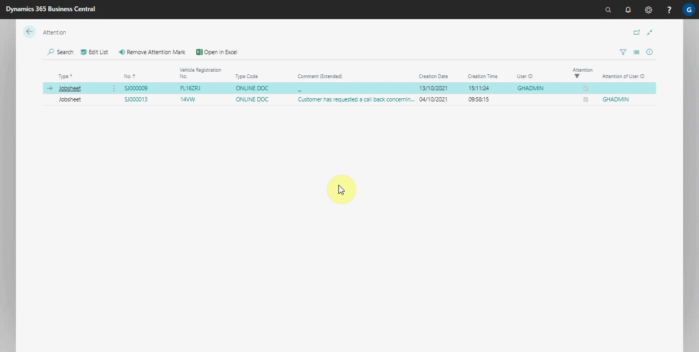

# General Keyboard Shortcuts in Garagehive

In this article, we'll go over some of the most popular keyboard shortcuts used by Garagehive customers. If you're looking for more keyboard shortcuts in business central, please see Microsoft's [Keyboard Shortcuts](https://docs.microsoft.com/en-us/dynamics365/business-central/keyboard-shortcuts){:target="_blank"} article.

**F8 Key** - Copies the field in the same column of the row above, and paste it into the current row.

**Space Bar Key** - Places a tick in a box.

**Tab Key** - In editable list, move in the same row to the next field to the right.

**Shift+Tab** - In editable list, move in the same row to the previous field to the left.

**Alt+N** - Open a page to create a new record. (Similar to choosing the New and + actions.)

**Alt+F2** - Show and hide the FactBox pane.

**Alt+Q** - Open the Tell Me window.

**Ctrl+Enter** - Save and close window (equivalent to choosing the OK button).

**F5 Key** - Refresh the data on the current page.

**Esc Key** - Close the current page or drop-down list.

**Alt+F4** - Close window or close program.

