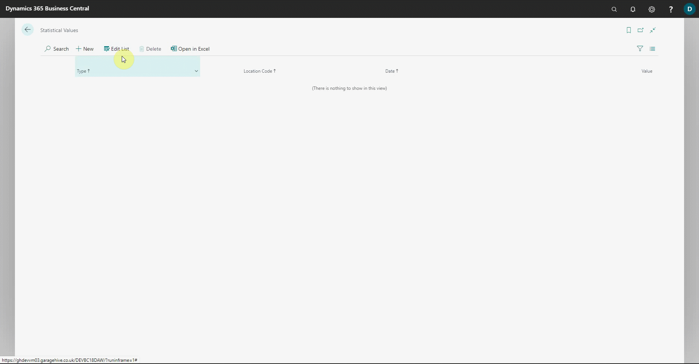
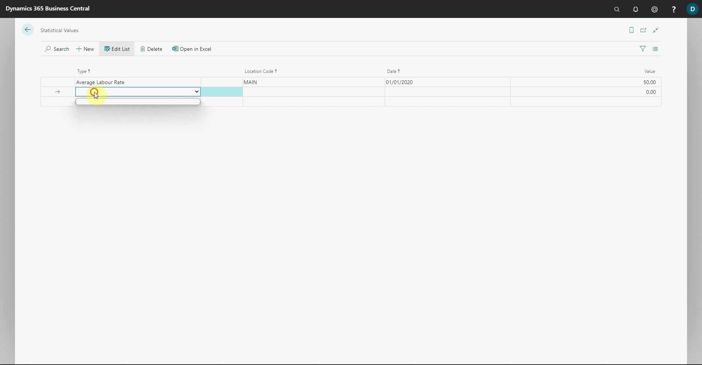

# Setting Your Average Labour Rate in Garage Hive

To calculate Garage Hive Efficiency, you must first enter your **Average Labour Rate** into the system. This is because the hours sold at full value are calculated by dividing Labour sales by your average labour rate for any given date range. To set the **Average Labour Rate**:
1. In the top-right corner, choose the  icon, enter **Statistical Value** and choose the related link.
   
   

2. Select **Edit List** to fill in the **Type**, **Location Code**, **Date**, and **Value** fields. The **Type** field should be set to **Average Labour Rate**.
3. The **Location Code** should specify your current business location, and if you have multiple locations, the process must be repeated for each. Enter an earlier date in the **Date** field before the labour rate was adjusted and the labour rate on the date entered in the **Value** field. In this case, we'll use the date as **01/01/2020** and labour rate as **50 £**.
   
   

4. Add a new line and fill in the **Type** and **Location Code** fields, just like in points **2** and **3**. Then, in the **Date** field, enter a recent date when the labour rate changed from the previously entered one, and in the **Value** field, enter the labour rate that it changed to on that day. We'll use the date as **01/01/2021** and labour rate as **55 £**.

   



 

### **See Also**
[Video - How to set your Average Labour Rate for Power BI in Garage Hive](https://youtu.be/lIkkJiUm_FE){:target="_blank"} \
[Installing the Power BI App](powerbi-installing-app.html){:target="_blank"} \