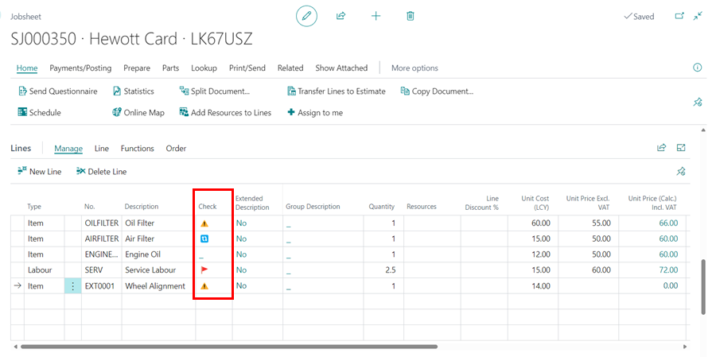
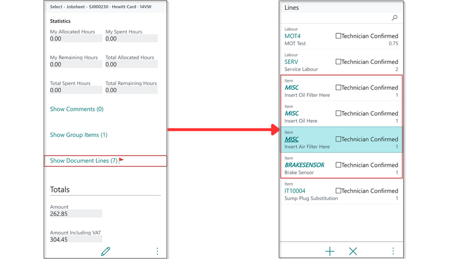
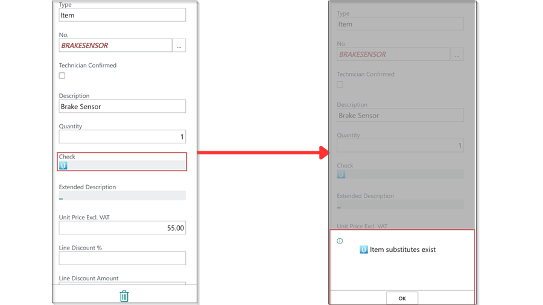

# Understanding the Jobsheet Line Checker Notifications
The line checker is a column available in the Jobsheet **Lines** Sub-Page that provides notifications on the **Item** or **Labour** that has been added to the Jobsheet lines. This ensures that the user is aware of any errors, warnings, or information related to the added item or labour. 

   

In this article, we will look at what they actually mean and the implications of posting the document:

   | Icon | Description                                                                                                                                               | Implication to Posting Jobsheet            |
   | :--- | :-------------------------------------------------------------------------------------------------------------------------------------------------------- | :----------------------------------------- |
   | 🚩    | The red flag icon indicates that there are insufficient items in stock for the item line and/or that resource information for the labour line is missing. | Prevents document from posting.            |
   | ⚠️    | The warning icon indicates that the selling amount in the line is less than or equal to zero.                                                             | Doesn't prevent the document from posting. |
   | 🔁    | The Anticlockwise Downwards and Upwards Open Circle Arrows icon indicates that there is a substitution available in the system for the item added.        | Doesn't prevent the document from posting. |
   | ℹ️    | The information icon, shows that there is more than one information to display.                                                                           | Doesn't prevent the document from posting. |
   | 📦    | The package icon indicates that the parts ordered from the Jobsheet have been received in the system.                                                     | Doesn't prevent the document from posting. |

The **Technician Jobsheet** allows the technician to see notification about Item Unavailability as well as whether a substitute for the item exists. The following is how the notification appears and what the technician should do to view it:
1. If a line(s) has a notification in the line checker, the icon appears in the **show document lines** action, and when clicked, it displays the lines with the notification in italic and bold for the **Item No.**, as shown below.

   

2. When the technician selects the line with the italic and bold item No., they will now see the icon notification on the **Check** field. The technician needs to click on the icon to find out what the notification is about.

   

[Go back to top](#top)
