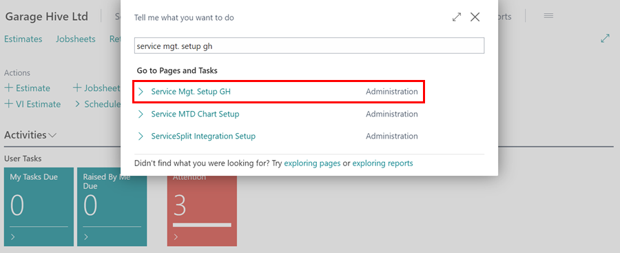
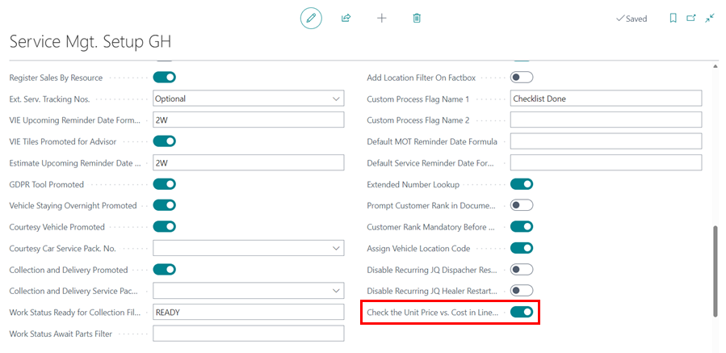
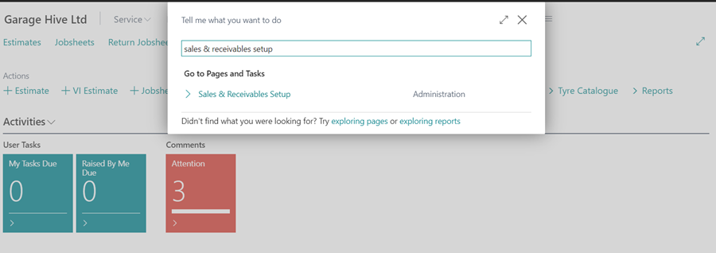
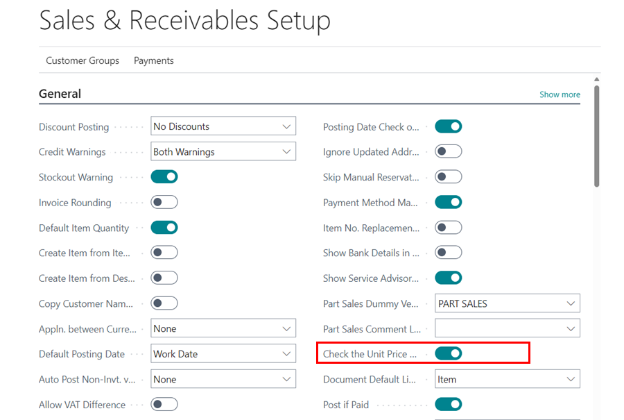

# We are still working on this article!
We are currently reviewing this article before it is published, check back later.

# Understanding the Jobsheet Line Checker Notifications
The line checker is a column available in the Jobsheet **Lines** Sub-Page that provides notifications on the **Item** or **Labour** that has been added to the Jobsheet lines. This ensures that the user is aware of any errors, warnings, or information related to the added item or labour. 

   

In this article, we will look at what they actually mean and the implications of posting the document:

   | Icon | Description                                                                                                                                                                                                                                  | Implication to Posting Jobsheet            |
   | :--- | :------------------------------------------------------------------------------------------------------------------------------------------------------------------------------------------------------------------------------------------- | :----------------------------------------- |
   | 🚩    | The red flag icon appears when item stock levels are insufficient, or when labour line resource information is missing.                                                                                                                      | Prevents document from posting.            |
   | ⚠️    | The triangle warning icon appears when the **Unit Price of Labour** in a line is less than or equal to zero.                                                                                                                                 | Doesn't prevent the document from posting. |
   | ⚠️    | The triangle warning icon appears when:   **1**. The **Unit Price of an Item** is zero, less than zero, or less than or equal to the Unit Cost (depending on the settings)*.   **2**. An item appears in more than one document lines. | Doesn't prevent the document from posting. |
   | 🔁    | The Anticlockwise Downwards and Upwards Open Circle Arrows icon appears when there is a substitution available in the system for the item.                                                                                                   | Doesn't prevent the document from posting. |
   | ℹ️    | The information icon, appears when there is more than one information available to display.                                                                                                                                                  | Doesn't prevent the document from posting. |
   | 📦    | The package icon appears when the parts ordered from the Jobsheet have been received in the system.                                                                                                                                          | Doesn't prevent the document from posting. |

[Go back to top](#top)

### How to Set the System to Check if Unit Price is Less Than or Equal to Unit Cost*
To set the system to check if Unit Price is less than or equal to Unit Cost and give a warning in the line checker:
1. In the top right corner, choose the  icon, enter **Service Mgt. Setup GH**, and select the related link.

   

2. Under **General** FastTab scroll down to the **Check the Unit Price vs. Cost in Line Checker** field and enable it.

   

3. To set the system to check if Unit Price is less than or equal to Unit Price in **Sales Order**, and **Sales Quote** line checker, choose the  icon, enter **Sales & Receivalbles Setup**, and select the related link.

   

4. Enable the **Check the Unit Price. Vs. Cost in Line Checker** field, under the **General** FastTab.

   

[Go back to top](#top)

### Line Checker in Technician Jobsheet
The **Technician Jobsheet** allows the technician to see notification about Item Unavailability as well as whether a substitute for the item exists. The following is how the notification appears and what the technician should do to view it:
1. If a line has a notification in the line checker, the icon appears in the **Show Document Lines** action, and when clicked, it displays the lines with the notification in italic and bold for the **Item No.**, as shown below.

   

2. When the technician selects the line with the italic and bold Item No., they will now see the icon notification on the **Check** field. The technician needs to click on the icon to find out what the notification is about.

   

[Go back to top](#top)
