

# Managing Key Numbers in Garage Hive

The system's key numbers feature is used to reference the vehicle key numbers with the Jobsheet. This ensures that the technicians can quickly and easily focus on incoming jobs without being disrupted in their workflow. The system allows you to match the vehicle key number to the Jobsheet for the vehicle.

## In this article

1. [Enabling Key Numbers Functionality](#enabling-key-numbers-functionality)
2. [How to Use Key Numbers from the Jobsheet](#how-to-use-key-numbers-from-the-jobsheet)
3. [How to Use Key Numbers from the Purchase Order](#how-to-use-key-numbers-from-the-purchase-order)

### Enabling Key Numbers Functionality
Normally, the **Key Tag Text** at the **General** FastTab is the only field on the Jobsheet; however, when the key numbers functionality is enabled, a new field **Key Tag No.** is added.

   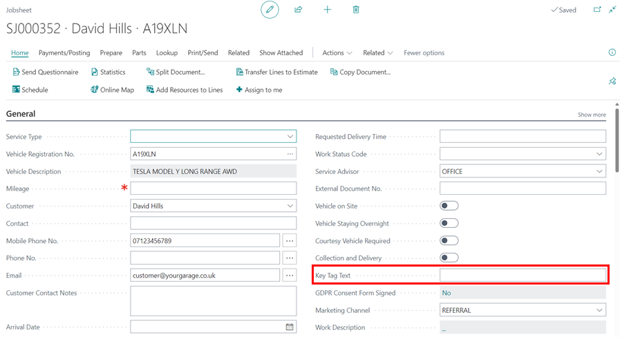

To enable the key numbers functionality, follow these steps:
1. Choose the  icon in the top-right corner, enter **Service Mgt. Setup GH**, and select the related link.

   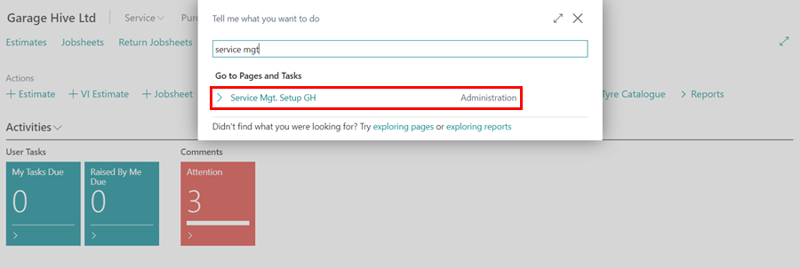

2. Scroll down to **Use Key Tag Catalogue** field and select the slider to enable it.

   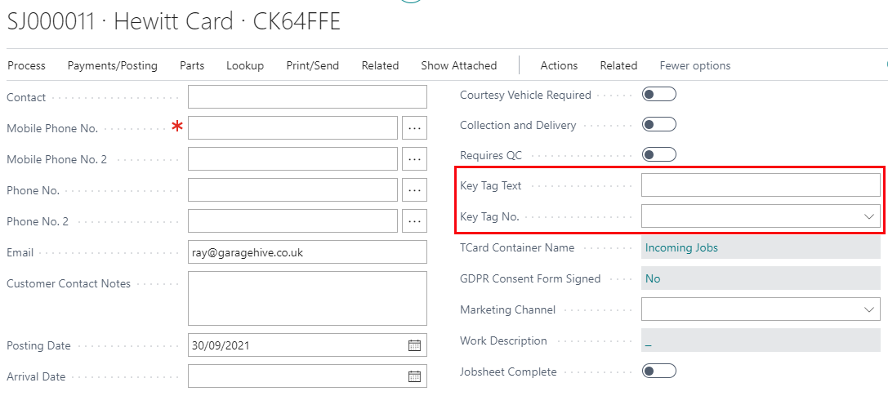

3. When the **Use Key Tag Catalogue** field is enabled, the **Key Tag No.** field is added to the Jobsheet.

   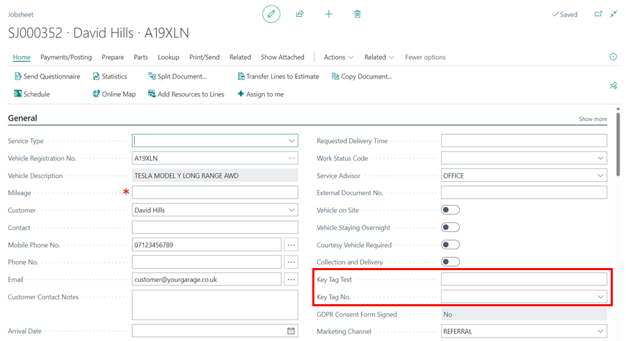

4. From the **Service Mgt. Setup GH** page, there is a **Use Parts Bin Catalogue** field below the **Use Key Tag Catalogue** field, with two drop-down options, **No** and **Use Key Tags**.
5. If you select **No**, the key tags feature will not be added to the purchase order; however, if you select **Use Key Tags**, the same numbering used for key tags will be used for parts bins.
6. In this case, we'll select **No**. When the garage has the same number of key tags as the parts bins, then **Use Key Tags** option is appropriate.

   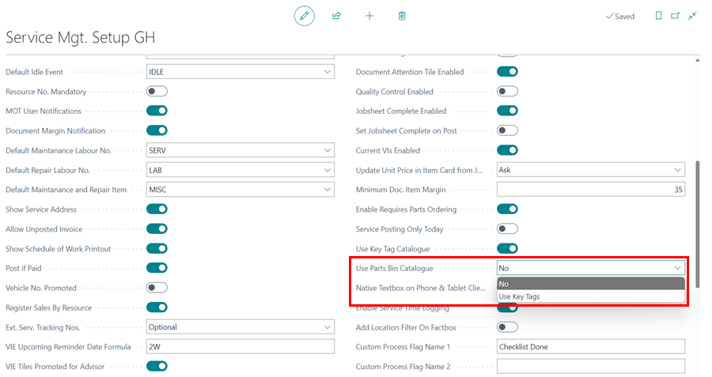



[Go back to top](#top)

### How to Use Key Numbers from the Jobsheet
To start using the **Key Tag No.** field, ensure that all key numbers from the key tags in your garage have been added. Follow these steps to do so:
1. In the top-right corner, choose the  icon, enter **Key Tags** and select the related link.

   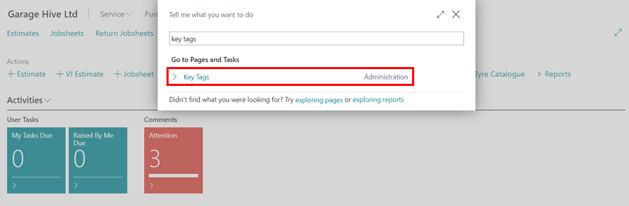

2. A page will open displaying a list of all key tags that have already been added, along with the details of where they have been assigned.
3. You can update this list by adding new key tags that you have.

   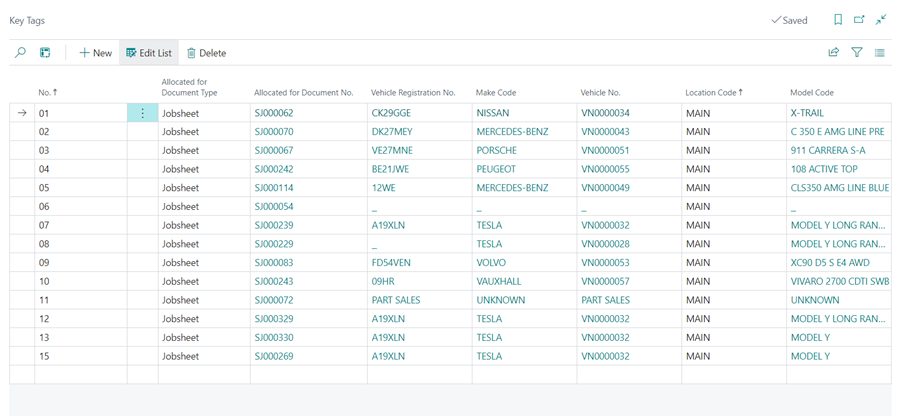

4. Once added, the key tags will now appear as a drop-down menu in the **Key Tag No.** field of the Jobsheet.

   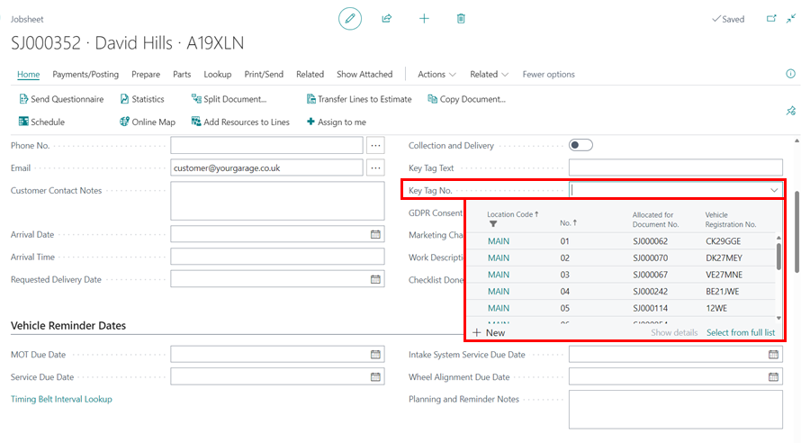   

5. When a vehicle arrives, it becomes easier to assign a key number to the Jobsheet. If you enable the **Vehicle on Site** slider, the system will prompt you to allocate a key number to the Jobsheet.
   * **Mark Vehicle on Site**:
  
      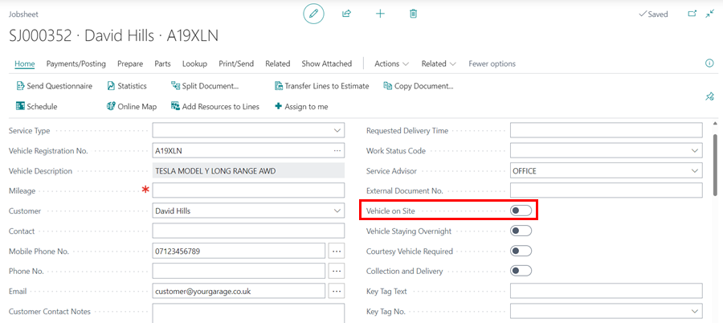

   * **System Prompt**:
      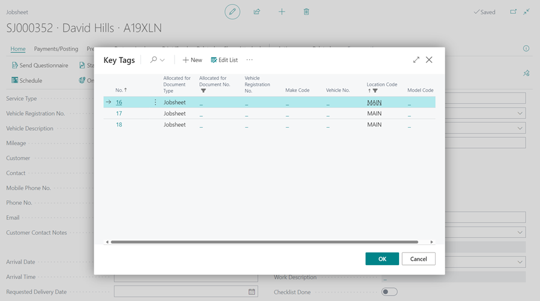

6. If the vehicle has not yet arrived, you can pre-allocate a key number by entering a number in the **Key Tag No.** field. The system will notify you, asking if you want to reserve the key number for the vehicle.

   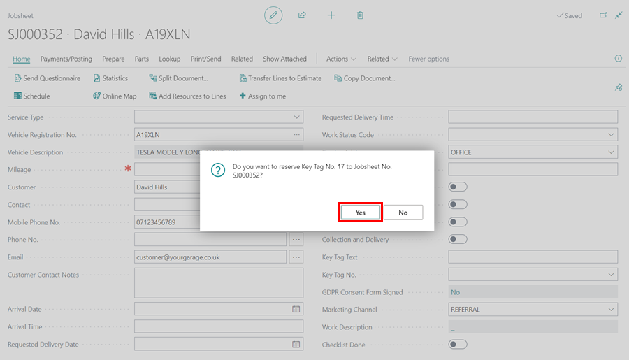

7. Once the job on the vehicle is completed and the vehicle is no longer on site, you must post the Jobsheet. Upon posting, the system will prompt you to deallocate the key number, as a Jobsheet cannot be posted with an assigned key number.

   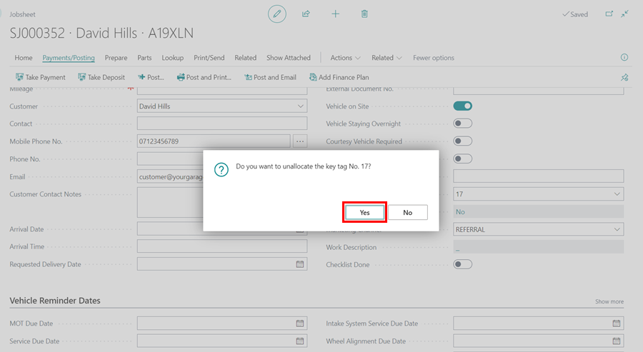



[Go back to top](#top)

### How to Use Key Numbers from the Purchase Order
1. If the **Use Key Tags** option is selected on the **Service Mgt. Setup GH** page under the **Use Parts Bin Catalogue** field, the key numbers functionality can be used in purchase orders. 
2. When this option is enabled, the purchase order will include the field **Jobsheet Key Tag No.**.

   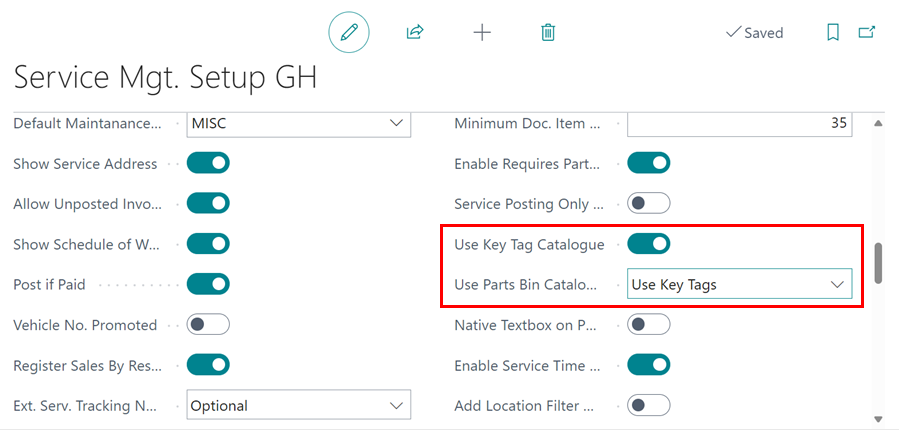

3. As a result, the **Jobsheet Key Tag No.** field displays the linked Jobsheet's key number; therefore, the service advisor will be able to determine which parts bin the parts being ordered will be placed in.

   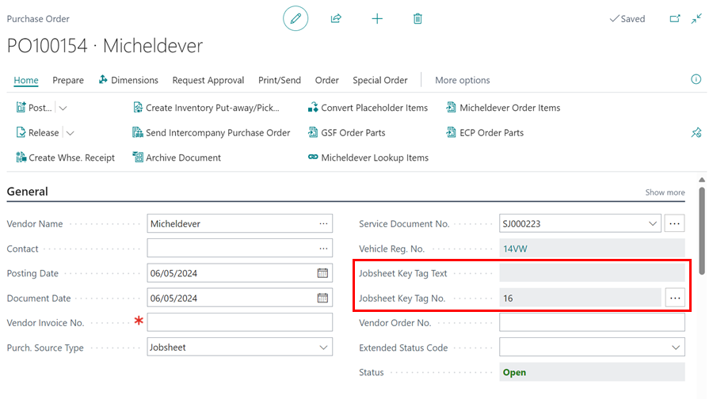

4. If the vehicle has not yet arrived and the Jobsheet is available, you can assign a key number from the purchase order by first linking the purchase order to the Jobsheet, then clicking the ellipsis (...) at the end of the **Jobsheet Key Tag No.** field and selecting the key number.

   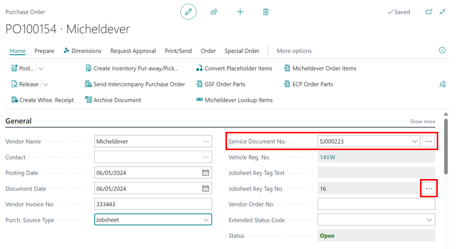

[Go back to top](#top)

