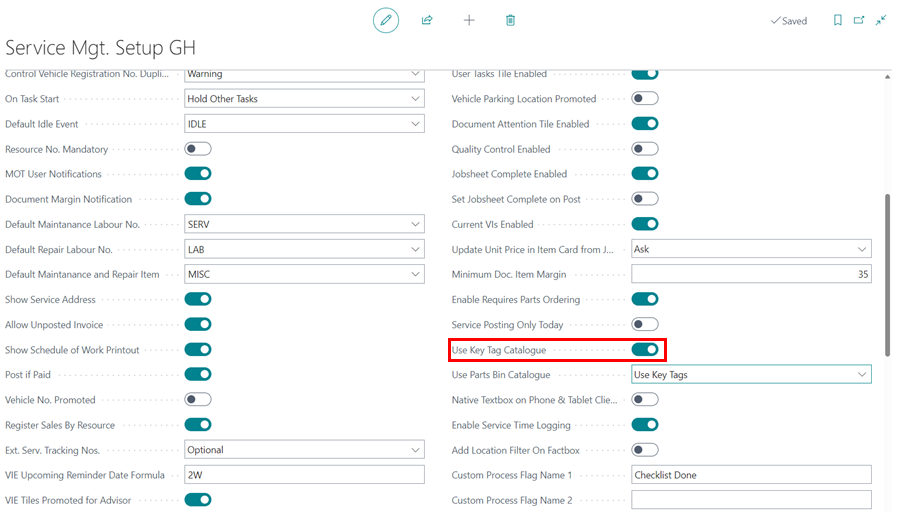

# Managing Key Numbers in Garage Hive

The system's key numbers functionality is used to reference the vehicle key numbers with the jobsheet. This ensures that the technicians can quickly and easily focus on incoming jobs without being disrupted in their workflow. The system allows you to match the vehicle key number to the jobsheet for the vehicle.

## In this article

1. [Enabling key numbers functionality](#enabling-key-numbers-functionality)
2. [How to use key numbers from the jobsheet](#how-to-use-key-numbers-from-the-jobsheet)
3. [How to use key numbers from the purchase order](how-to-use-key-numbers-from-the-purchase-order)

### Enabling key numbers functionality
Normally, the **Key Tag Text** at the **General** FastTab is the only field on the jobsheet; however, when the key numbers functionality is enabled, a new field **Key Tag No.** is added.

To enable the key numbers functionality, follow these steps:
1. Use the search icon in the top-right corner to search for **Service Mgt. Setup GH**, and select it from the search results.
2. Scroll down to **Use Key Tag Catalogue** field and select the slider to enable it.

   

3. When the **Use Key Tag Catalogue** field is enabled, the **Key Tag No.** field is added to the jobsheet.

   

4. From the **Service Mgt. Setup GH** page, there is a **Use Parts Bin Catalogue** field below the **Use Key Tag Catalogue** field, with two drop-down options, **No** and **Use Key Tags**.
5. If you select **No**, the key tags feature will not be added to the purchase order; however, if you select **Use Key Tags**, the same numbering used for key tags will be used for parts bins.
6. In this case, we'll select **No**. When the garage has the same number of key tags as the parts bins, the **Use Key Tags** option is appropriate.

   

> **Note:**
>
> In the future, the **Parts Bin** feature will be developed independently to accommodate garages with more bins than key tags.

### How to use key numbers from the jobsheet
To begin using the **Key Tag No.** field, ensure that you have added all of the key numbers from the key tags list that you have in your garage. To accomplish this, follow these steps:
1. Search for **Key Tags** in the top-right corner and select it from the search results.
2. From the window that appears, add all of the key numbers you have, specifying their location.

   

3. The list you added now appears as a drop-down menu in the jobsheet's **Key Tag No.** field.

      

4. When the vehicle arrives, it is easier to assign a key number to the jobsheet. If you select the **Vehicle on Site** slider, the system prompts you to assign a key number to the jobsheet.

   

5. If the vehicle has not yet arrived, you can reserve a key number for when it arrives.

   

6. When the job on the vehicle has been completed and the vehicle is no longer on site, you must post the jobsheet. When you post the jobsheet, the system prompts you to deallocate the key number. The jobsheet cannot be posted with the key number assigned.

   

> **Note:**
>
> A key number cannot be assigned to more than one jobsheet; doing so will result in an error from the system.

### How to use key numbers from the purchase order
If the **Use Key Tags** option is selected on the **Service Mgt. Setup GH** page under the **Use Parts Bin Catalogue** field, the key numbers functionality can be used in purchase orders. When this option is enabled, the purchase order will include the field **Jobsheet Key Tag No.**.

As a result, the **Jobsheet Key Tag No.** field displays the linked jobsheet's key number; therefore, the service advisor will be able to determine which parts bin the parts being ordered will be placed in.

If the vehicle has not yet arrived and the jobsheet is available, you can allocate a key number from the purchase order by clicking the three dots at the end of the **Jobsheet Key Tag No.** field and selecting the key number.

