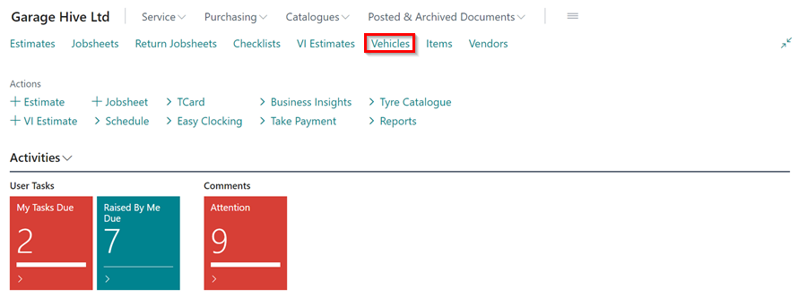
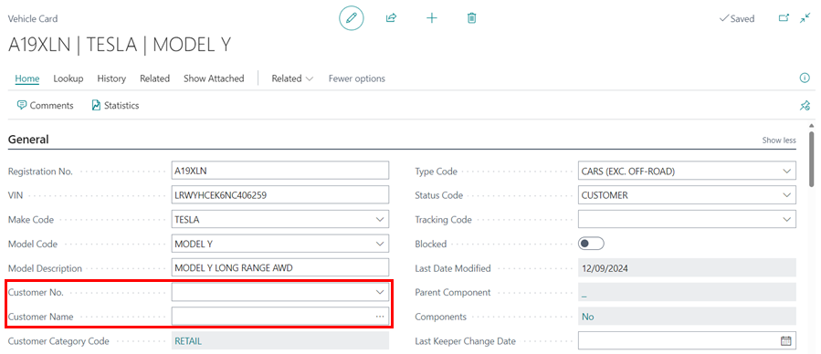

# Removing Customer Ownership from a Vehicle Card in Garage Hive
When a vehicle changes ownership, the previous owner may still receive reminders about the vehicle, even if they are no longer the owner. Here's how to remove the ownership from the vehicle:

1. Open the **Vehicle Card** in which the the ownership of the vehicle has changed, by selecting it from the Vehicles list in the Role Centre.

   

2. If you can't see all the details in the Vehicle card, click on **Show More** on the **General** FastTab located on the right-hand side. 

   

3. Scroll down to the **Customer No.** field and delete the customer that is currently associated with the vehicle.

   

4. This will remove the customer from the ownership of the vehicle and they will no longer receive reminders related with the vehicle.

[Go back to top](#top)