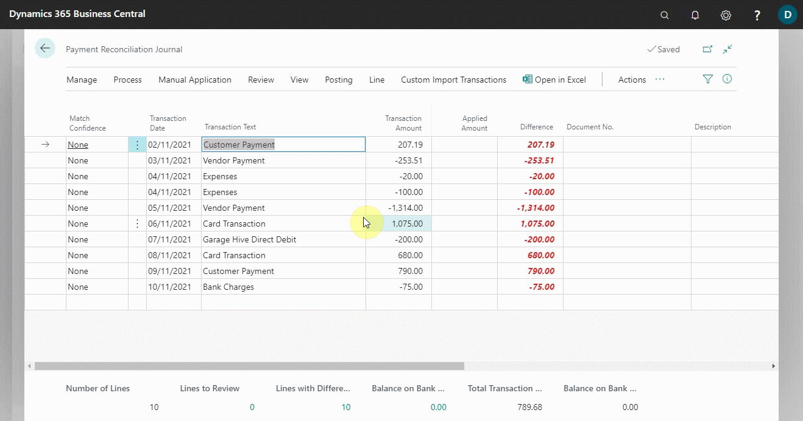

# Map Text on Recurring Payments to Accounts for Automatic Reconciliation 
The **Map Text to Account** action allows you to create mappings between text on payments and specific debit, credit, and balancing accounts, ensuring that such payments are posted to the specified accounts when the payment reconciliation journal is posted. This is useful for recurring cash receipts or expenses, such as bank fees or interest, that regularly appear on the bank statement and do not require a related business document. The following describes how to map text on recurring payments to accounts for automatic reconciliation:
1. Choose the  icon, on the top-right corner, enter **Payment Reconciliation Journals**, and select the related link.
2. Open a previously payment reconciliation journal.

   

3. Select **Manual Application** from the actions bar, and choose **Map Text to Account** action. The Text-to-Account Mapping page opens.
4. In the **Mapping Text** field, enter any text that occurs on payments that you want to post to specified accounts without applying to an open entry. You can enter up to 50 characters.
5. In the **Vendor No.** field, enter the vendor that the payments will be posted to.
6. In the **Bal. Source Type** field, specify if the payment will be posted to a general ledger account or to a customer or vendor account.
7. In the **Bal. Source No.** field, specify the account that the payment will be posted to, depending on your selection in the **Bal. Source Type** field.
8. After you've finished mapping payment text to accounts, click on **Edit List** to save the changes, and then the **Close** button. From the dialogue box that appears, click **Yes**. When you set up a text-to-account mapping, the resulting automatic payment application will have **High - Text-to-Account Mapping** in the **Match Confidence** field.

   

9.	Repeat steps 3 through 8 for all text on payments that you want to map to accounts for direct posting without application.

 

### **See Also**

[Video: How to perform a Payment Reconciliation Journal in Microsoft Dynamics Business Central](https://www.youtube.com/watch?v=WiAnm_VUQVQ){:target="_blank"} \
[Reconcile payments using the automatic application](garagehive-reconcile-payments-using-automatic-application.html) \
[Reconcile payments that cannot be applied automatically](garagehive-reconcile-payments-that-cannot-be-applied-automatically.html) \
[Review or apply payments after automatic application](garagehive-review-or-apply-payments-after-automatic-application.html) 