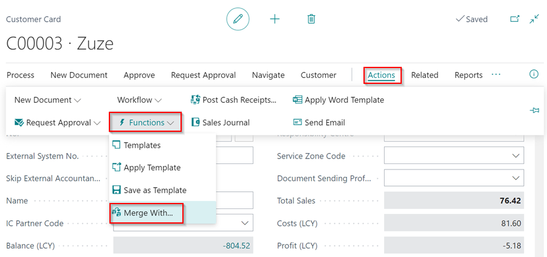
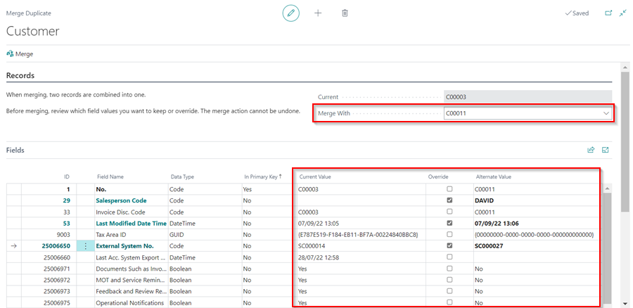
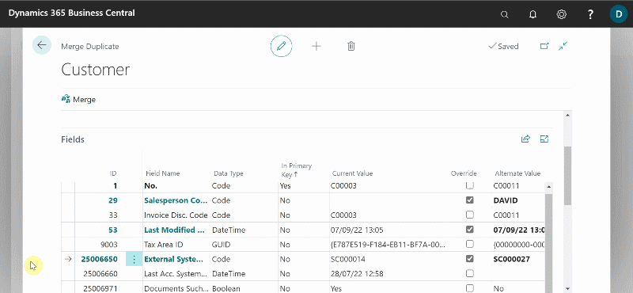

### How to Merge Duplicate Records
As different users create new customer, vendor, or contact cards over time, or as new records are created automatically during migration, a customer, vendor, or contact cards may be represented in the system by more than one record. In this case, you can use the **Merge Duplicate** page from the card of the record that you want to keep.
The following procedure is based on a customer card. The steps are similar for a vendor and contact cards:
1. Select the **Customers** list, and then choose the customer record that you want to keep.
2. Select **Home** from the menu bar, and then select **Merge With**.

   

3. On the **Merge Duplicate** page, in the **Merge With** field, under the **Records** FastTab, select the customer you believe is a duplicate or the one you want to replace with the one you have opened.
4. The **Fields** FastTab lists fields where the values for the two customers differ. This means that if the selected customer, for example, is a duplicate, only a few fields, such as typing errors and other data entry mistakes, should be listed.
5. The values of the fields in the customer record that you have opened are listed in the **Current Value** column, and the values of the fields in the customer card that you have selected are listed in the **Alternate Value** column if they differ from the **Current Value** column.
6. Select the **Override** check box (between the **Current Value** and **Alternate Value** columns) for each field where you want to use a different value than the current one. When you complete the process, the value in the **Alternate Value** column will be transferred to the current record.

   

7. The **Related Tables** FastTab (which is only an informational section) lists tables with fields that are related to both customers. The **Current Count** and **Duplicate Count** columns show the number of fields in related tables that use the **No.** value of both the current and duplicate customer.
8. If conflicts exist, they will be shown in the **Conflicts** column.

   

9.  When you have finished selecting which values to keep or override, choose the **Merge** action from the menu bar. Select **Yes** in the pop-up notification message. This step cannot be undone.

   

[Go back to top](#top)