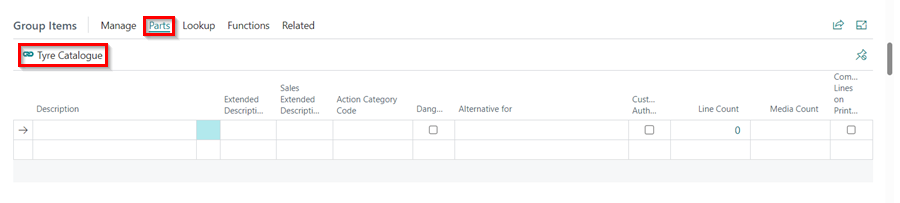
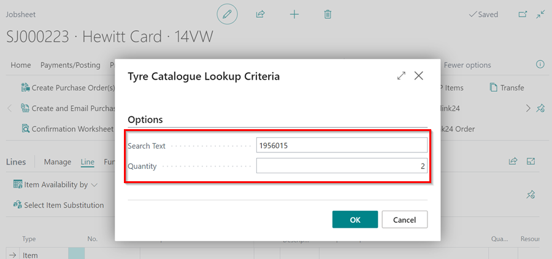
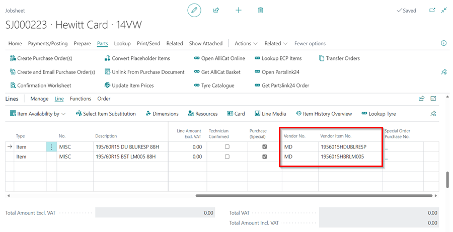
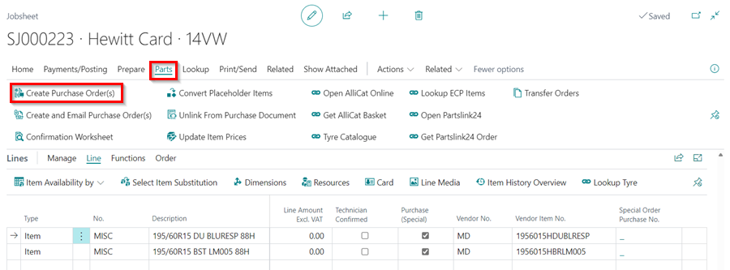
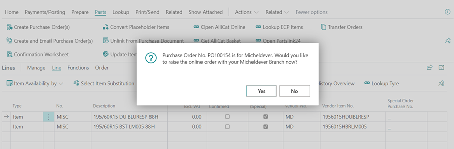
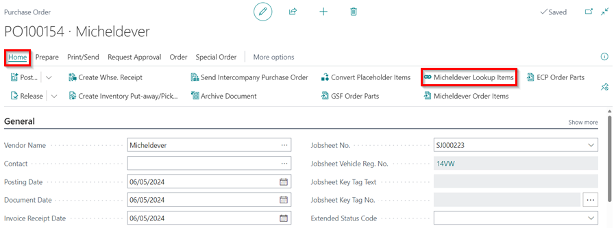
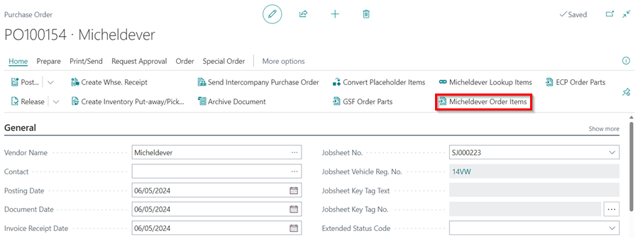

# We are still working on this article!
We are currently reviewing this article before it is published, check back later. 

# Micheldever Integration With Garage Hive
Micheldever Integration makes it easy for Garage Hive users to find and order tyres for vehicles from the Micheldever tyre catalogue/stock, directly from Garage Hive.This helps in making the process of **Quoting**, **Sourcing** and **Ordering** the tyres to be efficient.

## In this article
1. [Registration With Micheldever](#registration-with-micheldever)
2. [System Setup for Micheldever Integration](#system-setup-for-micheldever-integration)
3. [Micheldever Tyre Lookup from the Document](#micheldever-tyre-lookup-from-the-document)
4. [Ordering Parts from the Purchase Order](#ordering-parts-from-the-purchase-order)

### Registration With Micheldever
Before you can begin the process of linking your Garage Hive system to Micheldever, you will require a **Party ID**, an **API User Name** and an **API Password**. if you would like to use this integration, please send an email to [**garagehiveonboarding@micheldever.co.uk**](mailto:garagehiveonboarding@micheldever.co.uk), with the following details.

1. ##### Existing Micheldever Customers
   If you are an existing customer of MTS, please add the following template to your email:
   * What is your MTS Account Number? (*hint: This can be found on any invoiced paperwork or your ESP login page.*)
   * What is your Business Name?
   * Postcode?
   * What is the sales office you contact MTS with?

1. ##### New Micheldever Customer
   If you currently do not have an account with MTS, please add the following template to your email:
   * What is your Business Name?
   * What is your Business Address? (*hint: If your delivery address is different to your trading address please provide both addresses.*)
   * Main contact name?
   * Main contact Telephone number?
   * Approximate quantity of tyres purchased per month?

[Go back to top](#top)

### System Setup for Micheldever Integration
To enable the Micheldever Integration in Garage Hive:
1. In the top-right corner, choose the  icon, enter **Micheldever Integrations**, and select the related link.

   

2. Select **New** in the **Micheldever Integrations** page, to create a new Micheldever Integration card.

   

3. Enter the **Location Code** for the location where you want the integration, enter the **Party ID**, **API User Name** and the **API Password** that you will have received from Micheldever.
4. Select the **Placeholder Item No.** that is used on the tyres added to the document, and then select the default **Vendor No.** to order the tyres added to the document.
5. Select the **Enabled** slider, to enable the Micheldever integration.

   

[Go back to top](#top)

### Micheldever Tyre Lookup from the Document
The Micheldever integration is available in **VI Estimates**, **Estimates**, **Jobsheets** and **Purchase Orders**. To add the tyres to order from Micheldever in the document:
1. First you need to have the tyre size that you want to add, for example **1956015**, then open the document that you want to add items, select **Parts**, followed by **Tyre Catalogue** in the menu bar.

   

1. Other places where the tyre catalogue can be accessed in the **Service Documents** (Jobsheet, Estimate or VI Estimate) are:
   * **Group Items**
     - From the Group Items sub-page menu bar, select **Parts** followed by **Tyre Catalogue**.

       

   * **Lines**
     - From the **Lines** sub-page menu bar, select **Line** followed by **Tyre Lookup**. Ensure that an **Item** line is selected.

       

1. This opens the **Tyre Catalogue Lookup Criteria** pop-up. Enter the tyre size in the **Search Text** field and the number of tyres that you want in the **Quantity** field. Click, **OK**.

   

1. After clicking **OK**, the system opens up the tyre catalogue list available in the **Local Inventory** (tyres available in your system) and in the Micheldever inventory.

   

1. The list has the specifications of each tyre available, of which you can filter further from the available filters at the top.
1. There is also the **Delivery By** column (the latest date and time that the tyres can be delivered) and **Order By** column (the latest date and time to order to receive the tyres in the indicated date and time at the Delivery By column).

   

1. Select the tyres you want to add in the document and click **OK**. The Items will now be added to the document with the **Vendor No.** and the **Vendor Item No.**.

   

1. To create a Purchase Order for the tyres, select **Parts**, then **Create Purchase Orders** in the menu bar.

   

1. If you want to place an online order directly from your Micheldever branch, select **Yes**; otherwise, select **No** and just create a purchase order.

   

1. This creates the Purchase Order for the tyres added in the document.

   

[Go back to top](#top)

### Ordering Parts from the Purchase Order
To order the tyres from Micheldever in the Purchase Order:
1. Open the Purchase Order you have created. You have the option to add more tyres to order from Micheldever Catalogue/Stock in the Purchase Order. Select **Process**, followed by **Micheldever Lookup Items**.

   

2. Enter the tyre size in the **Search Text** and the **Quantity**.

   

3. Select the tyres to add. Note that the list here is only from Micheldever catalogue/stock (without the local inventory). Click **OK**.

   

4. Then to order the tyres, select **Process**, followed by **Micheldever Order Items** in the menu bar.

   

5. This wil open the **Micheldever Availability** page showing the **Delivery By**, **Order By**, **Available Quantity**, **Unit Price Excl. VAT**, **Old Unit Price Excl. VAT** (the previous price the tyre was sold at) and the **Supplier**. Click **OK**, to order the item from Micheldever.

   

6. The tyres will be ordered, and the **Time Ordered** will be indicated in the item line.

   

7. After receiving the items, you can convert the **Placeholder Item No.** to the **Vendor Item Nos.** which also updates the items in the Jobsheet, [learn more](garagehive-creating-a-placeholder-item.html#convert-a-placeholder-item-to-the-vendor-item-number){:target="_blank"}.

[Go back to top](#top)
