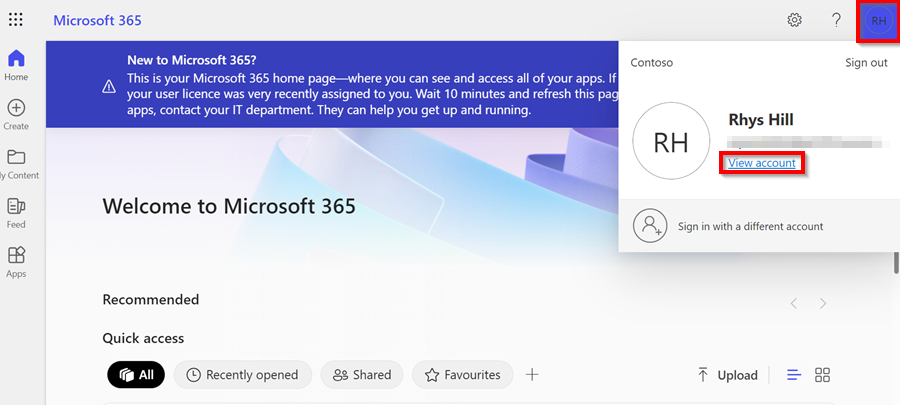

# We are still working on this article!
We are currently reviewing this article before it is published, check back later.

# Your First Sign In to Microsoft Account
In this article, you'll learn how to log in to your Microsoft account as a new user and how to enable the Authenticator app to add an extra layer of security to your account. As a new user, you will receive an email containing your **Email** address and **Temporary Password**. Once you have these details, you can proceed with the following steps:
1. Open the [Microsoft Office 365 Login Page](https://www.office.com/){:target="_blank"} and click on **Sign In** button. Enter your **Email** address, as sent and click on **Next** and then enter the **Temporary Password**. Click **Sign In**.

   

3. In the next page, you will be prompted to change the temporary password to a password of your choice. Enter your **Current Password (temporary password)** as received on email, and then create a **New Password** and confirm the password. Click **Sign In**.

   

4. To increase the security of your account, click on your account icon located at the top right corner and select **View Account**.

   

5. Go to the **Security info** section on the left and click on **add a sign-in method**. Choose the **authenticator app** as the method you want to use, and click on **Add**. Download the Microsoft Authenticator App for your mobile phone or tablet [**here**](https://www.microsoft.com/en-us/security/mobile-authenticator-app){:target="_blank"}.

   

6. In the **Microsoft Authenticator App**, add an account, select **Work or School** account, and then **Scan a QR Code**.
7. In your **Microsoft Account Page**, click **Next** until you reach the page where you can **Scan the QR Code**. Scan the code.

   

8. You will be given an authenticator number to enter into your Microsoft Authenticator app; enter the number as prompted in the app.

   

9. Once this is completed and we have changed the sign on method for your system, you will use this new username and password you created to access Garage Hive.

[Go back to top](#top)