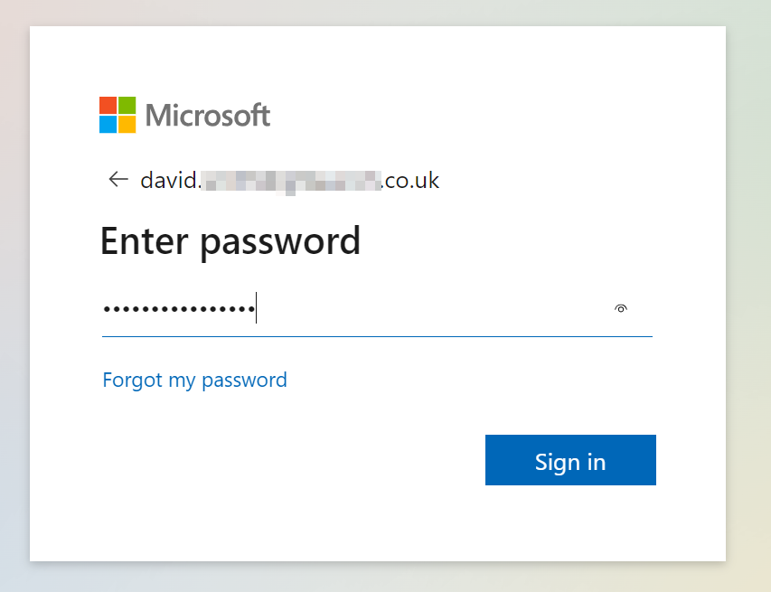
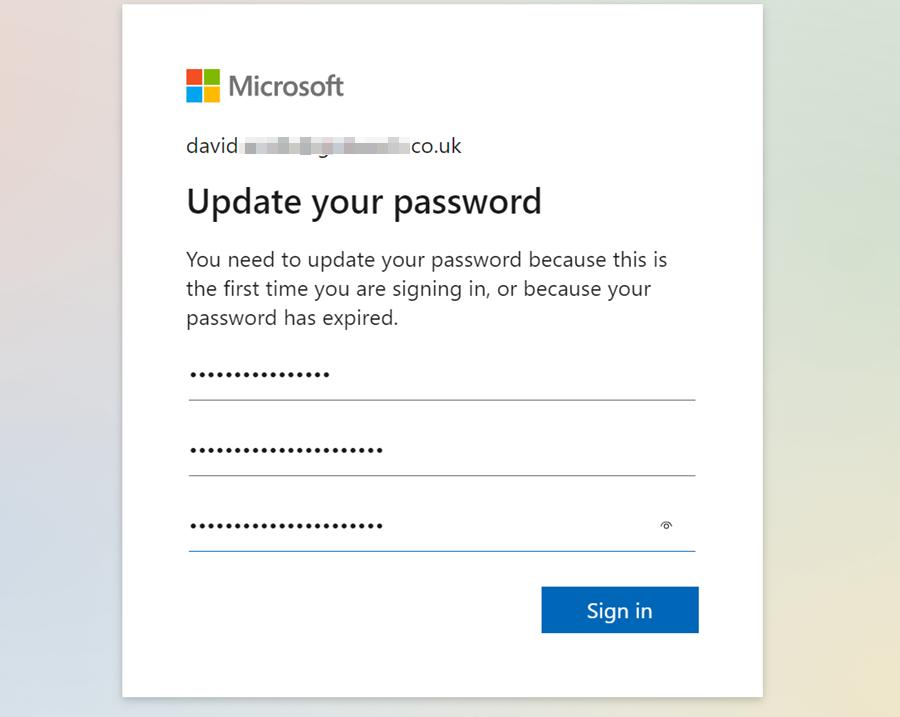
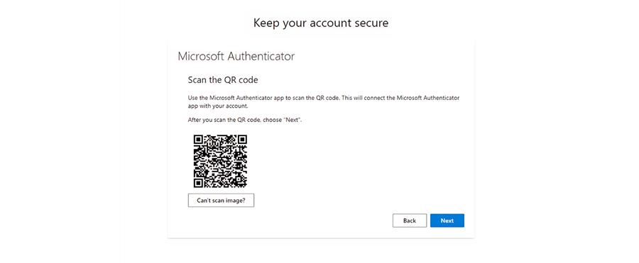

# Your First Sign In to your new Microsoft Account
In this article, you'll learn how to log in to your Microsoft account as a new user and how to enable the Authenticator app to add an extra layer of security to your account. As a new user, you will receive an email containing your **Email** address and **Temporary Password**. Once you have these details, you can proceed with the following steps:
1. Navigate to www.office.com from any browser or click [here](https://www.office.com/){:target="_blank"} to open the [Microsoft Office 365 Login Page] and click on **Sign In** button. Enter your **Email** address, as sent and click on **Next** and then enter the **Temporary Password**. Click **Sign In**.

   

2. In the next page, you will be prompted to change the temporary password to a password of your choice. Enter your **Current Password (temporary password)** as received on email, and then create a **New Password** and confirm the password. Click **Sign In**.

   

3. To increase the security of your account, you will receive a prompt to download and set up the **Microsoft Authenticator App**. Click **Next**.

   

4. Start by downloading the **Microsoft Authenticator App** on your mobile phone or tablet. [Download now](https://www.microsoft.com/en-us/security/mobile-authenticator-app){:target="_blank"}. Click **Next**.

   

5. In the **Microsoft Authenticator App**, add an account, select **Work or School** account, and then **Scan a QR Code**.

   

6. In your **Microsoft Account Page**, click **Next** until you reach the page where you can **Scan the QR Code**. Scan the code.

   
   

7. You will be given an authenticator number to enter into your Microsoft Authenticator app; enter the number as prompted in the app.

   

8. Once this is completed, you will use email address and password you created to access your Microsoft Account and Garage Hive.

   

[Go back to top](#top)