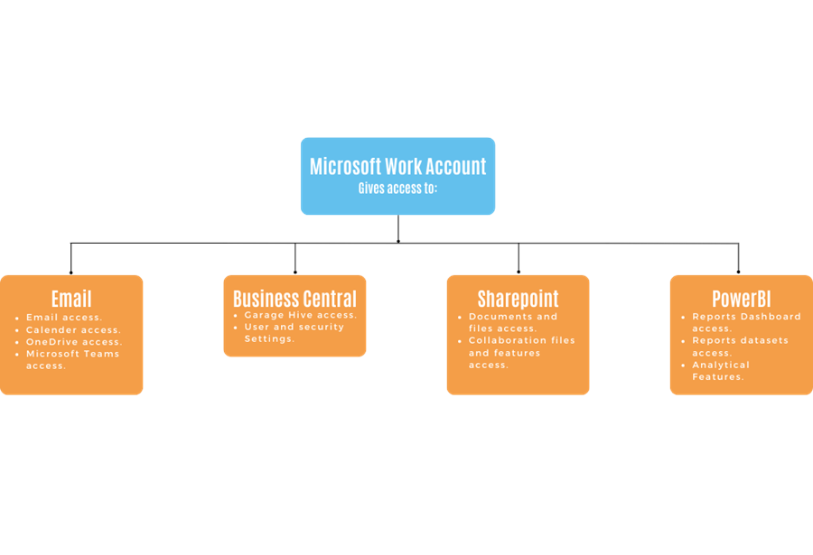

# Guide on Microsoft Accounts
When using Microsoft Accounts, it is important to understand that there are different types of **Microsoft Accounts**. In this article we’ll endeavour to guide you the the Microsoft Accounts available and which ones to use.

1. [Types of Microsoft Accounts](#types-of-microsoft-accounts)
2. [How Microsoft Work Account Function](#how-microsoft-work-account-function)
3. [Work Account Domain Name](#work-account-domain-name)
4. [Adding Features and Licences to Your Work Account](#adding-features-and-licences-to-your-work-account)
5. [Creating Work Account without Microsoft 365 Licence](#creating-work-account-without-microsoft-365-licence)
6. [Sharing Work Account Credentials with Multiple People](#sharing-work-account-credentials-with-multiple-people)

## Types of Microsoft accounts
There are two types of Microsoft Accounts:
1.	Work or School Account.
2.	Personal Account.

To access Business Central, you’ll need to have a work or school account. If you don’t have one, you can create one through your organisation’s subscription or contact your IT Admin.
Personal Accounts are the most common ones, which are used for accessing services like Outlook, OneDrive and Xbox Live. 
It is possible to create both types of account with the same email, which means you’ll always have a prompt on which email to use, [read more](https://support.microsoft.com/en-us/office/which-account-do-you-want-to-use-2b5bbd7a-7df6-4283-beff-8015e28eb7b9).

[Go back to top](#top)

## How Microsoft Work Account Function
When it comes to managing Microsoft Work Account, also known as Azure Active Directory, there are a few important things to keep in mind:
1.	These accounts are managed through either [admin.microsoft.com](https://admin.microsoft.com/){:target="_blank"} or [portal.azure.com](https://portal.azure.com/){:target="_blank"}.
2.	It is recommended to enable **multi-factor authentication (MFA)** for added security. We recommend using the [Microsoft Authenticator app](https://www.microsoft.com/en/security/mobile-authenticator-app){:target="_blank"}.
3.	You’ll need administrative rights in order to set up these accounts.

[Go back to top](#top)

## Work Account Domain Name
When you create a Microsoft work account, it is automatically assigned an **onmicrosoft.com** domain. This means that your username will have a format similar to *john@yourcompanyname.onmicrosoft.com*.
However, it is possible to change the domain name for your user accounts at any time. You can choose to transfer your existing domain or purchase a new one to make your user accounts appear as *john@yourcompanyname.com*. 
If you require assistance with this process, please contact GH Support.

[Go back to top](#top)

## Adding Features and Licences to Your Work Account
You can manage everything except for Business Central features and licenses through [admin.microsoft.com](https://admin.microsoft.com/){:target="_blank"}. If you want to add, e.g. Microsoft Office to your username:
1.	You obtain a Microsoft licence from Garage Hive or another reseller.
2.	Then assign the licence to the user in [admin.microsoft.com](https://admin.microsoft.com/){:target="_blank"}.

If you want to add a user with the Business Central user license or enable the feature:
1.	You submit a request directly from Business Central.
2.	You administer features and functions directly from Business Central.

[Go back to top](#top)

## Creating Work Account without Microsoft 365 licence
You can create a user account, such as *john@yourcompanyname.com* or *john@yourcompanyname.onmicrosoft.com*, without a Microsoft 365 Licence. The account will look like an email address, but no email services will be activated. Learn how to create one [here](garagehive-azure-active-directory-user.html){:target="_blank"}.

[Go back to top](#top)
 
## Sharing Work Account Credentials with Multiple People
It's always good to be cautious when sharing your Work Account credentials with other people. Keep in mind that whoever you give access to will be able to use all the services that come with it. The following are the services that come with your work account:

   

[Go back to top](#top)
