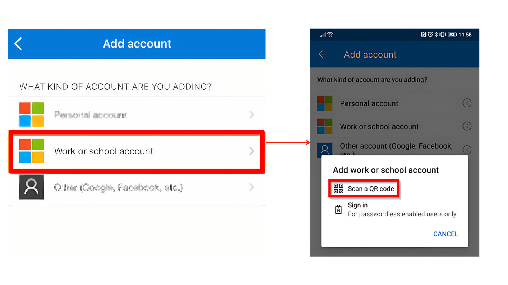

# We are still working on this article!
We are currently reviewing this article before it is published, check back later.

# Migrating to AAD Sign-on for Garage Hive
When your Garage Hive system is migrated to AAD sign on, how you sign in will change. Previously, the sign-in screen looked something like the one below:

   

After migrating to AAD Sign-on, the above sign-in screen will be replaced with the following:

   

Your old username, for example, 'Daves,' will no longer work and will be replaced by something similar to an email address, such as 'dave.smith@yourgaragename.com'. Here's how to finish the migration to AAD sign-on for Garage Hive:

1. First, Microsoft will send you an email from **ms-noreply@microsoft.com** on behalf of your organisation that looks as follows. If you do not receive one, please contact the support team as we may be using your current email address as a username and you can skip this step.

   

2. You will receive a **Username** and a **Temporary Password** in the email. To login, open an **inprivate/incognito** window in your browser or use a **guest** profile in your browser and go to [office.com](https://www.office.com/?auth=2){:target="_blank"}. Enter the username and temporary password you received.

   

3. You will be prompted to change the temporary password to a password of your choice.

   

4. To increase the security of your account, select your account on the top right corner, and click on **View Account**.

   

5. Go to the **Security info** section on the left and click on **add a sign-in method**. Choose the **authenticator app** as the method you want to use, and click on **Add**. Download the Microsoft Authenticator App for your mobile phone or tablet [**here**].(https://www.microsoft.com/en-us/security/mobile-authenticator-app).

   

6. In the **Microsoft Authenticator App**, add an account, select **Work or School** account, and then **Scan a QR Code**.
7. In your **Microsoft Account Page**, click **Next** until you reach the page where you can **Scan the QR Code**. Scan the code.

   

8. You will be given an authenticator number to enter into your Microsoft Authenticator app; enter the number as prompted in the app.

   

9.  Once this is completed and we have changed the sign on method for your system, you will use this new username and password you created to access Garage Hive.

[Go back to top](#top)
